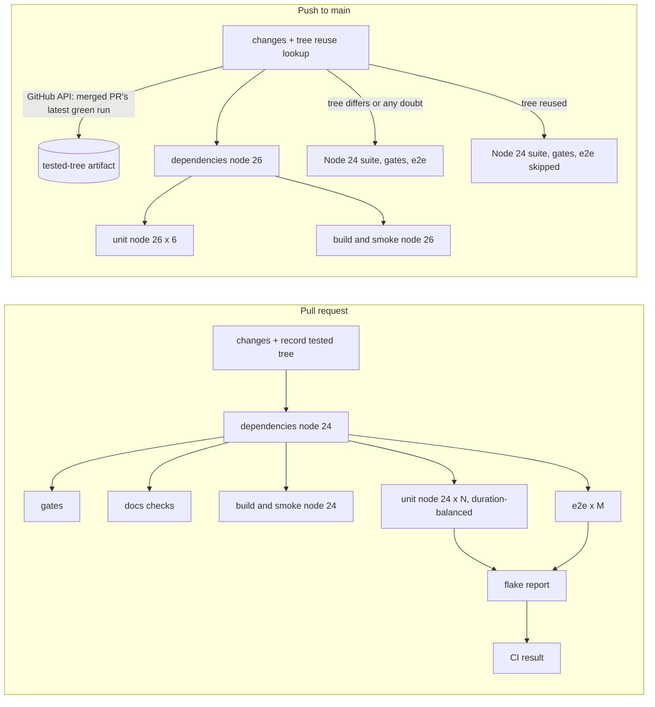

# Cut CI time-to-green by removing redundant runs and the job queue

Status: shaped on 2026-10-05 from the shape task "Plan how to reduce build time and speed it up.
Explore different angles and propose cutting redundant runs." Decisions recorded from three
interview rounds. Approved as written by the operator the same day, with "Create tickets after
the plan merges" chosen as the follow-up. Not implemented. One phase.

## Problem

A pull request waits about 12 minutes for `CI result`, and a push to `main` about 14. The longest
single job in those runs takes about 6 minutes. The rest is waiting, not working.

### What was measured (2026-10-05, GitHub API)

Full PR runs on `main` (no Windows jobs, nothing skipped), the four most recent green ones:

| Run | Branch | Wall clock to `CI result` | Longest job | Jobs |
|---|---|---|---|---|
| 37358592349 | sync/upstream-2026-10-05 | 11.8 min | 6.3 min | 35 |
| 37356609183 | feat/executable-platform-table | 22.5 min | 6.0 min | 35 |
| 37355842206 | fix/notification-prompt-merge-rollover | 11.4 min | 5.6 min | 35 |
| 37297064313 | feat/docs-only-ci-gate | 9.9 min | 5.6 min | 35 |

Baseline median: **11.6 min** (the 22.5 min run queued behind parallel runs). The push to `main`
37378460883 took 13.7 min with a longest job of 6.1 min.

Where the time goes, from run 37378460883:

- **Queueing.** One run fans out to 33 Linux jobs. The repository is public and owned by a
  personal account, and GitHub Free allows 20 concurrent jobs per account (GitHub's documented
  limit, confirmed by this run: all six Node 26 unit shards and five e2e shards started 2 to 5
  minutes after their dependencies were ready). Mission Control sessions push several PRs at
  once, and they share the same 20 slots.
- **Uneven unit shards.** `node --test --test-shard` splits by file index, not duration. Node 24
  shard 5 took 306 s and Node 26 shard 5 took 366 s, while shard 3 took 159 s and 107 s.
- **e2e is the critical path.** e2e shards take 211 to 368 s, of which 19 s is `npm run build`
  and about 45 s is setup.

### Redundant work in every run

| # | Redundancy | Cost per run |
|---|---|---|
| R1 | `npm run build` + `npm run smoke` runs at the end of all 12 unit shards | 12 x about 17 s, and every unit job stays open for it |
| R2 | The unit shard action builds the native state lock and installs the Electron runtime, then `pretest` checks or does both again | about 2 s warm, duplicated logic |
| R3 | `npm test`'s `posttest` reruns `test:workflow-evidence` in every shard, though those two files are already in the shard glob | 12 x about 3 s |
| R4 | Node 26 runs the whole unit suite (6 jobs) on every PR | 6 jobs of the 20-slot budget |
| R5 | Every merged PR reruns the whole suite as a push to `main`, usually against the exact tree the PR run already tested | a full 33-job run per merge |

Local `npm run build` (about 14 s) and `tsc --noEmit` (about 44 s) were measured too, and are out of scope
(decision 1).

## Decisions (recorded from the interview)

| # | Question | Answer |
|---|---|---|
| 1 | Which build time this plan is about | CI time-to-green on pull requests, and CI on pushes to `main`. Local build/typecheck and Windows CI are out of scope |
| 2 | What the plan optimizes and is measured against | PR wall clock time-to-green, target **under 8 min** |
| 3 | Node 26 on PRs | Runs only on push to `main` (and manual runs) |
| 4 | Where build + smoke runs | One dedicated build-and-smoke job per Node version |
| 5 | How PR and `main` runs divide work | PRs run the full suite; the `main` push skips when a green run already tested the identical tree |
| 6 | Duplicate provisioning in the unit shard action | Remove the action-level steps; `pretest` is the one provisioning path; the Electron cache step stays |
| 7 | Critical-path levers | Duration-balanced unit sharding; build `dist` once for e2e; re-tune shard counts against the 20-job cap |
| 8 | What a deduped `main` push still runs | The Node 26 unit matrix and its build-and-smoke, always. Only the Node 24 suite, `gates` and e2e are skipped |
| 9 | Which green run may stand in for the `main` push | Only the latest successful CI run for the PR that produced the commit |
| 10 | Build `dist` once for e2e, given it adds about 30-45 s to the critical path to save 19 s | Prototype it, keep it only if measured PR wall clock does not regress |
| 11 | Source of unit test durations | A committed timings file, regenerated by a script from a CI run's JUnit output |
| 12 | Duration-balance e2e too | No. Unit only; e2e keeps Playwright's `--shard` |
| 13 | How shard counts are set | By a budget: one PR run's peak concurrent jobs at or under 20, counts picked from measured timings during implementation |
| 14 | How the target is proven | Median of 5 consecutive full (non-docs) PR runs on a warm cache, before and after, from the GitHub API |
| 15 | How `CI result` accepts the new skips | Keep the `docs-only-ci` skill assets verbatim: compute the step's `DOCS_ONLY` env in YAML as "docs-only OR tree reused", put tree detection in its own step, leave the Node 26 jobs out of `CI result`'s `needs` (as `package` already is) |

## Design

### Job graph after the change

On a pull request, Node 26 jobs skip. On a push to `main`, the Node 26 unit matrix and its
build-and-smoke always run. The Node 24 suite, `gates` and e2e run unless the tree was reused.
Tags and `workflow_dispatch` run everything, as today. Docs-only PRs behave exactly as they do
now.

### 1. Node 26 runs only on push to `main` (R4, decisions 3 and 8)

`dependencies-node-26`, `unit-node-26` and the new `build-smoke-node-26` carry
`if: github.event_name != 'pull_request'`. They never depend on the tree-reuse result. They run
on every push to `main`, tag and manual run. They leave `CI result`'s `needs` (decision 15), so a
skipped Node 26 job on a PR is not a failure. A Node 26 failure on `main` still turns that
workflow run red. `flake report` keeps needing them; it already runs after skipped jobs through
`!cancelled()`.

### 2. One build-and-smoke job per Node version (R1, decision 4)

New jobs `build-smoke-node-24` (gated like the other Node 24 jobs) and `build-smoke-node-26`
(rule above): restore `node_modules`, run `npm run build`, run `npm run smoke`. The `Build` and
`Smoke the built bundles` steps leave `.github/actions/run-unit-shard/action.yml`. Smoke still
runs on both supported Node releases, which is the reason the ci.yml comment gives for it living
in the matrix. That comment is rewritten to match.

`build-smoke-node-24` also needs the native state lock built before `npm run build`. It already
gets that: `build` starts with `build:native`.

### 3. One provisioning path in the unit shard (R2, R3, decision 6)

- Remove the action's `Install Electron test runtime` and `Build native state lock` steps. Keep
  `Resolve Electron version` and `Cache the Electron runtime`.
- `pretest` stays the single definition of test provisioning. The cold-cache download retry
  (three attempts with backoff), which only the action has today, moves into
  `scripts/ensure-electron-runtime.mjs` so it protects local runs too.
- The shard runs `npm run pretest` once, then `npm run --silent test:run -- --test-concurrency=$MISSION_TEST_CONCURRENCY <its files>`
  (section 4). Calling `test:run` directly drops the duplicated `posttest`
  (`test:workflow-evidence`): those two files are already in the partition. Local `npm test`,
  with its `pretest` and `posttest`, is unchanged.
- The flake rerun command already goes through `test:run`, so the first run and the rerun still
  agree on how JUnit is produced (pinned by `test/flake-report-action.test.ts`).

### 4. Duration-balanced unit sharding (decisions 7, 11, 12)

- **Timings file:** `test/shard-timings.json`, a generated file mapping each test file path to
  its duration in milliseconds. Never hand-edited (AGENTS.md).
- **Generator:** `scripts/unit-shard-timings.mjs <run-id>` (npm script `test:timings`) downloads
  the run's per-shard JUnit artifacts with `gh run download` and sums `testsuite` times per file.
  The unit shard action therefore also uploads its `junit.xml` as an artifact
  (`unit-junit-node-<v>-shard-<n>`, retention 7 days).
- **Partitioner:** `scripts/unit-shard.mjs <index>/<total>` expands `test/**/*.test.ts`, weights
  each file by its recorded duration (a file missing from the timings gets the median), sorts by
  weight then path, and assigns longest-first to the lightest shard (LPT). It prints the shard's
  files. The result is deterministic for a given file set and timings file.
- **Correctness invariant**, pinned by a new `test/unit-shard.test.ts`: across all shards, every
  test file appears exactly once, for any file set, any timings (including empty or stale ones)
  and any shard total. A stale timings file only worsens balance. It never drops a test.
- **Regeneration** is manual: rerun `npm run test:timings -- <run-id>` when shard spread drifts,
  and commit the result. The implementing PR commits the first file.
- e2e keeps Playwright's `--shard` (decision 12).

### 5. Shard counts from a concurrency budget (decision 13)

The rule: **one PR run peaks at no more than 20 concurrent jobs.** At peak a PR runs `gates`,
`docs checks`, `build-smoke-node-24`, N unit shards and M e2e shards, so `3 + N + M <= 20`.
`changes` and `dependencies-node-24` finish before the shards start.

During implementation, N and M are picked from the balanced unit timings and the measured e2e
step times so that the slowest shard of each fits the 8-minute target. A starting estimate:
N = 4 (about 3.5 min each once balanced) and M = 13 (about 280 s average e2e test time). The
final numbers and the arithmetic go in the ci.yml comment that already explains the current
counts. `MISSION_TEST_SHARDS`, the shard lists and `test/init-script.test.ts` move together.

The cap is per account, so parallel PRs still compete for it. Fewer jobs per run is the only
lever this plan has on that.

### 6. `main` push skips a tree it already tested (R5, decisions 5, 8, 9)

**Recording, on every PR run.** A new step in `changes`, after the verbatim docs-only step,
writes `git rev-parse HEAD^{tree}` (the tree of the merge ref the run tests) and the run's
`docs_only` value to `tested-tree.json`. A new `tested-tree` artifact (retention 7 days)
uploads it.

**Reuse decision, on every push to `main`.** A second new step in `changes`, with
`actions: read` and `pull-requests: read` added to that job only, outputs `tree_reused=true`
only when all of these hold:

1. The event is `push` to `refs/heads/main`. Tags and manual runs never reuse.
2. `GET /repos/{repo}/commits/{sha}/pulls` returns exactly one merged PR.
3. The newest CI run of this workflow with `event=pull_request` and `head_sha` = that PR's head
   SHA has conclusion `success`. This is decision 9: only that PR's latest green run counts.
4. That run's `tested-tree` artifact exists and says `docs_only=false`. A docs-only PR run
   skipped the suite, so it cannot stand in for one.
5. Its recorded tree equals `git rev-parse HEAD^{tree}` of the pushed commit.

Every API error, missing artifact or mismatch outputs `false` and logs why. Any doubt runs
everything, which is the rule the docs-only gate already follows. A squash merge and a merge
commit both produce the merge ref's tree when `main` has not moved since the PR run, so the merge
method does not matter.

**Trust.** The artifact only ever comes from a successful run of this same workflow for the
merged PR's head. That PR's code, `ci.yml` included, is in the merged tree and was reviewed.
Reuse therefore trusts nothing the full `main` run would not have trusted.

**What skips.** `gates`, `unit-node-24`, `build-smoke-node-24` and `e2e` gain
`needs.changes.outputs.tree_reused != 'true'` beside their docs-only condition. `docs checks`,
`flake report`, `CI result` and every Node 26 job still run.

### 7. `CI result` keeps the skill assets verbatim (decision 15)

The `Detect docs-only change` step body and the `CI result` step body stay byte-identical to
`skills/docs-only-ci/assets/`, so `test/docs-only-ci-template.test.ts` keeps passing unchanged.
Only YAML outside the bodies changes:

- `CI result`'s `DOCS_ONLY` env becomes
  `${{ (needs.changes.outputs.docs_only == 'true' || needs.changes.outputs.tree_reused == 'true') && 'true' || 'false' }}`,
  with a comment saying the variable now means "the skippable jobs may skip".
- `SKIPPABLE` gains `build-smoke-node-24`.
- `needs` adds `build-smoke-node-24` and drops `dependencies-node-26` and `unit-node-26`, matching
  `package`'s treatment.

### 8. Build `dist` once for e2e: prototype only (decision 10)

Variant: `build-smoke-node-24` uploads `dist/` as an artifact, and each e2e shard needs it,
downloads it and drops its own `Build` step. It saves about 19 s per shard but delays every e2e
start by the build job (about 30-45 s). The implementing PR measures both variants with the
method in Verification. It keeps the variant only if the PR median does not regress, and records
both numbers either way. Without the variant, the e2e comment ("Each shard builds its own
`dist/`") stays true.

## Surfaces to change

| Path | Change |
|---|---|
| `.github/workflows/ci.yml` | Sections 1, 2, 5, 6, 7 (and 8 if kept); rewrite the runner, smoke, shard-count and docs-only comments to match |
| `.github/actions/run-unit-shard/action.yml` | Drop provisioning, build and smoke steps; run `pretest` then the partitioned `test:run`; upload JUnit |
| `scripts/ensure-electron-runtime.mjs` | Add the download retry |
| `scripts/unit-shard.mjs`, `scripts/unit-shard-timings.mjs`, `package.json` (`test:timings`) | New |
| `test/shard-timings.json` | New, generated |
| `test/unit-shard.test.ts` | New: partition invariant, determinism, unknown-file weighting |
| `test/init-script.test.ts` | Update the pinned CI shape (Node 26 consumers, shard totals and lists, build-smoke jobs) |
| `test/oss-readiness.test.ts` | Add the new jobs' `ubuntu-latest` runner assertions |
| A new test of the tree-reuse step | Table-driven, as `test/docs-only-ci-scripts.test.ts` is for the docs-only steps: each reuse condition, and every failure path resolving to `false` |
| `AGENTS.md` | The CI paragraph: job count, Node 26 on `main` only, build-and-smoke jobs, tree reuse |
| `docs/flaky-tests.md`, `docs/upstream-sync.md` | Shard names and the fork's `ci.yml` changes, where they mention them |
| `docs/fork/ledger.md`, `docs/fork/ledger.html` | New "CI time-to-green" entry (intent, contracts, surfaces, status, PRs), re-rendered |

## Verification

- New and changed tests pass when run by file: `test/unit-shard.test.ts`, the tree-reuse step
  test, `test/init-script.test.ts`, `test/oss-readiness.test.ts`,
  `test/docs-only-ci-template.test.ts`, `test/flake-report-action.test.ts`.
- `npm run typecheck` and `npm run lint` pass.
- **Coverage is unchanged:** on the implementing PR's own run, the union of the N shards' JUnit
  test files equals `test/**/*.test.ts`. A CI step in each shard prints its file count, and the
  partition test pins the invariant.
- **Target (decision 14):** the median wall clock from run creation to `CI result` completion,
  over 5 consecutive full (non-docs) PR runs on a warm cache, is under 8 minutes. The before
  median uses the same method (11.6 min over the 4 runs above, topped up to 5 at implementation
  time). The query and both tables go in the PR description.
- **Tree reuse works end to end:** after the implementing PR merges, its own `main` push run
  shows `tree_reused=true`, Node 24/e2e skipped, Node 26 run, `CI result` green. A merge after
  `main` moved shows `tree_reused=false` and a full run. Both run links go in the PR or a
  follow-up comment.

## Risks and known gaps

- **A Node 26-only break reaches `main` before anyone sees it.** It turns the `main` run red
  right after merge, and nothing blocks the PR. Accepted in decision 3.
- **`CI result` on `main` no longer covers Node 26.** The workflow run's overall conclusion does.
  `main` has no branch protection today, so nothing reads `CI result` there as a gate.
- **The 8-minute target may not fit the 20-job budget**, because e2e needs about 60 minutes of
  shard time. If balanced counts within the budget cannot reach it, the PR reports the measured
  median and names the next lever (e2e duration balancing, declined in decision 12) rather than
  breaking the budget.
- **Parallel PRs still share 20 slots.** This plan shrinks each run's share; it cannot raise the
  cap.
- **Windows.** `release/windows` carries its own `ci.yml` with about 25 Windows jobs. It picks
  this change up through the weekly sync runbook, where `ci.yml` conflicts are expected. Its
  31-minute Windows unit shards are out of scope (decision 1).
- **Timings rot.** Balance degrades as tests change until someone regenerates the file.
  Coverage never does.

## Out of scope

Local `npm run build` parallelization, incremental `tsc`, Windows CI, larger paid runners, and
affected-test selection on PRs (considered in round 1, not chosen).
