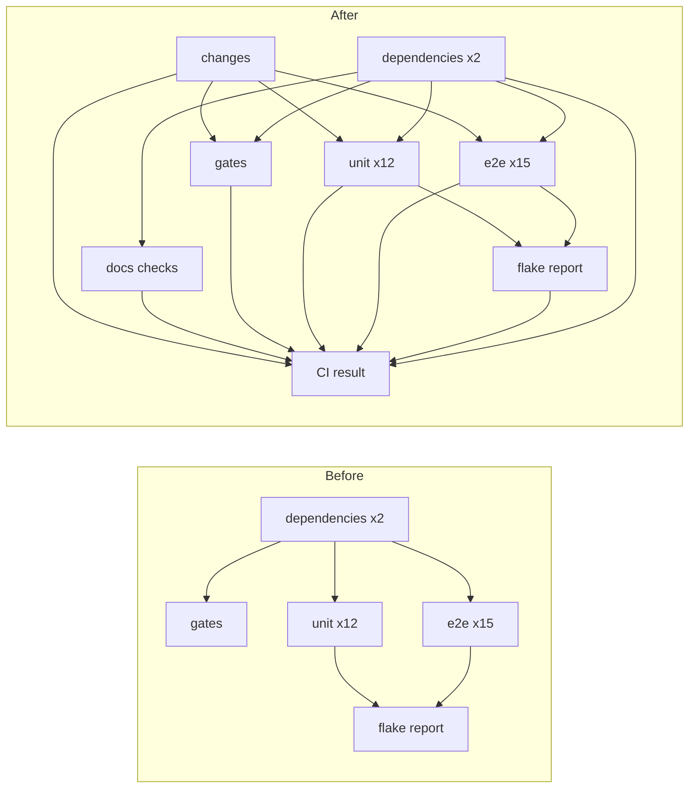

# Docs-only pull requests skip the full CI, and a skill installs the same gate elsewhere

Status: shaped on 2026-10-04 from the shape task "When a PR only has changes in docs/ GitHub
shouldn't run a full CI build. Mission Control should also have a skill that adds the same
functionality for other repos." Decisions recorded from three interview rounds. Approved as
written by the operator the same day, with "Create tickets after the plan merges" chosen as the
follow-up. Revised in Plan Validation repair round 1: Wait for CI requires a "Flaky tests" check,
so the operator chose to keep `flake report` running on docs-only PRs (decision 20), and the
verification gained committed table-driven tests of both step scripts. Not implemented.

## Problem

Every pull request runs the whole of `.github/workflows/ci.yml`: two dependency caches, `gates`
(typecheck and lint), six Node 24 and six Node 26 unit shards (each also builds and runs the
bundle smoke), fifteen E2E shards, and `flake report`. That is thirty-one jobs, which `AGENTS.md`
counts, for a pull request that may only edit Markdown under `docs/`. Plans, reports and fork
ledger updates are frequent in this repository, so the cost recurs.

The operator also wants the same behavior available to other repositories through a Mission
Control skill.

## What a docs change can and cannot break (verified 2026-10-04)

| Surface | Reads `docs/`? | Evidence |
|---|---|---|
| Typecheck | No | `tsconfig.json` includes `src`, `hooks`, `test`, `integrations`, `vite.config.ts` |
| Lint | No | `oxlint src hooks test scripts e2e integrations` |
| Build, smoke, package | No | nothing in `src` imports from `docs/`; `electron-builder.yml` ships `dist`, `skills`, `personas/FOREMAN.md` and named scripts, not `docs/` |
| E2E | No | specs create `docs/...` only inside temp fixture checkouts |
| Unit tests | **5 files** | doc-drift guards, below |
| `scripts/check-doc-links.mjs` | Yes | walks every Markdown file under `docs/`; **no CI job or npm script runs it today**; it passes on `main` (676 files) |

Twenty-two test files mention `docs/`, but seventeen only use it as a fixture path in a temp
directory. These five read the repository's real docs and can be turned red by a docs-only change:

| Test | Asserts |
|---|---|
| `test/keybinding-hints.test.ts` | `docs/ui.md` still enumerates every control that prints its chord |
| `test/llm-config.test.ts` | `README.md` and `docs/configuration.md` name every headless transport env var |
| `test/db-shell.test.ts` | `docs/sqlite-database.html` catalogs every `db.ts` table exactly once, with family counts |
| `test/setup-guide-links.test.ts` | every reference inside `docs/setup-guide.html` resolves |
| `test/setup-guide-embedding.test.ts` | `docs/setup-guide.html` equals what `npm run docs:embed` produces from `docs/images/` |

`main` has no branch protection, so no check is required here today. A repository that does
require checks cannot use a plain `paths-ignore` filter: a filtered workflow never reports, and a
required check would sit in Pending forever. That is why the pattern below always reports.

## Decisions (recorded from the interview)

| # | Question | Answer |
|---|---|---|
| 1 | What counts as docs-only for Mission Control | Every changed path is under `docs/**` |
| 2 | What still runs on a docs-only PR | A `docs checks` job: the tests that reference `../docs/`, discovered automatically, plus `check-doc-links` |
| 3 | Do docs-only pushes to `main` skip | No. Only pull requests skip; `main`, tags and `workflow_dispatch` always run the full suite |
| 4 | Mechanism for Mission Control | The same pattern the skill installs: a `changes` detection job the heavy jobs depend on, plus one summary job that always runs and reports, so a required check never sits in Pending. Dogfooded here first. The answer listed `flake report` among the gated jobs; decision 20 supersedes that part |
| 5 | How operators reach the skill | Skill only: Skills catalog and `/slash`, no repository action, route or button |
| 6 | Skill flow | The testing-setup shape: audit, one approval form, apply only what was approved |
| 7 | CI systems | GitHub Actions only; anything else is a clear "not supported" stop |
| 8 | Does `gates` run on a docs-only PR | No, it skips with the heavy jobs |
| 9 | Detection | An inline shell step running `git diff --name-only` between base and head, matched against the docs patterns. No third-party action. Implemented with `--no-renames`; see the `changes` job, step 2 |
| 10 | When detection cannot decide | Run the full suite |
| 11 | Skill id | `docs-only-ci` (installed as `mission-docs-only-ci`) |
| 12 | Docs paths in other repos | The audit proposes a set (default `docs/**`, plus what it finds, such as `*.md` or a docs site directory); the human edits it in the form |
| 13 | Docs checks job in other repos | Proposed only when the audit finds tests or scripts that read the docs paths |
| 14 | Required checks in other repos | Read them with `gh api` and tell the operator exactly which to swap for the summary job; never edit branch protection |
| 15 | When `docs checks` runs | On every run, docs-only or not |
| 16 | Summary check name | `CI result` (job id `ci-result`) |
| 17 | Keeping the dogfooded copy identical | A unit test asserting the `ci.yml` step scripts equal the skill's template assets byte for byte |
| 18 | Proving the skip | Before merge: a throwaway docs-only PR stacked on the feature branch, recorded as evidence, closed unmerged |
| 19 | Delivery | One phase, one pull request |
| 20 | How a docs-only PR gets past Wait for CI (repair round 1) | `flake report` is **not** gated: it runs on docs-only PRs, reads zero reports and publishes "Flaky tests: No flaky tests". Gates, unit and E2E still skip. Chosen over a "Docs-only change" marker check that Wait for CI would accept, and over documenting the block |

## Wait for CI and the "Flaky tests" check (investigated in repair round 1)

Plan Validation asked how Mission Control's Wait for CI node treats a run with no "Flaky tests"
check. Read on 2026-10-04:

- `decideWaitForCi` (`src/shared/wait-for-ci.ts`) passes only when every check on the head
  commit has settled green **and** a check named "Flaky tests" exists. A green run without one
  waits `WAIT_FOR_CI_FLAKE_REPORT_GRACE_MS` (five minutes) and then blocks with
  `ci_flake_report_missing`. There is no exception, so it holds for every repository.
- The node reads only check names, conclusions, titles and summaries from the Inspector's
  `statusCheckRollup` query. `SKIPPED` counts as passing (`src/shared/ci-checks.ts`), and
  `package (macOS arm64)` already reports `skipped` on every pull request, so "a job was
  skipped" is not a docs-only signal.
- A job's step summary never reaches its check run: on `main`'s head, `flake report` writes
  `$GITHUB_STEP_SUMMARY` and its check run's `summary` is null. A docs-only marker would need a
  check created through the Checks API with `checks: write`.
- The flake-report action is safe with zero reports. `publish` in
  `src/flake-report-action/publish.ts` merges what it read, so zero reports give zero flakes.
  It then does exactly what a clean full run does: it opens and updates no flake issues, strips
  the actionable label from closed ones, and publishes "Flaky tests" with conclusion `success`
  and title "No flaky tests". Where the token is read-only (`ctx.readOnlyReason`, for example a
  fork PR), it publishes no check, on any run, which is the same as today. The engine reads a
  missing report as zero flakes (`flakeReport?.flakes.length ?? 0` in
  `src/server/workflows/engine.ts`).

**Resolution (decision 20):** `flake report` stays ungated. Its existing `if: ${{ !cancelled() }}`
already lets it run when the jobs it needs were skipped, so a docs-only run still publishes
"Flaky tests", and Wait for CI passes with no change to Mission Control's code. The skill does the
same in target repositories.

## Design

### The job graph



`package` is unchanged: release-only, outside the gate, and not a need of `CI result`.

### `changes` job

- Runs on every event, `ubuntu-latest`, short timeout, `contents: read`.
- Checks out with `fetch-depth: 0` so the merge base is reachable.
- One step, `Detect docs-only change`, whose `run:` body is the skill asset
  `skills/docs-only-ci/assets/detect-docs-only.sh`, verbatim. Its inputs come through `env`, so
  the script text is identical in every repository and only the `env` block differs:
  - `DOCS_ONLY_PATHS`: newline-separated shell `case` patterns. Mission Control sets `docs/*`.
    In a `case` pattern `*` matches across `/`, so `docs/*` covers every depth and `*.md` means
    Markdown anywhere. The skill documents this.
  - `EVENT_NAME`, `BASE_SHA`, `HEAD_SHA` from the `github` context.
- Behavior, emitting one output `docs_only=true|false` to `$GITHUB_OUTPUT`:
  1. Not a `pull_request` event: `false`.
  2. `git diff --no-renames --name-only "$BASE_SHA...$HEAD_SHA"` fails, or lists zero files:
     `false`. `--no-renames` is required, not a style choice: with git's default rename
     detection, a file moved from `src/` into `docs/` is listed only by its new `docs/` path,
     so a PR that removes a source file would look docs-only and skip the tests. Without rename
     detection the move lists both the deleted source path and the added docs path, and the
     source path fails the match. It also disables copy detection, which matters for the same
     reason.
  3. Every listed path matches at least one pattern: `true`. Otherwise `false`.
  4. It prints the decision and the first non-matching path, so a full run says why.
- The script never exits non-zero on a detection problem; every doubt resolves to `false` (full
  suite, decision 10). If the job itself fails (runner trouble), its dependents skip and
  `CI result` fails, which is loud rather than a silent pass.

### Gated jobs

`gates`, `unit-node-24`, `unit-node-26` and `e2e` add `changes` to `needs` and
`if: needs.changes.outputs.docs_only != 'true'`.

`flake-report` is unchanged (decision 20). It keeps `needs: [unit-node-24, unit-node-26, e2e]`
and `if: ${{ !cancelled() }}`, which runs it when those jobs were skipped. On a docs-only run it
downloads no reports and publishes "Flaky tests: No flaky tests", which is what Wait for CI
requires. Both `dependencies` jobs keep running too: a warm cache hit takes seconds,
`docs checks` needs Node 24's tree, and gating them adds wiring for no saving.

### `docs checks` job

Runs on every run (decision 15), needs `dependencies-node-24`, restores `node_modules` the same
way `gates` does, then:

1. `node scripts/check-doc-links.mjs`. Exposed as `npm run docs:links` so contributors can run it.
2. Discovers test files with `grep -l '\.\./docs/' test/*.test.ts`. If discovery returns no
   files, the step fails: a pattern that matches nothing has rotted, and silence would hide it.
3. Runs them with the suite's loader:
   `node --test --import ./test/setup-state.mjs --import tsx <files>`.

On full runs the five tests also run inside the unit shards. That duplication costs well under a
minute and keeps `CI result`'s logic free of a "docs checks ran only sometimes" case.

### `CI result` job

- `needs` every job above except `package`, `if: always()`, `ubuntu-latest`.
- One step whose `run:` body is the skill asset `skills/docs-only-ci/assets/ci-result.sh`,
  verbatim. Inputs through `env`: `NEEDS_JSON: ${{ toJSON(needs) }}`, `DOCS_ONLY` from
  `changes`, and `SKIPPABLE`, the newline-separated job ids allowed to skip on a docs-only run
  (`gates`, `unit-node-24`, `unit-node-26`, `e2e` here; `flake-report` is not among them).
- `NEEDS_JSON` is parsed with `jq`, which GitHub-hosted Ubuntu runners and macOS 15 and later
  ship. Both scripts stay compatible with bash 3.2, macOS's `/bin/bash`, so the committed test
  below runs on a developer's machine as well as in CI.
- Rule: every need must be `success`, except that a job listed in `SKIPPABLE` may be `skipped`
  **only when** `DOCS_ONLY` is `true`. Any `failure`, `cancelled`, or other `skipped` fails the
  job, naming each offending job and its result.
- This is the one check a protected repository marks as required.

### The `docs-only-ci` skill

```
skills/docs-only-ci/
  SKILL.md
  assets/
    detect-docs-only.sh   # the changes step body, copied verbatim
    ci-result.sh          # the summary step body, copied verbatim
```

Frontmatter: `name: docs-only-ci`, a description that triggers on requests to skip or gate CI
for docs-only pull requests, and `metadata.mission` with `category: testing` and
`enforcement: triggered`, like `testing-setup`. Reached only from the Skills catalog and
`/docs-only-ci` (decision 5): no route, task type or Trust panel button.

Procedure, mirroring `skills/testing-setup/SKILL.md`:

1. **Audit, read-only.**
   - Confirm GitHub Actions. Any other CI (GitLab, CircleCI, Jenkins, Buildkite) stops with
     "not supported" and no form.
   - Find the workflows that trigger on `pull_request`, and their jobs.
   - Propose docs patterns: `docs/*` if it exists, plus what the repository shows, such as
     root or nested Markdown and a docs site directory.
   - Find tests and scripts that read those paths, to decide whether to propose a docs checks
     job.
   - Find any existing `paths` or `paths-ignore` filter, which would be replaced by the gate.
   - Read required checks with
     `gh api repos/{owner}/{repo}/branches/{default}/protection/required_status_checks`. A
     403 or 404 is reported as "could not read branch protection", never as "no required
     checks".
   - Note a testing-setup `flake-report` job. It is never gated (decision 20), because Wait for
     CI needs its "Flaky tests" check on every run. If its `if:` does not already let it run when
     its test jobs were skipped (`!cancelled()` or `always()`), the form proposes adding that.
   - If the gate is already installed and matches the assets, say so and stop: no form, no
     commit.
2. **One approval form** through `request_plan_decisions`: the docs patterns (editable), which
   jobs to gate, whether to add a docs checks job and which command it runs, and the exact
   workflow edits. Every option allows Other.
3. **Apply only what was approved** in one commit: the `changes` job with the asset pasted as
   its step body, the gated jobs' `needs` and `if`, the optional docs checks job, and
   `CI result` with the asset pasted as its step body. Mission Control publishes the pull
   request; the skill follows the task's publication ownership rather than opening one itself.
4. **Report required checks.** When protection requires checks that a docs-only run now skips,
   the report and the PR body name each one and say to replace them with `CI result`. When
   protection could not be read, they list every check name the workflow produces so the
   operator can compare. The skill never edits protection (decision 14).
5. **Verify** on the setup pull request's own CI that `changes` and `CI result` report. Where
   the operator wants proof of the skip, open a throwaway docs-only pull request stacked on the
   setup branch and close it unmerged.

### Drift guard

A new `test/docs-only-ci-template.test.ts` reads `.github/workflows/ci.yml` as text (the
repository has no YAML parser and `test/oss-readiness.test.ts` already reads it this way),
extracts the `run: |` block scalar of the `Detect docs-only change` step and of the `CI result`
step by indentation, dedents each, and asserts each equals its asset byte for byte. It also
asserts the `changes` and `ci-result` jobs exist, run on `ubuntu-latest`, and that every gated
job carries the `docs_only != 'true'` condition. Editing one copy without the other fails
`npm test`.

### Documentation and ledger

- `AGENTS.md`: the CI paragraph's count becomes thirty-four non-package jobs, and the paragraph
  names `changes`, `docs checks` and `CI result` and the docs-only skip.
- `ci.yml` header comment: the gate, what skips, why `main` never skips, and why `CI result`
  exists.
- `docs/flaky-tests.md`: on a docs-only PR, `flake report` still runs, reads zero reports and
  publishes "Flaky tests: No flaky tests", which keeps Wait for CI passing.
- `docs/skills-and-settings.md`: the new bundled skill.
- `docs/upstream-sync.md`: `skills/docs-only-ci/` and the gate's `ci.yml` jobs are fork-only
  surfaces.
- `docs/fork/ledger.md`: a new "Docs-only CI" entry and an "At a glance" row, with
  `ledger.html` re-rendered in the same commit.

## Verification

- `node --test --import ./test/setup-state.mjs --import tsx test/docs-only-ci-template.test.ts`
  passes, and fails when one byte of either asset or either `ci.yml` step body changes.
- Running the docs checks job's commands locally passes: `npm run docs:links`, then the
  discovered test files with the suite loader.
- A committed `test/docs-only-ci-scripts.test.ts` (AGENTS.md working rule 3) runs both assets
  with `bash -eo pipefail`, which is how GitHub Actions runs a `run:` step, and passes inputs only
  through `env`. Each case asserts the exit code and the output line:
  - `detect-docs-only.sh`, with a stub `git` first on `PATH`, must print `docs_only=false` and
    exit 0 for a non-PR event, a failing diff, zero changed files, one non-docs path among
    docs paths, and a file renamed from `src/` into `docs/`. For the rename case the stub
    asserts it was called with `--no-renames` and then lists both paths, so dropping the flag
    fails the test. It must print `docs_only=true` for all docs paths, and for a nested `.md` path
    matched by a `*.md` pattern.
  - `ci-result.sh` must **pass** when every need succeeded, and when only `SKIPPABLE` jobs were
    skipped with `DOCS_ONLY=true`.
  - It must **fail**, naming the offending job, when:
    - a `SKIPPABLE` job was skipped and `DOCS_ONLY` is `false`;
    - `DOCS_ONLY` is empty because `changes` failed;
    - any need is `failure` or `cancelled`;
    - a job outside `SKIPPABLE` (for example `docs-checks` or `flake-report`) was skipped on a
      docs-only run;
    - `changes` itself did not succeed.
- A Wait for CI case in the same file feeds `decideWaitForCi` the check list a docs-only run
  produces: `changes`, `docs checks`, `CI result`, `flake report` and "Flaky tests" passing, and
  gates, unit, E2E and package `skipped`. It asserts the decision is `pass`, not a wait that ends
  in `ci_flake_report_missing`.
- `npm run typecheck` and `npm run lint` pass.
- **On GitHub, before merge:**
  - The implementation PR's own run shows `changes` reporting `docs_only=false`, every heavy job
    running, and `CI result` green.
  - A throwaway PR, based on the feature branch, that touches only one file under `docs/`, shows
    `changes` reporting `docs_only=true`; `gates`, unit and E2E skipped;
    `flake report` and `docs checks` ran, and "Flaky tests" and `CI result` are green. Its run is
    captured with `gh pr checks` and registered as evidence, then the PR is closed unmerged. A
    `pull_request` run uses the merge ref's `ci.yml`, so the new workflow runs on that stacked PR.
  - That PR's head-commit check runs, read with
    `gh api repos/{owner}/{repo}/commits/{sha}/check-runs` and mapped through
    `classifyCheckEntry`, are passed to `decideWaitForCi`, and the decision is `pass`. This proves
    a docs-only PR passes Wait for CI on the real check list, not only on the fixture.
  - Optionally, a second throwaway commit on that PR that breaks one doc-drift guard (for
    example, removing a table row from `docs/sqlite-database.html`) shows `docs checks` and
    `CI result` failing.

## Out of scope and follow-ups

- Turning on branch protection for `main` here, or marking `CI result` required. Not asked
  for; the gate makes it possible.
- A Trust panel repository action for the skill (decision 5 chose skill only).
- CI systems other than GitHub Actions.
- Path classes other than docs, such as skipping E2E for server-only changes.
- Skipping on pushes to `main`.

## Risks

- **A docs-reading test that does not spell `../docs/`.** Discovery would miss it, and a
  docs-only PR could break it unseen until `main`'s push run. Mitigation: `main` always runs the
  full suite (decision 3), and the discovery pattern is named in the `ci.yml` comment so a
  reviewer of a new doc-drift test can check it.
- **A future build step that reads `docs/`.** The "cannot break" table above would then be
  wrong. The `ci.yml` header names the assumption so the change that breaks it sees it.
- **Required-check names.** In this repository nothing is required, so renaming or adding jobs
  stays free. In a protected repository the operator must swap required checks for `CI result`
  by hand, which the skill reports.
- **`fetch-depth: 0` on a large repository** makes `changes` slower. Acceptable here; the skill
  notes it and the audit can propose a shallow fetch of the base and head SHAs instead when
  history is large.

## Rendering

`plan.html` is generated from this file by `node docs/plans/docs-only-ci/render-plan.mjs`, which
inlines `job-graph.svg` in place of the mermaid block. `--check` fails when the page is stale.
