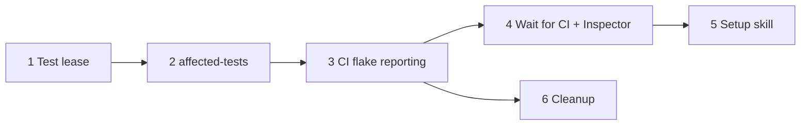

# Flake-aware testing: phased implementation plan

Source plan: [plan.md](plan.md). Rendered: [plan.html](plan.html).

Human decision on the plan review: **Create phased implementation plan**. The source plan's 28
settled decisions are requirements, not open questions.

## Phases

| Phase | File | Direct prerequisites | Outcome |
| --- | --- | --- | --- |
| 1 | [phase-1-check-test-lease.md](phase-1-check-test-lease.md) | none | One test command at a time across the machine, at a lower concurrency |
| 2 | [phase-2-affected-tests-check.md](phase-2-affected-tests-check.md) | 1 | The `affected-tests` slot: selection, `{files}`/`{junit}` template, one local rerun, JUnit repair packets |
| 3 | [phase-3-ci-flake-reporting.md](phase-3-ci-flake-reporting.md) | 2 | The report action, the "Flaky tests" check, one GitHub issue per flaky test, wired into this repository's CI |
| 4 | [phase-4-wait-for-ci-and-inspector.md](phase-4-wait-for-ci-and-inspector.md) | 3 | The Wait for CI node, the Affected tests built-in workflow, and the Inspector reading the flake summary |
| 5 | [phase-5-testing-setup-skill.md](phase-5-testing-setup-skill.md) | 4 | The once-per-repository setup skill and its repository action |
| 6 | [phase-6-flake-cleanup.md](phase-6-flake-cleanup.md) | 3 | Task source "all of" / "none of" labels and the `deflake` skill |

**Concurrency**: Phase 6 depends only on Phase 3, so it can run alongside Phases 4 and 5. Every
other phase is sequential. **Merge order**: 1, 2, 3, then 4 and 6 in either order, then 5.

## Investigated findings that change the source plan

These are recorded decisions. Each phase file repeats the ones it owns.

1. **The Inspector poller is the only GitHub poller.** The change contracts say the PR session
   action "never talks to a provider" and that a second poll loop would double the API cost. So
   the Wait for CI node does not poll GitHub. Phase 4 extends the Inspector's single PR GraphQL
   query with the head commit's check runs, and the node is re-observed on Inspector updates, the
   way session actions already are. The Inspector's flake reading uses the same snapshot, which is
   why the source plan's Phases 3 and 4 are one phase here.
2. **More than one daemon can run on a machine** (one per state directory), so a queue inside the
   daemon is not a machine-wide lease. Phase 1 lifts the e2e host lease's user-scoped loopback
   TCP pattern into a shared module rather than inventing a second lock mechanism.
3. **The runtime has no XML parser, glob library or import-graph tool**, and the packaged app
   ships no `node_modules`. Node's `path.matchesGlob` covers patterns on Node 24 and 26. JUnit is
   parsed by a small parser for the subset the runners emit, and imports are found by a lexical
   scanner with relative and `tsconfig` `paths` resolution. No new runtime dependency.
4. **Node's JUnit reporter carries the test's file** (`file` attribute on each `<testcase>`) on
   Node 24 and 26, which is what rerunning "only the failed files" needs.
5. **A check's worktree is a detached tree at the head commit and does not reliably contain
   ignored files**, so `.mission/testing.local.json` is read from the session's main checkout,
   not the check tree.
6. **The recorded check command is capped at 32 arguments.** An outcome records the template, never
   the argv expanded with `{files}`.
7. **Placing a node after the Pull Request action removes the "shipping-only continuation"
   exemption** from evidence readiness. Phase 4 extends that predicate to allow Wait for CI
   between the action and End, and turns off the Pull Request action's CI follow-through contract
   when a Wait for CI node follows it, so the agent and the node do not both chase CI.
8. **There is no per-repository action menu in the UI.** Phase 5 adds the "Set up flake-aware
   testing" action as a row action on the Trust panel's repository rows, the only per-repository
   row surface today.
9. **The packaged app ships `skills/` but not `.github/`.** The report action is a generated
   bundle. Phase 3 emits it into this repository's `.github/actions/`, and Phase 5 adds a second
   generated copy under the setup skill's assets so the skill can copy it into other repositories.
10. **CI currently grants only `contents: read`.** Phase 3 grants `checks: write` and
    `issues: write` to the one reporting job only. Fork PRs get a read-only token regardless, so the
    action degrades to a job summary there, and Wait for CI reports the missing check plainly.
11. **A Settings backup restore refuses a snapshot missing a Command slot.** Phase 2 makes restore
    accept a snapshot without `affected-tests` (it predates the slot) by using the default.

## Deviations from the source plan's phase list

- **Source Phase 1 is split** into Phase 1 (test lease, concurrency) and Phase 2 (affected-tests).
  Together they are the largest slice of the feature. The lease is a cross-process primitive with its own
  failure modes and immediate value, and splitting it gives a small, independently testable merge
  unit.
- **Source Phases 3 and 4 are combined** into Phase 4, because both read the same new check-run data
  from the Inspector's snapshot (finding 1). Splitting them would build that data path twice or
  leave it half-owned.

- **The setup skill verifies on the setup PR's own CI**, not after the PR merges. The setup PR
  runs the new CI, so the "Flaky tests" check appears on it before merge. That is the same proof,
  available while the agent's session is still open.
- **Switching the kind defaults to the new workflow is not scheduled.** The source plan switches them
  "once it has proven itself on this repository", which is an operator decision after Phase 4 has
  run for a while, not implementation work. It is one setting change under Dispatch defaults.

## Sizing

Estimated non-test implementation lines, with the assumptions:

| Phase | Estimate | Main cost |
| --- | --- | --- |
| 1 | 200-300 | Shared lease module, check runtime wiring, two settings |
| 2 | 900-1200 | New slot across about 20 enumerations, selection, import scanner, JUnit parser, executor loop, outcome and UI |
| 3 | 800-1100 | Report action source and generator, GitHub REST calls, issue upsert and windowing, CI wiring |
| 4 | 1000-1400 | New node kind across engine, graph, store, web; Inspector query and prompt; new built-in workflow |
| 5 | 350-550 | Skill prose, repository row action and route, asset generation |
| 6 | 250-400 | Two config fields, query and UI, `deflake` skill prose |
| Total | 3500-4950 | |

Six phases, because the total is far above one reviewable change. Each boundary is either a
different system (daemon checks, CI, workflow engine, skills) or a new contract later phases
consume. Phase 6 is separate from Phase 5 because it does not need Wait for CI and can ship as
soon as flake issues exist.

## Cross-phase contracts

| Contract | Owner | Consumers |
| --- | --- | --- |
| `slotRunsTests(slot)` predicate, and the lease wrapping every test-running check | 1 | 2 |
| Setting names for the lease and check test concurrency | 1 | 5 |
| `affected-tests` slot id (appended to `WORKFLOW_CHECK_SLOTS`) | 2 | 4, 5 |
| `src/shared/testing-config.ts`: `.mission/testing.json` schema including the `flakes` block, and the key-by-key local merge | 2 | 3, 5, 6 |
| `src/shared/junit.ts`: JUnit subset parser | 2 | 3 |
| Command template placeholders `{files}` and `{junit}` | 2 | 3, 5 |
| `src/shared/flake-report.ts`: flake report v1 format, the `Flaky tests` check name, the summary's machine-readable marker | 3 | 4 |
| Flake issue body marker, occurrence comment shape, label semantics | 3 | 6 |
| Generated report action source and generator | 3 | 5 |
| Wait for CI node kind id and the Inspector snapshot's check runs | 4 | 5 |
| Setup skill id `testing-setup` | 5 | none |
| `labelsAll` / `labelsNone` task source fields, `deflake` skill id | 6 | none |

## Final verification

- Each phase's own verification (in its file), plus `npm run typecheck`, `npm run lint`, `npm test`,
  and `npm run build` with `npm run smoke` where it touches runtime surfaces.
- UI changes carry Playwright specs in `e2e/` (Phases 2, 4, 5, 6), per the repository's rule.
- End to end, after Phase 5 merges: run the setup skill against this repository, dispatch a ship
  task on the Affected tests workflow, and confirm the local check runs only touched tests, the PR's
  "Flaky tests" check appears, Wait for CI passes on green, and the Inspector review carries the
  flake summary.
