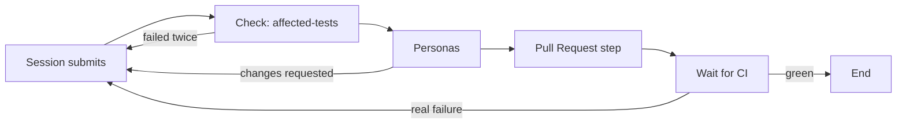
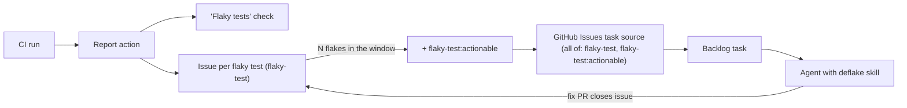

# Flake-aware testing: touched tests locally, the full suite in CI

Workflows should stop making the operator's laptop the bottleneck. A workflow runs only the
tests the change touched on the laptop, relies on the full suite in GitHub CI, and treats
flaky tests as something to report and fix rather than a reason to send an agent back for
another repair round.

Settled through a six-round grilling session (30 decisions). It was prompted by the Shape this
work (PR #21), where three repair rounds in a row were spent on unrelated tests that timed out
under laptop load: a worktree preview time limit, an unnamed test whose name the repair packet
cut off, and an Electron spawn.

## Goals

- A workflow can run **only the touched tests** locally, and still be trusted, because it
  waits for the **full suite in GitHub CI** before it finishes.
- CI **identifies flaky tests** (failed, then passed on one rerun), stays green when flakes
  are the only problem, and **reports** them where people and agents can see them.
- The **GitHub Inspector** sees the flake report and raises it only when the PR under review
  plausibly caused the flake.
- **Flake history** is durable, and an agent can be pointed at it to **fix flaky tests** at
  their cause.
- Testing on the laptop **stops piling up**: one test command at a time across worktrees, at
  a lower concurrency.
- It is a **Mission Control product feature** that any repository can adopt, with a
  once-per-repository **setup skill** that brings a repository into the contract.

## Non-goals

- Quarantine. No flaky test is skipped automatically, and there is no quarantine label. Flakes
  already do not block a merge, so quarantine would only hide tests that still catch real bugs.
  Revisit only if the "Flaky tests" check becomes permanent noise.
- A pluggable flake-history backend. GitHub Issues is the only store. The flake report format
  is the stable part; a second store gets an interface when one is actually needed, the way
  task sources grew one.
- A second copy of history in Mission Control's database. History lives in GitHub.
- Changing the existing built-in workflows in place. The new shape ships as a new workflow.

## Background: how things work today

- A workflow Check runs one command per slot (`test`, `lint`, `typecheck`, `build`) from a
  machine-wide catalog with per-repository overrides. The command receives the repository, the
  head commit and a subfolder. It gets no base commit and no changed files.
- Any non-zero exit fails the Check, and the repair packet quotes the last few KB of output.
  There is no idea of a flaky test, and the failing test's name can be cut off.
- No workflow step waits on GitHub CI. CI follow-through is only an instruction in the Pull
  Request step's packet, and Personas never see CI results.
- The Inspector reads the PR diff, its comments and threads, and the overall CI state. It does
  not read individual checks, job summaries, logs or artifacts.
- CI runs the unit suite in 6 shards per Node release and the e2e suite in 15 shards. Unit tests
  have no retry, no machine-readable reporter, no artifacts and no job summary. Playwright
  retries once in CI, and nothing reports what that retry caught.
- The GitHub Issues task source matches issues carrying any one of a list of labels. It cannot
  require all of several labels, or exclude one.

## Design

### 1. Local touched tests (`affected-tests`)

A new check slot, `affected-tests`, is appended to the fixed slot list. Its command is a
template with two placeholders:

- `{files}`: the selected test files.
- `{junit}`: a path Mission Control reads JUnit XML results from.

Example for this repository:

```sh
node --test --import ./test/setup-state.mjs --import tsx --test-reporter=junit --test-reporter-destination={junit} {files}
```

Mission Control selects the tests, from the project's settings:

1. Test files the diff changed or added, matched by the project's test-file patterns.
2. Tests that import a changed file, directly or indirectly. This uses a built-in JS/TS import
   resolver. For other languages this step is skipped, and selection is (1) plus (3).
3. The **smoke set**: patterns that always run, for registry-style tests that any change can
   break (for this repository, the route-surface oracle and the telemetry manifest are the
   obvious members).

The base for "changed" is the merge base with the repository's default branch.

Behaviour:

- An empty selection skips the step and passes with a note saying nothing was selected.
- When tests fail, Mission Control reads `{junit}`, reruns only the failed files once with the
  same template, and fails the Check only for tests that fail both times. A test that passes on
  the rerun is reported in the Check's result as a local flake. It does not fail the Check and
  is not recorded in flake history, because local flakes mostly measure laptop load.
- The repair packet quotes the failing tests' names and messages from the JUnit results, not
  the raw end of the output.

### 2. Project testing settings (`.mission/testing.json`)

Selection settings are knowledge about the project, so they are committed to the repository and
reviewed like code:

```json
{
  "tests": {
    "patterns": ["test/**/*.test.ts"],
    "includeImporters": true,
    "smokeSet": ["test/route-surface-oracle.test.ts", "test/telemetry-primary-actions.test.ts"]
  },
  "flakes": {
    "label": "flaky-test",
    "actionableLabel": "flaky-test:actionable",
    "actionableAfter": 3,
    "windowDays": 30
  }
}
```

- A gitignored `.mission/testing.local.json` overrides the committed file **key by key**. A key
  set locally replaces the committed value, and a list replaces a list, so a local file can
  remove something (for example a slow smoke test) and stays small.
- Mission Control shows the effective settings and marks which values came from the local file.
- CI never has the local file, so everything CI reads (the `flakes` block) comes from the
  committed file only.
- The `affected-tests` command template itself stays a machine-local Command override, like
  every other slot.

### 3. Laptop load controls

- A **machine-wide test lease**: only one test Command (`test` or `affected-tests`) runs at a
  time across all worktrees on the machine. Others wait, the way e2e runs already wait for the
  e2e host lease.
- **Lower test concurrency for checks**: a Check's test command runs with a lower concurrency
  (this repository reads `MISSION_TEST_CONCURRENCY`).
- Both are settings.

### 4. Flake reporting in CI

A **report action** turns JUnit XML into a flake report:

1. The test job runs the suite with a JUnit reporter.
2. **Rerun**: by default the action reruns only the failed test files once, from a rerun
   command template with the same `{files}` and `{junit}` placeholders. When the test runner's
   own retry output already shows which tests flaked (Playwright does), the action reads that
   instead of rerunning.
3. A test that failed and then passed is a **flake**. A test that failed both times is a **real
   failure**.
4. The action publishes:
   - a neutral **"Flaky tests"** check on the commit, whose summary lists each flake with its
     error snippet and a link to its history issue
   - a job summary with the same content
   - the report as an artifact, in Mission Control's flake report format
5. The test job itself stays green when flakes are the only failures, and fails on any real
   failure.

**Distribution**: the action is **copied into each repository** by the setup skill (for example
`.github/actions/mission-flake-report/`), pinned to a version. Mission Control can update the
copy later. Copying works for any repository owner and avoids needing access to this private
repository.

### 5. Flake history in GitHub Issues

The report action also keeps history, so it covers every CI run, including pushes to `main` and
PRs that Mission Control did not open:

- **One issue per flaky test**, labelled with the configured flake label (default `flaky-test`).
  The first flake opens the issue, and each later occurrence adds a comment with the branch or
  PR, commit, run link, error snippet and time. The issue shows the occurrence count.
- When a test reaches `actionableAfter` occurrences (default 3) within the last `windowDays`
  (default 30), the action adds the configured actionable label (default
  `flaky-test:actionable`).
- The fix PR closes the issue in the normal way, and the actionable label is removed. If the
  test flakes again, the action reopens the issue and counting starts fresh from the reopen.
- The CI job needs `issues: write` and `checks: write`. The setup skill checks for both.

### 6. The "Wait for CI" workflow step

A new workflow step kind, placed after the Pull Request step. It watches the pushed commit's
checks:

| Outcome | What the step does |
| --- | --- |
| All green, including green with flakes | Passes, and records the flake summary in the run |
| A real failure | Fails, with a repair packet naming each failing check and quoting its failure summary |
| Timed out (default 45 minutes) | Does not pass, and says it timed out |
| No checks at all, or no "Flaky tests" check | Does not pass, and says CI is missing or not set up for flake reporting |

- A failure uses the existing repair-round limit. After each repair push, the step watches the
  **new** commit, never an earlier green result.
- Absent or incomplete CI is never reported as passing.

### 7. The new built-in workflow

"No-Mistakes Review (Affected tests)":



- The existing No-Mistakes workflows are unchanged. You choose the new one per task kind under
  Dispatch defaults.
- Once it has proven itself on this repository, the kind defaults switch to it.

### 8. Inspector

- The Inspector reads the "Flaky tests" check summary for the PR's current commit and includes
  it in its review.
- By default flakes are informational. It raises a finding only when a flaky test is one this
  PR added or touched, or the PR plausibly introduced the flakiness, and it links the test's
  history issue.

### 9. Cleanup: from flake issues to fixes



- The GitHub Issues task source gains **"all of these labels"** and **"none of these labels"**
  next to today's "any of these labels". A source can then pick up exactly the actionable flake
  issues, for example all of `flaky-test` and `flaky-test:actionable`, none of `wontfix`.
  Existing sources behave as before. The Jira source is unchanged, since JQL already does this.
- A new **`deflake` skill** in Mission Control's skills catalog, which the task's instructions
  invoke. It tells the agent to:
  - read the issue's occurrence history
  - reproduce the flake under load (repeat the test, raise concurrency, run it alongside a
    CPU-heavy process)
  - find the timing dependency and fix its cause
  - loosen a timeout only when the limit itself is wrong, and say why in the PR
  - prove the fix with a before/after repeated run
  - close the issue from the PR

### 10. Setup skill (once per repository)

A skill in Mission Control's catalog, started as an ordinary task from a "Set up flake-aware
testing" action on the repository:

1. **Audit** the repository against the contract: a test runner that can emit JUnit XML, the
   rerun command template, the report action in CI and its version, the `checks: write` and
   `issues: write` permissions, the `affected-tests` command template, test-file patterns and a
   proposed smoke set.
2. **Propose** the changes in one approval form.
3. **Apply** after approval: open a PR with the CI and test-script changes, the copied report
   action, `.mission/testing.json` and the `.gitignore` entry for the local file, and set
   Mission Control's `affected-tests` command template for the repository.
4. **Verify**: run the new `affected-tests` command once locally, and after the PR merges
   confirm the "Flaky tests" check appears on a CI run.

Run again later, it detects an outdated copy of the report action and offers the update.

## Phases

Each phase is usable on its own.

1. **Laptop relief**: the `affected-tests` slot, selection from `.mission/testing.json` and its
   local override, the `{files}`/`{junit}` template with one local rerun and JUnit-based repair
   packets, the machine-wide test lease, and check concurrency settings.
2. **Flake reporting in CI**: the report action, the "Flaky tests" check, and the flake issues
   with the actionable threshold, proven on this repository's CI.
3. **Wait for CI step** and the new built-in workflow.
4. **Inspector** reads the flake summary.
5. **Setup skill**: audit, apply after approval, verify.
6. **Cleanup**: task source "all of" and "none of" labels, and the `deflake` skill.

## Open verification

- Whether Node 24 has `--test-rerun-failures`. Node 26 does. The report action's default rerun
  only needs the failed files and the rerun template, so it does not depend on this flag.

## Decisions

Numbers follow the grilling session. Q21 and Q25 were never asked.

| # | Decision | Chosen |
| --- | --- | --- |
| Q1 | Product feature or this repository only | A Mission Control product feature |
| Q2 | What relying on CI means | The workflow waits for green CI; a real CI failure is a repair round |
| Q3 | What counts as touched tests | Changed tests, plus importers, plus a smoke set, adjustable per project |
| Q4 | What a flake does to CI | CI stays green, with a separate neutral "Flaky tests" check |
| Q5 | Reruns before a failure is real | One rerun of the failed files |
| Q6 | Local flakes | Rerun once locally; only CI flakes are recorded |
| Q7 | Who selects touched tests | Mission Control, from per-project settings |
| Q8 | How a workflow asks for touched tests | A new `affected-tests` check slot |
| Q9 | Wait for CI behaviour | As in section 6, with a 45-minute default limit |
| Q10 | Flake report format and producer | Mission Control's format, built from JUnit XML by a report action; plus a setup skill |
| Q11 | Inspector and flakes | A finding only when the PR plausibly caused the flake |
| Q12 | Where history lives | Outside Mission Control, GitHub by default |
| Q13 | What starts cleanup | Flake issues through a task source, at a configurable actionable threshold (default 3) |
| Q14 | Laptop load controls | A machine-wide test lease and lower check concurrency, both settings |
| Q15 | GitHub store | One issue per flaky test, with a dedicated flake label |
| Q16 | Pluggable history | GitHub only, no provider interface yet |
| Q17 | Setup skill scope | Audit, apply after approval, verify |
| Q18 | Who reruns in CI | The report action by default; a runner's own retry output when it shows flakes |
| Q19 | Local command contract | A template with `{files}` and `{junit}` placeholders |
| Q20 | Cleanup instructions | A `deflake` skill |
| Q22 | Quarantine | None for now |
| Q23 | How the workflow is offered | A new built-in workflow; defaults switch once proven |
| Q24 | Where project settings live | `.mission/testing.json`, with a gitignored `.local` override |
| Q26 | Shipping order | The six phases above |
| Q27 | Local file merge | Key by key; lists replace lists |
| Q28 | Actionable threshold | In `.mission/testing.json`: 3 occurrences in 30 days; label names configurable |
| Q29 | Task source label matching | Add "all of" and "none of" to the GitHub Issues source |
| Q30 | Report action distribution | Copied into each repository by the setup skill, pinned to a version |
