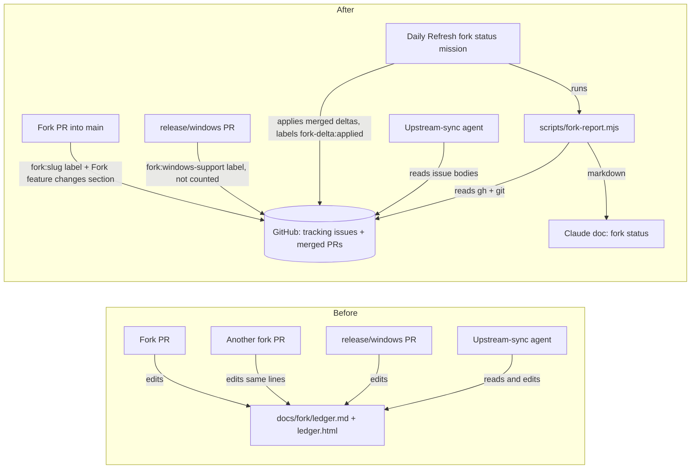

# Track fork changes in GitHub issues and PRs, with a generated Claude doc, instead of the fork ledger

Status: shaped on 2026-10-07 from the shape task "The ledger often causes conflicts between PRs
leading to additional rounds of conflict solving. Plan a different way to keep track of the
changes. Use github issues and PRs as a history and keep a claude artifact updated with the
latest data. Only keep track of changes in main, plan how the changes in release/windows will be
tracked once it's merged on main". Decisions recorded from four interview rounds. Approved as
written by the operator the same day in the plan review, which also settled decision 26, with
"Create tickets after the plan merges" chosen as the follow-up. Revised in Plan Validation repair round 1: the migration became a reconciling upsert
that is rerun right before merge (decision 27), the recurring mission is created paused and
enabled only after the merge (decision 28), and the label and issue writes of decision 10 gained
a recorded standing grant and a refresh fallback (decision 29). These refine the mechanisms of
decisions 10, 20, 23 and 24 and do not change any answer the operator gave. Not implemented.

## Problem

`docs/fork/ledger.md` (1,535 lines) and its hand-rendered `docs/fork/ledger.html` (1,979 lines)
record every fork feature against upstream. `AGENTS.md` makes every fork PR that adds or changes
a feature edit both files in the same PR. Two parts of the ledger are shared by every PR: the
"At a glance" table, where each PR appends its number to a row, and the status header. Any two
PRs open at the same time therefore conflict on the same lines, and whichever merges second
needs another round of conflict solving and CI. The ledger has 88 commits on `main`.

`release/windows` makes this worse. Its PRs edit the ledger too (for example #265 and #273),
even though [docs/windows-branch-sync.md](../../windows-branch-sync.md) says the ledger is not
updated there. The weekly main-into-release/windows sync then conflicts on the same file.

The ledger has two readers, and both must keep working:

- **The upstream-sync agent** checks each new upstream commit against every active feature's
  behavior contracts, assumed upstream behavior and upstream surfaces
  ([docs/upstream-sync.md](../../upstream-sync.md) section 2), and updates statuses and the
  ahead/behind header afterwards (section 7).
- **The human** reads the status header and the at-a-glance table to see where the fork stands.

## Where the ledger is referenced today (verified 2026-10-07)

| File | Reference |
| --- | --- |
| `AGENTS.md` | "Fork" section: every feature PR updates its ledger entry and re-renders the HTML |
| `docs/upstream-sync.md` | Intro, section 2 (check commits against the ledger), section 6 (fork-only docs), section 7 (update the ledger), section 9 (Conceptual conflicts lists ledger entries) |
| `docs/windows-branch-sync.md` | Lines 104 and 168: the Windows entry's surfaces, and "the ledger is not updated by this sync" |
| `docs/README.md` | Line 59: index link to the ledger and its rendering |
| `.agents/memory/upstream-sync.md` | Line 15: check new commits against the ledger's active entries |
| `.github/workflows/ci.yml` | Line 538: a comment pointing at the CI time-to-green ledger entry |
| `docs/plans/*` | Historical plans that link the ledger. They are records of past decisions and are not edited. |

No test reads `docs/fork/`, so deleting it turns no test red.

## Decisions (recorded from the interview)

| # | Question | Answer |
| --- | --- | --- |
| 1 | Where each feature's sync-critical detail lives (intent, behavior contracts, assumed upstream behavior, surfaces touched, fork-only files) | In the feature's **tracking issue body**: one issue per feature, labeled `fork-feature`. The sync agent reads it with `gh`. |
| 2 | How a merged PR is tied to its feature | A **per-feature label** `fork:<slug>` on the PR and on the tracking issue. |
| 3 | Standalone fixes | Implicit: any PR merged into `main` with no `fork:*` label is listed as a standalone fix. |
| 4 | Fate of `ledger.md` and `ledger.html` | Migrate each entry into its tracking issue, then **delete both files**. A short `docs/fork/README.md` explains the system and links the doc. |
| 5 | When the Claude doc is refreshed | A **daily scheduled mission**, plus at the end of every upstream sync (see "Upstream sync" below). |
| 6 | How the snapshot is produced | A repo script, `scripts/fork-report.mjs`, turns `gh` data and `git` counts into markdown. The agent only writes that markdown into the doc. |
| 7 | How much the doc carries | Status header, feature table (status, PRs, tracking issue link), standalone fixes, and a one-line intent per feature. Contracts stay in the issues and the doc links them. |
| 8 | How status is recorded | An open issue means active. `fork-status:in-progress` marks an open feature that is not finished on `main`. A closed issue carries exactly one of `fork-status:superseded`, `fork-status:removed` or `fork-status:upstreamed`, plus a closing comment naming the date and the PR. |
| 9 | How a PR's contract change reaches the issue | The PR body carries a **"Fork feature changes"** section. The daily refresh applies it to the issue body once the PR has merged into `main`. |
| 10 | Who creates labels and tracking issues, and who labels each PR | The **pull-request step**. When it opens a PR, it applies the feature's label. For a new feature, it creates the `fork:<slug>` label and the tracking issue as part of opening the PR. |
| 11 | Which ledger entries are migrated | **All 18.** The 15 active entries become open issues. The 3 superseded or removed entries become closed issues with their `fork-status` label. Historic PRs are labeled from the at-a-glance table. |
| 12 | Windows support before `release/windows` merges | An open `fork:windows-support` issue labeled `fork-status:in-progress`. PRs into `release/windows` also carry `fork:windows-support`, but the report counts only PRs merged into `main`. |
| 13 | Windows support once `release/windows` merges | The single "feat: Windows support" merge PR is labeled `fork:windows-support` and carries the Windows contract and surface delta. The refresh applies it to the issue and clears `fork-status:in-progress`. The report lists the merge PR as "includes N release/windows PRs". |
| 14 | The ledger edits already on `release/windows` | On the weekly sync, `main`'s deletion wins. The sync agent first copies the branch's version of the Windows entry into `docs/plans/windows-support/merge-delta.md`, the draft of the merge PR's "Fork feature changes". `windows-branch-sync.md` gains this rule, and branch PRs stop editing the ledger now. |
| 15 | Open (unmerged) PRs in the snapshot | **Not shown.** Only PRs merged into `main` count. |
| 16 | Where the new rules are written | The `AGENTS.md` "Fork" section and `docs/fork/README.md` only. The upstream `skills/pull-request/SKILL.md` is not touched, so the upstream-sync conflict surface does not grow. |
| 17 | How the refresh knows a delta was already applied | It adds a `fork-delta:applied` label to the PR after applying it. |
| 18 | Shape of a "Fork feature changes" section | Full replacement text for each issue section it changes, grouped per feature, or the single word `none`. |
| 19 | When a scheduled run cannot reach the Claude Docs connector | It still applies deltas and labels, fails the doc write loudly through `report_status`, and leaves the generated markdown in `.tmp/fork-report.md` (gitignored). |
| 20 | How the one-off migration runs | A committed, idempotent `scripts/fork-migrate.mjs` that parses `ledger.md`. The implementing session runs it once under the task's explicit authorization, then deletes the ledger in the same PR. |
| 21 | PRs that are open while the ledger is deleted | On their next update from their base branch, the deletion wins. They move their ledger edit into a "Fork feature changes" section and label their PR. |
| 22 | Recurring mission settings | "Refresh fork status": daily at 08:00 local time, coalesce missed runs, skip if active, complete automatically, no PR. The task body grants the issue, label and doc writes. |
| 23 | Who creates the recurring mission | **The implementing session**, through the daemon (`POST /api/schedules`). |
| 24 | Delivery | **One phase, one PR**: both scripts with unit tests, the docs and `AGENTS.md` changes, the ledger deletion, the migration run and the first doc creation. The migration and doc creation run only after the human authorizes those writes. |
| 25 | Does the snapshot mention `release/windows` | **No.** Only `main`. The Windows issue's in-progress status is enough. |
| 26 | What "refresh at the end of every upstream sync" means, given that a sync's deltas apply only after its PR merges (plan review) | The runbook's hand-off tells the human to press **Run now** on "Refresh fork status" after merging the sync PR. Otherwise the next daily run catches it. The doc only ever shows merged state. |
| 27 | (Repair round 1, refines 20 and 24) How ledger edits that merge into `main` after the migration first runs reach the issues | `fork-migrate.mjs` is a **reconciling upsert**, not create-only: it rewrites each migrated issue's sections and status from the ledger and adds any missing PR label. The implementing session reruns it as the **last step before the merge**, after its final update from `main`, so the issues match the ledger as it stands at the merge. |
| 28 | (Repair round 1, refines 23) When the recurring mission starts | The implementing session creates "Refresh fork status" **paused** through `POST /api/schedules`. Its tasks run against `main`, where `scripts/fork-report.mjs` and `docs/fork/README.md` exist only after this PR merges. The PR's hand-off tells the human to press **Resume** on the mission after merging, and optionally **Run now**. |
| 29 | (Repair round 1, refines 10) How the pull-request step is authorized to create labels and issues | The approved decision 10 is recorded as a standing grant in the `AGENTS.md` "Fork" section: in this repository only, a session may create a `fork:<slug>` label, create its `fork-feature` tracking issue, and add `fork:*` labels to its own PR. When a session's authorization still refuses those writes, it writes the full issue body into its PR's "Fork feature changes" section instead, and the refresh creates the label and issue after the merge. |

## Design

### Flow, before and after



Before, every writer edits the same two files in git, so concurrent PRs conflict. After, PRs
only label themselves and describe their change in their own body. Issue bodies are written by
one serialized writer, the daily refresh, and only from PRs that have merged into `main`. The
Claude doc is regenerated in full each time. Nothing a PR writes is shared with another PR, so
there is nothing to conflict on.

### GitHub labels

| Label | On | Meaning |
| --- | --- | --- |
| `fork-feature` | Tracking issues | This issue is a fork feature's record. |
| `fork:<slug>` | Tracking issue and every PR of that feature | The join key. One label per feature, for example `fork:windows-support`. A PR may carry several. |
| `fork-status:in-progress` | Open tracking issue | The feature is not finished on `main`. Windows support starts with it. |
| `fork-status:superseded`, `fork-status:removed`, `fork-status:upstreamed` | Closed tracking issue | Why the feature is no longer active. Exactly one per closed issue. |
| `fork-delta:applied` | Merged PR | The refresh has applied this PR's "Fork feature changes" section. |

Slugs come from the ledger's entry headings, lowercased and hyphenated (for example "Per-task
base branch" becomes `fork:per-task-base-branch`). The migration script prints the slug table
for review before writing anything.

### Tracking issue

Title: `Fork feature: <name>`. Labels: `fork-feature`, `fork:<slug>`, and a `fork-status:*` label
when the feature is not plainly active. The body uses the ledger entry's fields as fixed
sections, so the refresh can replace them by heading:

```markdown
### Intent
### Behavior contracts
### Upstream behavior it assumes
### Upstream surfaces touched
### Fork-only files
### Plan docs
### Upstream candidate
```

The ledger's "PRs" field is not copied. The PR list is whatever GitHub returns for the label,
so it can never drift.

### "Fork feature changes" section in a PR body

Every PR that carries a `fork:*` label has this section, either holding the word `none` or one
block per feature:

```markdown
## Fork feature changes

### fork:per-task-base-branch
#### Behavior contracts
- (the complete new list, not a diff)
#### Upstream surfaces touched
(the complete new text)

### fork:windows-support
#### Status
active
```

Each `####` block replaces the issue section of the same name in full. A `#### Status` block
takes one of `active`, `in-progress`, `superseded`, `removed` or `upstreamed`, plus an optional
note. The refresh turns it into labels, closes or reopens the issue, and posts the closing
comment with the date and the PR number. A PR that creates a new feature already wrote the full
body when it created the issue (decision 10), so its section is `none` unless the PR changed the
issue body afterwards.

### `scripts/fork-report.mjs`

It is split into a pure `renderForkReport(data)` and a thin fetcher, so the renderer is
unit-tested without the network.

- **Inputs**, fetched with `gh` and `git` from a checkout with `origin` and `upstream` fetched:
  - every `fork-feature` issue, open and closed (number, title, state, labels, body, URL)
  - every PR merged into `main` (number, title, labels, head branch, merge date, URL)
  - for `fork:windows-support` only: the count of PRs merged into `release/windows` that carry
    the label, used for the "includes N release/windows PRs" note on the merge PR's row
  - the same `git` measurements the ledger's status header uses today: the upstream
    `package.json` version, the `upstream/main` SHA, and the ahead (with and without merges) and
    behind counts between `upstream/main` and `origin/main`
- **Output**, written to `--out` (default `.tmp/fork-report.md`):
  - **Status header**: last synced upstream version and SHA, the last sync PR (the newest
    merged PR whose head branch matches `sync/upstream-*`) and its date, the commit counts
    ahead and behind, the active feature count, and the measured-at SHA and time.
  - **Features**: one row per tracking issue, with name (linking the issue), status, the
    first sentence of its Intent, and the merged-into-`main` PRs carrying its label, ascending.
    Closed features follow the active ones.
  - **Standalone fixes**: merged-into-`main` PRs with no `fork:*` label, excluding upstream
    sync PRs.
- It never shows open PRs or anything only on `release/windows` (decisions 15 and 25).

### `scripts/fork-migrate.mjs`

A one-off migration that reconciles rather than only creates (decision 27). It parses
`ledger.md`'s entries and its "At a glance" table, and:

1. prints the plan: every label, every issue title with its slug, and every historic PR it
   would label. `--dry-run` stops here.
2. creates any missing label.
3. creates each tracking issue that has no issue with its `fork:<slug>` label yet. When the
   issue exists, it rewrites the issue's sections from the ledger entry where they differ. It
   sets each issue's state and `fork-status` label from the ledger, and closes the 3 superseded
   or removed ones with a closing comment carrying the ledger's date and sync PR, posted once.
4. labels every historic PR in the at-a-glance table with its feature's label and
   `fork-delta:applied`. Its contracts are already in the issue body, so the first refresh does
   not re-apply anything. "Pending" cells and issue numbers in the table are skipped.

Re-running it against an unchanged ledger makes zero writes. Against a ledger that changed, it
writes exactly the differences. Overwriting issue sections is safe only before this PR merges,
because nothing else writes issue bodies until the refresh mission is enabled (decision 28).

**The window between the first run and the merge.** Other fork PRs keep editing the ledger on
`main` until this PR merges. The implementing session therefore:

1. runs `--dry-run`, then the real migration, early, so the human can review the issues;
2. updates its branch from `main` as usual. Each modify/delete conflict on the ledger is
   resolved by keeping the deletion, as decision 21 says;
3. as its **last step before the merge**, runs the migration again against `main`'s current
   ledger (`git show origin/main:docs/fork/ledger.md`, passed with `--ledger`), so ledger edits
   merged after step 1 reach the issues;
4. records that final run's commit in the PR. If `main`'s ledger changes again before the human
   merges, the hand-off says to rerun step 3 first.

After the merge the ledger no longer exists on `main`, so the window is closed. The script can
be deleted in a later PR. It is not needed afterwards.

### Refresh procedure (the daily mission's task body, and `docs/fork/README.md`)

1. List PRs merged into `main` after this plan's PR merged that have no `fork-delta:applied`
   label and either carry a `fork:*` label or have a "Fork feature changes" section. Order them
   oldest merge first. The cut-over date is recorded in `docs/fork/README.md`.
2. For each one, apply its "Fork feature changes" section to each named issue: replace the
   named sections, and apply any Status block. When a section names a `fork:<slug>` whose
   label or tracking issue does not exist, create them from the section, which then carries
   the full issue body. Also add any `fork:*` label the PR is missing (decision 29). Then add
   `fork-delta:applied`. A labeled PR with `none`, or with no section at all, gets
   `fork-delta:applied` too. A missing section is reported in the run's summary so the human
   can backfill it.
3. Run `node scripts/fork-report.mjs`.
4. Replace the Claude doc's whole content with the output through the Claude Docs connector.
   If the connector is unavailable, call `report_status` with the failure and leave
   `.tmp/fork-report.md` in place (decision 19). Steps 1 and 2 have already happened.

The mission writes no repository files, so it opens no PR. Its tasks run against `main`, so it
is created paused and enabled only after this plan's implementation merges (decision 28).

### The Claude doc

One Claude Docs doc named "Mission Control fork status", created once by the implementing
session through the Claude Docs connector. Its link goes in `docs/fork/README.md` and in the
mission's task body. Each refresh replaces its full content, so nothing in it is hand-edited.

### Upstream sync

[docs/upstream-sync.md](../../upstream-sync.md) changes:

- **Section 2** reads the active features from GitHub instead of the ledger:
  `gh issue list --label fork-feature --state open --json number,title,labels,body`. It then
  reads, but does not apply, the "Fork feature changes" sections of PRs merged into `main` that
  still lack `fork-delta:applied`, and overlays them on the issue text it checks. This covers
  the up-to-a-day lag with reads only, so the sync session needs no issue-write grant and the
  sync mission's task body does not change. The checks
  against each issue's Behavior contracts, Upstream behavior it assumes, and Upstream surfaces
  touched sections are unchanged, as is the PR's "Conceptual conflicts" section.
- **Section 7** stops editing files. The sync PR carries the upstream-sync feature's `fork:<slug>` label
  and a "Fork feature changes" section with a `#### Status` block for each feature the sync
  supersedes, removes or upstreams, and replacement surface text for each feature whose paths
  moved. The status header is no longer hand-measured, because the report computes it.
- **The doc refresh at the end of a sync** (decisions 5 and 26): sync deltas are applied only after the
  human merges the sync PR. A sync session ends at the open PR, so it cannot refresh the doc
  itself. The runbook's hand-off tells the human to press **Run now** on "Refresh fork status"
  after merging the sync PR. If they don't, the next daily run catches it.
- The `.agents/memory/upstream-sync.md` line and the section 6 list of fork-only docs are
  updated to match.

### `release/windows`

- **Now (in this PR, on `main`):** [docs/windows-branch-sync.md](../../windows-branch-sync.md)
  gains the rule that PRs into `release/windows` carry `fork:windows-support` and never edit
  `docs/fork/`. The line-168 note is rewritten to match. The Windows tracking issue is created
  open, with `fork-status:in-progress`, from `main`'s version of the entry.
- **The first weekly sync after this merges** meets a modify/delete conflict on
  `docs/fork/ledger.md` and `ledger.html`. Following decision 14, the sync agent copies the
  branch's "Windows support" entry from `release/windows` into
  `docs/plans/windows-support/merge-delta.md`, written in the "Fork feature changes" format,
  then resolves the conflict by deleting both ledger files. Under D27, dropping a Windows change
  needs the human. That does not apply here, because the entry's text is kept, not dropped.
- **Until the merge:** branch PRs that change the Windows contracts update `merge-delta.md` on
  `release/windows`. That file lives only in the branch's plan folder, so it never conflicts
  with `main`.
- **At the merge:** the "feat: Windows support" merge PR into `main` carries the
  `fork:windows-support` label, and its "Fork feature changes" section is `merge-delta.md`'s
  content plus `#### Status` `active`. After the human merges it, the refresh applies it,
  removes `fork-status:in-progress`, and the report lists that one PR with "includes N
  release/windows PRs". The branch's individual PRs never appear as `main` changes.

### Transition for open PRs

Several PRs are open while this lands, on `main` and on `release/windows`, and some carry
ledger edits. On their next update from their base branch, each hits a modify/delete conflict
on the ledger. Each resolves it the same way: keep the deletion, move the edit into a "Fork
feature changes" section in the PR body, and add the feature's label (decision 21).
`docs/fork/README.md` states this so an agent resolving the conflict finds the rule.

## Changes

| Path | Change |
| --- | --- |
| `scripts/fork-report.mjs` | New: renderer plus fetcher, as above |
| `scripts/fork-migrate.mjs` | New: one-off idempotent migration, as above |
| `test/fork-report.test.ts` | New: renderer cases from fixture JSON |
| `test/fork-migrate.test.ts` | New: ledger parsing and slug derivation against a fixture ledger excerpt |
| `docs/fork/ledger.md`, `docs/fork/ledger.html` | Deleted |
| `docs/fork/README.md` | New: the labels, the issue template, the "Fork feature changes" format, the refresh procedure, the transition rule, the mission's settings and the doc link |
| `AGENTS.md` | The "Fork" section's ledger rule becomes: label the PR `fork:<slug>`, create the label and tracking issue for a new feature, and write a "Fork feature changes" section, linking `docs/fork/README.md`. It also records the standing grant for those writes, in this repository only, and the fallback when a session's authorization refuses them (decision 29). |
| `docs/upstream-sync.md` | Sections 2, 6, 7 and 9, and the intro, as above |
| `docs/windows-branch-sync.md` | Branch PR labeling, no ledger edits, the `merge-delta.md` rule, and the first-sync conflict resolution |
| `docs/README.md` | The index line points at `docs/fork/README.md` |
| `.agents/memory/upstream-sync.md` | Reads the tracking issues instead of the ledger |
| `.github/workflows/ci.yml` | Line 538 comment only: points at the CI time-to-green tracking issue. Comment-only, so it is in scope and changes no CI behavior. |
| `docs/plans/fork-tracking/` | This plan |

Historical plans under `docs/plans/` keep their ledger links. They record the decisions of
their time, and `scripts/check-doc-links.mjs` is the check that says whether a dead relative
link must be fixed. If it flags them, the implementing PR repoints those links at
`docs/fork/README.md`.

## External writes the implementation needs authorized

The implementing task's body must grant these, because a session's default authorization covers
only its own PR (decision 24):

- creating 24 labels (`fork-feature`, 18 `fork:<slug>`, 4 `fork-status:*`, `fork-delta:applied`), 18 tracking issues, and the closing comments on 3 of them
- labeling the historic PRs listed in the at-a-glance table (about 70)
- creating the Claude doc through the Claude Docs connector
- creating the "Refresh fork status" recurring mission, paused, through `POST /api/schedules`
  (decision 28)
- rerunning the migration as the last step before the merge (decision 27)

Feature sessions after this lands get their label and issue grant from the `AGENTS.md` "Fork"
section (decision 29). The daily mission gets its grant from its own task body.

## Verification

- `node --test --import ./test/setup-state.mjs --import tsx test/fork-report.test.ts test/fork-migrate.test.ts`:
  rendering of active, in-progress and closed features, standalone-fix exclusion of sync PRs
  and labeled PRs, the Windows "includes N" note, ledger parsing of all 18 entries, and the
  slug table.
- `node scripts/fork-migrate.mjs --dry-run` output attached to the PR, reviewed before the real
  run, and a second real run that reports zero writes, proving idempotence. A unit case also
  proves the reconcile: an issue whose section differs from a changed ledger entry is rewritten,
  and a PR label added to the at-a-glance table is applied.
- The final pre-merge rerun against `origin/main`'s ledger (decision 27), with its write count
  and commit recorded in the PR.
- `node scripts/fork-report.mjs` output attached to the PR, compared by hand with the deleted
  ledger's status header and at-a-glance table. The counts and PR lists match, apart from the
  intended drops: open PRs, issue numbers, and `release/windows` PRs.
- After the merge and **Resume**, one manual run of the refresh procedure on a throwaway PR
  body: once for a feature whose label exists, and once for a `fork:<slug>` with no label or
  issue (the decision 29 fallback). The throwaway issue and label are deleted afterwards.
- `npm run typecheck`, `npm run lint` and `npm run docs:links`.
- No UI surface changes, so no Playwright spec is needed.

## Assumptions and risks

- **The Claude Docs connector is reachable from a daemon-dispatched session.** This shaping
  session has it, and dispatched sessions run under the same signed-in Claude Code on this
  machine. That is inferred, not verified. Decision 19 makes the failure loud rather than
  silent.
- **Up to a day of lag.** An issue body reflects a merged PR only after the next refresh. The
  upstream-sync agent reads the unapplied merged deltas and overlays them, without writing
  (see "Upstream sync").
- **A session's harness may still refuse the decision 10 writes** despite the `AGENTS.md`
  standing grant, for example when a Mission Control execution authorization block names
  only its own PR. The refresh fallback in decision 29 then creates the label and the issue
  after the merge, so the feature is never lost. It shows as a standalone fix for at most
  one refresh cycle.
- **Label discipline.** A feature PR that forgets its label is listed as a standalone fix. That
  is visible in the doc and fixed by labeling the PR. No conflict round is needed.
- **Issue bodies are editable by hand.** A hand edit is overwritten only in the sections a
  later delta replaces. The issue's edit history is the audit trail.

## Out of scope

- Changing the upstream `skills/pull-request/SKILL.md` (decision 16).
- Tracking `release/windows` PRs as `main` changes before the merge (decisions 12 and 25).
- A dashboard surface for fork status. The Claude doc is the reading surface.

## Rendering

`plan.html` is generated from this file by `node docs/plans/fork-tracking/render-plan.mjs`,
which inlines `flow.svg` in place of the mermaid block. `--check` fails when the page is stale.
