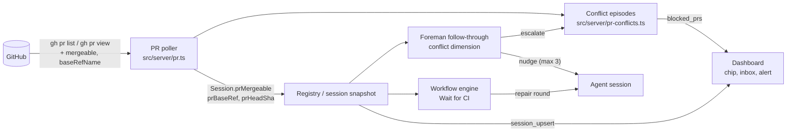

# React to pull requests blocked by merge conflicts

When a session's pull request conflicts with its base branch, Mission Control does nothing
about it. GitHub reports the PR as `CONFLICTING`, CI often stops running, and the PR sits
there. The agent is not told, the card shows nothing, and the operator finds out only by
opening GitHub.

This plan adds one conflict signal to the PR poller Mission Control already runs. Three
reactions consume it:

- Foreman nudges a live session to merge the base branch in.
- A workflow that owns the session treats the conflict as a repair round.
- The operator is alerted, and an inbox row is added, only when nothing else is handling the
  conflict.

The PR chip on cards and the session header shows the conflict in every case.

Settled in two grilling rounds (12 decisions) and the plan review (decisions 13 to 15), all
recorded below. Approved in the plan review on 2026-10-04 with Create tickets as the
follow-up. Single phase.

GitHub Inspector review on PR #103 (rounds 1 to 4) made these changes:

- A conflict in a workflow-owned session whose run can no longer reach a Wait for CI node is
  surfaced as `workflow-not-gating`. Round 2 narrowed this from "not at one right now".
- Episodes and escalations are matched by PR URL alone.
- Foreman re-sends an escalation, so it survives a daemon restart. In round 3, the daemon's
  escalated flag reaches Foreman on the session snapshot, so it survives a Foreman restart too.
- An open conflict episode keeps its PR on the by-URL poller, so an exited session with no task
  still reaches `session-gone` and clears once the conflict is fixed (round 4).

Each is marked "Inspector review" where it appears.

Workflow repair round 1 (Plan Validation) made two changes. It bound the kept mergeability
observation to the head it was observed on (§1, §3, §4, Edge cases). It also extended the E2E
spec to the session header and the settings toggle, on a task-backed session (Testing). These
changes are marked "repair round 1" where they appear. No recorded human answer changed.

## Goals

- Every open PR a live session or a task owns is checked for conflicts, with no Inspector, YOLO
  mode or workflow required. A PR with an open conflict stays checked until the conflict closes,
  even after its session exits.
- A live session that Foreman may drive is told to resolve the conflict, and the number of
  nudges is capped.
- A workflow-owned session gets the conflict as an ordinary repair round instead of waiting
  45 minutes for `ci_missing`.
- The operator is interrupted only when a human is actually needed: the session has gone,
  Foreman cannot drive it, or the nudges ran out.
- A conflicting PR is visible on its chip whatever else is going on.

## Non-goals

- **A PR that is behind its base without conflicting.** That remains
  [`pr-behind-base`](../pr-behind-base/plan.md), unchanged.
- **Rebasing, force-pushing, or the daemon resolving conflicts itself.**
- **Automatically resuming an exited session, or filing a follow-up task for it.** The operator
  decides.
- **Changing YOLO auto-merge.** Its `conflicting` gate (`src/shared/shipping.ts:242`) keeps
  reading the Inspector's own `mergeable`.
- **A conflict label in the Shipping panel when YOLO is off.**
- **Persisting conflict state across daemon restarts.** See [Edge cases](#edge-cases).

## Recorded decisions

| # | Decision | Answer |
|---|----------|--------|
| 1 | Scope | Conflicts only: GitHub `mergeable == CONFLICTING`. `pr-behind-base` stays its own plan. |
| 2 | Signal source | Add `mergeable` to the existing 20s `gh pr list` poller and store it as `Session.prMergeable`. `UNKNOWN` means no change. |
| 3 | Live session | A third Foreman PR follow-through dimension, beside failing CI and review comments, with a new `trackMergeConflicts` setting that defaults to on. |
| 4 | Exited session or freed worktree | Attention only. The operator resumes the session or dispatches new work. |
| 5 | Visibility | A mark on the PR chip (cards and session header), **and** an attention reason (desktop alert plus inbox row). Not the Shipping label. |
| 6 | Workflow-owned session | The workflow reacts. Wait for CI and the Pull Request action's CI contract treat `CONFLICTING` as a repair round. |
| 7 | Resolution method | Merge the base branch into the PR branch, resolve the conflicts, run focused tests, push. Never rebase or force-push. |
| 8 | When attention fires | Only when nothing is handling the conflict: the session exited, Foreman cannot nudge it, or the nudges ran out. |
| 9 | Inbox placement | A new **Blocked pull requests** section after Pipeline halts. Each row shows the PR, repository, base, and owning task or session, with links to the PR and the session. The row clears itself when the conflict goes away. |
| 10 | Re-nudge policy | Once per PR head SHA while the PR stays `CONFLICTING`, at most 3 nudges per conflict episode, then escalate to attention. The episode re-arms when the PR becomes mergeable. |
| 11 | Workflow repair budget | A conflict repair is an ordinary repair round with a conflict-specific packet, and it counts against the run's budget. |
| 12 | Workflow signal | The workflow gates read `Session.prMergeable` from the 20s poller, not the Inspector. |
| 13 | Episode persistence (plan review) | In memory. No migration. A restart can allow up to 3 more nudges, which is still bounded. |
| 14 | Give-up threshold (plan review) | 2 minutes settled-idle on the nudged head while the PR is still `CONFLICTING`. |
| 15 | Follow-up (plan review) | Create tickets after the plan merges. |

## How it works today (verified)

- **PR poller** (`src/server/pr.ts`, every 20s, always on).
  - For live sessions it calls `gh pr list --head <branch> --json url,number,state,statusCheckRollup,createdAt,mergedAt,headRefOid` (`pr.ts:99`).
  - For task PRs whose session has gone, it calls `gh pr view <url> --json state,mergedAt` (`pr.ts:173`). This covers every task in an active, `failed` or `cancelled` status (`completableByMerge`, `registry.ts:9459`).
  - It reads no mergeability.
- **Inspector** (`src/server/inspector/github.ts:279`) is the only reader of `mergeable`.
  - It is off by default and sees only adopted PRs.
  - Its only consumer is the YOLO gate, which writes `merge_block` and re-checks forever without telling anyone.
- **Foreman PR follow-through** (`src/server/foreman/review-followup.ts`) types a nudge into a settled-idle, invited session for two things: posted Inspector findings and failing CI.
  - The de-duplication mark (`FollowupMark`) is in memory and kept per PR.
  - An active workflow suppresses it (`review-followup.ts:276`).
- **Wait for CI** (`src/shared/wait-for-ci.ts:218`) decides from the Inspector's check observation.
  - GitHub Actions `pull_request` workflows do not run on a conflicting PR. The node therefore waits until it blocks with `ci_missing` (45 minutes by default).
- **Workflow PR CI contract.** `workflowPullRequestCiContract` (`src/server/workflows/agent-contract.ts:5`) is added to Pull Request actions that have no Wait for CI node after them. It says nothing about conflicts.
- **Attention inbox and alerts** (`src/web/lib/attention.ts`, `src/shared/alerts.ts`) are derived in the browser from state the daemon publishes. No reason covers a PR.

## Design

### 1. The signal (`src/server/pr.ts`)

- Add `mergeable,baseRefName` to the `--json` list in `queryPr`. Add `mergeable,baseRefName,headRefOid` to `queryPrUrl`.
- Normalise GitHub's value to a shared `PrMergeable = "mergeable" | "conflicting"`, defined in `src/shared/`.
  - `UNKNOWN` maps to "no observation". The reconciler keeps the previous observation, the same way the `"error"` lookup is handled today.
  - GitHub computes mergeability lazily, so the first read after a push is often `UNKNOWN`.
- New session snapshot fields (`src/shared/types.ts`):
  - `prMergeable: { state: PrMergeable; headSha: string } | null`. This is **an observation bound to the head it was made on** (repair round 1). `headSha` is the `headRefOid` GitHub returned in the same response that carried the definitive `MERGEABLE` / `CONFLICTING`.
  - `prBaseRef: string | null`
  - `prHeadSha: string | null`, the PR's current head, which advances on every read.

  They are set and cleared exactly when `prState` / `prChecks` are, with one exception. On `UNKNOWN`, `prHeadSha` advances to the new head, but `prMergeable` is kept **whole, including its old `headSha`**. A kept observation therefore never claims to describe a head GitHub did not report it for. A multi-repo task carries the same three fields on each `repoPrs[].feedback` entry.
- **One reading rule** for every consumer. `currentMergeability(pr)` in `src/shared/` returns `prMergeable.state` only when `prMergeable.headSha === prHeadSha`, and `null` otherwise. `null` means "not yet known for this head".
  - The chip, conflict episodes and Foreman read through it.
  - Wait for CI compares the observation's own `headSha` with its `expectedHeadOid` (§4).
  - So the sequence "conflicting on head A, push head B, `UNKNOWN`" reads as unknown on B, never as conflicting on B.
- No schema change. These are live observations, like `prChecks`.

### 2. Conflict episodes (`src/server/pr-conflicts.ts`, new)

This is the one daemon-side owner of "is this conflict handled?". It is in-memory and keyed by PR URL.

- **Episode lifecycle.**
  - An episode opens on the first `conflicting` observation for the current head (`currentMergeability`), from either poll path.
  - It closes when the PR is observed `mergeable`, merged, or closed, or when no session and no task reference it any longer.
    - "No session" means the session was removed (`session_remove`). An exited session still references its PR (Inspector review, round 4).
  - **An open episode keeps its PR polled** (Inspector review, round 4).
    - `pr-conflicts.ts` contributes the URL of every open episode to the by-URL poller's harvest. It is deduplicated into `linkedUrls` but never into `operationalUrls`, so it gains no merge-completion authority.
    - That covers an exited session **with no task**, which `prPollTargets` (live sessions only) and `taskPrPollTargets` (task PRs only) both miss.
    - Its episode stays open as `session-gone`, raises attention per decision 4, and still closes when the conflict is fixed, merged or closed.
    - The extra polling is bounded by the number of open conflict episodes and ends when each one closes.
  - While the current head's mergeability is unknown, for example straight after a fix push, an open episode stays as it is. It is neither closed nor re-opened until GitHub answers for that head.
  - It records `since`, `baseRef`, `headSha`, `taskId`, `sessionId` and `escalated`.
  - **Identity is the PR URL alone.** `headSha` is the *latest* head observed `conflicting`, and it advances on every new conflicting head. It is a display and log field, never part of the episode's identity (Inspector review).
- **Unhandled reason.** An episode is *unhandled*, and becomes a blocked PR, when one of these holds:
  - `session-gone`: no live session owns the PR. The session exited or was removed, and the task's PR is seen only through the by-URL poller.
  - `foreman-cannot-nudge`: the owning session is live but Foreman will not type into it. The cases are:
    - `trackMergeConflicts` is off.
    - The session has no `foremanInvite`.
    - Foreman is dry-run or off.
    - The repository is not allowlisted.
    - The harness lacks `workQueue`, or the session lacks hooks.

    These are the same predicates `decideReviewFollowup` uses, imported rather than copied. The daemon already reads Foreman's config for `trackCiFailures` (`workflows/manager.ts:5340`).
  - `nudges-exhausted`: Foreman reported an escalation for this episode (see §3).
  - `workflow-not-gating`: an active workflow owns the session (`activeWorkflowOwnsSession`), so Foreman stays out, but **no Wait for CI node is reachable** from the run's active node(s) for this PR (Inspector review, round 2). There are two such cases:
    - The workflow has no Wait for CI node for this binding.
    - Every Wait for CI node is behind the active node. For example, the base moved after the last Wait for CI passed and the run is in a later node with no edge back to one.

    The Pull Request action's conflict line is read once at dispatch and cannot react later, so the conflict is surfaced to the operator.
  - **Handled by the workflow:** a Wait for CI node for this run's binding (the same repository, so the same PR) is the active node, or is reachable from it along the version graph's edges. That includes a run on the Pull Request action upstream of Wait for CI, and a repair round whose edges loop back to Wait for CI. Such an episode is not unhandled. That node fails on the conflict when the run reaches it and starts a repair round (§4), and the run's existing budget and `workflow-repeat` alerts take over from there.
    - Reachability is a pure graph walk over `version.graph` from the active node ids, in `src/shared/workflow.ts`. Membership is recomputed whenever the run changes, so an alert cannot flap as the run moves between nodes that can all still reach Wait for CI.
- **Publication.** The set of unhandled episodes goes out as a new `blocked_prs` snapshot `ServerEvent`. It is emitted when the set changes, and on connect. `src/web/useEventStream.ts` handles it exhaustively, per the change contracts.
- **Escalation on the snapshot** (Inspector review, round 3). The session snapshot carries `prConflictEscalated: boolean`, and the same flag sits on each `repoPrs[].feedback` entry. It is true while the PR's open episode is marked `escalated`. Foreman reads it through `followupPrs`, as it does every other PR fact.
- **Foreman's escalation route.** `POST /api/pr-conflicts/escalate` takes `{ prUrl, headSha }`. Its body is parsed with a Zod schema.
  - It finds the open episode **by `prUrl` alone** and marks it `escalated`. `headSha` is recorded as the head Foreman escalated on.
  - It does nothing only when no episode is open for that URL.
  - A cap escalation on the 4th conflicting head therefore always lands, even though that head is not the one the episode opened on (Inspector review).

### 3. Foreman: the conflict dimension (`src/server/foreman/review-followup.ts`, `worker.ts`)

- **Setting.** Add `trackMergeConflicts: z.boolean().default(true)` beside `trackCiFailures` (`src/shared/protocol.ts:2002`). Add its toggle, **Keep sessions on track with merge conflicts**, in Foreman settings beside the other two follow-through toggles (`src/web/components/ForemanBar.tsx:672`, `:682`). Gate 1 skips only when all three are off.
- **Feedback.** `feedbackState` gains `conflicting = cfg.trackMergeConflicts && currentMergeability(pr) === "conflicting"`. `FollowupPr` carries `mergeable` (the head-bound observation), `baseRef` and `headSha` from `followupPrs`.
  - A kept observation from an earlier head is not `conflicting`. A session that just pushed its fix is therefore neither nudged nor counted toward the cap while GitHub is still computing (repair round 1).
- **Mark.** `FollowupMark` gains:
  - `conflictHead: string | null`, the head SHA last nudged. It is the observation's own `headSha`.
  - `conflictNudges: number`.

  `advanceFollowupMark` resets both only when the current head is observed `mergeable`, which re-arms the episode. An unknown current head leaves the mark untouched.
- **When to nudge.** The current head is observed `conflicting`, that head is not `conflictHead`, `conflictNudges < 3`, **and the PR's `prConflictEscalated` is false**.
  - An escalated episode belongs to the operator. Foreman seeds `conflictEscalated = true` from the snapshot and stays silent until the episode re-arms (Inspector review, round 3).
  - So after a Foreman restart, the inbox row "Foreman's 3 nudges didn't resolve it" never coexists with a fresh nudge to the agent, and the human and the agent are never both fixing the same conflict. All other gates are unchanged: invite, live, idle, pane, no queue, no workflow, and live mode on an allowlisted repo. Delivery reuses the existing stamp-then-inject path, with rollback when delivery is confirmed undelivered.
- **When to escalate.** The worker calls the escalation route once per episode in either of these cases:
  - A new head is observed `conflicting` after 3 nudges.
  - The session has been settled-idle for 2 minutes (`CONFLICT_GIVE_UP_MS`) while the current head is still the one it was nudged about and is observed `conflicting`. In other words, the agent parked without pushing a fix. A new head, even one whose mergeability is still unknown, means the agent did push, and it does not count as giving up.

  The escalation is also logged and recorded as an episode, like the ship shepherd's escalations.
- **Escalation survives a daemon restart** (Inspector review, round 2).
  - The mark gains `conflictEscalated: boolean`.
  - While Foreman holds an escalated mark for a PR that is still observed `conflicting`, it re-sends the escalation at most once a minute (`CONFLICT_ESCALATE_RESEND_MS`).
  - The route is idempotent, so the re-send is a no-op on a daemon that already holds the flag. A restarted daemon re-learns `nudges-exhausted` within a minute instead of dropping the PR out of the inbox.
  - The mark resets, and re-sending stops, when the episode re-arms.
- **Payload.** `buildPayload` gains a conflict problem line: "it has merge conflicts with `<base>`". It also gains these steps:
  1. `git fetch origin <base>` and `git merge origin/<base>`.
  2. Resolve every conflict, keeping both sides' intent.
  3. Run the tests that cover the files you touched.
  4. Commit the merge and push to the same branch.
  5. Do not rebase or force-push.

  The existing "Do NOT open a new pull request" and multi-repo qualifiers still apply. When CI or findings are also open, they share one payload, as they do today.

### 4. Workflows (`src/shared/wait-for-ci.ts`, `src/server/workflows/engine.ts`, `agent-contract.ts`)

- **Wait for CI.** `decideWaitForCi` takes an extra `mergeability: { mergeable: PrMergeable; headSha: string; baseRef: string | null } | null` input.
  - The engine reads it from the bound session's `prMergeable` observation and `prBaseRef`, or from its `repoPrs` entry for a per-repository binding. It comes through the same seam as `observe`.
  - `headSha` is the **observation's own** head (`prMergeable.headSha`), never the session's current `prHeadSha`. A conflict observed on the pre-repair head therefore cannot match the post-repair `expectedHeadOid`. The node waits until GitHub answers for the new head (repair round 1).
  - When it is `conflicting` and `headSha` matches `expectedHeadOid`, the node returns `fail` with a conflict cause. It does this before the pending, missing-check and timeout branches, because a conflicting PR may never get checks.
  - `waitForCiVerdict` turns that into one requested change: "Resolve merge conflicts with `<base>`". Its rationale repeats the resolution method from decision 7.
  - The `fail` edge then runs the run's ordinary repair round, which counts against the repair budget (decision 11).
- **Pull Request action contract.** When `trackMergeConflicts` is on, the packet carries a conflict line: "If the PR reports merge conflicts with its base, merge the base branch in, resolve the conflicts, run focused tests, and push. Never rebase or force-push."
  - This applies to PR actions with no Wait for CI node after them, the same condition as `pullRequestCi`.
  - It is a separate line from the CI contract, so it does not depend on `trackCiFailures`. It is frozen with the packet like the CI policy.

### 5. Dashboard

- **PR chip** (`src/web/components/session-bits.tsx:1635`).
  - When `currentMergeability` is `"conflicting"` (or is for any `repoPrs` entry), the chip shows a conflict icon. Its accessible name is "Conflicts with `<base>`".
  - It appears on cards and in the session header, next to the failing-CI icon.
- **Inbox** (`src/web/lib/attention.ts`, `AttentionInbox.tsx`).
  - A new **Blocked pull requests** section goes after Pipeline halts, fed by `blocked_prs`.
  - Each row shows:
    - PR number and title link.
    - Repository and base branch.
    - Owning task or session.
    - Why it needs you: "session ended", "Foreman can't drive this session", "Foreman's 3 nudges didn't resolve it", or "the workflow isn't waiting on CI for this PR".
    - "Conflicting for Nm".
    - Links to open the PR and the session.
  - Each row counts as one answer owed. It disappears when the episode closes. The section is read-only, like Pipeline halts.
- **Alert** (`src/shared/alerts.ts`).
  - A new `AlertKind` `"pr-conflict"` with `attention` severity.
  - `detectAlerts` fires it once when a PR enters the blocked set. The id is stable per PR URL, so a repeat replaces its toast.

### 6. Documentation

- `docs/work-queues.md` (follow-through section): the conflict dimension, its cap, and its escalation.
- `docs/foreman.md` (settings): `trackMergeConflicts`.
- `docs/attention-and-alerts.md`: the Blocked pull requests section and the `pr-conflict` alert.
- `docs/workflows.md` (Wait for CI, Pull Request action): the conflict `fail` and the contract line.
- `docs/fork/ledger.md`: a new feature entry, and re-render `docs/fork/ledger.html`. This happens in the implementing PR.

## Edge cases

- **`UNKNOWN` forever.** GitHub sometimes never settles. The last definitive observation stands with the head it was made on, and the PR is never flagged on `UNKNOWN` alone.
- **Push, then `UNKNOWN`, then resolved** (repair round 1). The kept `conflicting` observation stays on the old head, so the new head reads as unknown:
  - Wait for CI keeps waiting.
  - Foreman neither nudges nor counts the push toward the cap.
  - The chip mark is hidden.
  - An open episode is left as it is.

  The next definitive read settles it: `MERGEABLE` closes the episode and re-arms the mark, and `CONFLICTING` on the new head is a genuinely new conflict.
- **Daemon or Foreman restart.**
  - Episodes and Foreman marks are in memory, so a restart can buy up to 3 more nudges. That is still bounded.
  - Escalation is recomputed:
    - `session-gone`, `foreman-cannot-nudge` and `workflow-not-gating` are re-derived from live state on the first poll.
    - `nudges-exhausted` is restored by Foreman's escalation re-send (§3) within a minute.
    - If Foreman restarts instead, the daemon keeps its escalated episode in the inbox. Foreman's fresh mark is seeded escalated from the snapshot's `prConflictEscalated`, so it sends no further nudges (Inspector review, round 3).
    - If both restart, nothing is escalated anywhere. Foreman may nudge up to 3 more times and then escalate again, which is still bounded.
- **Multi-repo task.** There is one episode per PR, and each PR gets its own mark (the existing per-PR keying). Nudges name the repository.
- **CI dimension silent on a conflict.** GitHub runs no `pull_request` checks while the PR conflicts, so the failing-CI nudge does not fire. The conflict dimension is what speaks.
- **Session exits mid-episode.** The next poll moves the episode to `session-gone`, and the alert fires then. This holds for a task-less session too, because its open episode keeps the PR on the by-URL poller (round 4).
- **Exited task-less session whose PR was never conflicting.** Nothing polls it after exit, so a conflict that first appears after the session exited is not detected. That is accepted: there is no task or live session left to act for, and the session can be resumed to restore polling.
- **Workflow without a reachable Wait for CI** (Inspector review). The run has no Wait for CI node, or the base moved after the last reachable Wait for CI. The episode is `workflow-not-gating` and goes to the inbox. Foreman still does not type into the session, because the workflow owns it. A run upstream of Wait for CI, or in a repair loop back to it, is handled and raises nothing.
- **Conflict spanning several heads.** The episode stays one episode keyed by PR URL, and `headSha` tracks the latest conflicting head.
- **PR closed or merged while blocked.** The episode closes, and the inbox row and chip mark clear.
- **Draft PRs.** They are treated the same way. A draft can still conflict, and the fix is the same.

## Testing

Focused unit tests in `test/`, using `node:test`:

- `pr.ts` reconciliation:
  - `CONFLICTING` → `prMergeable: "conflicting"`.
  - `UNKNOWN` keeps the previous observation with its old `headSha`, while `prHeadSha` advances.
  - Push, then `UNKNOWN`, then resolved: `currentMergeability` is `conflicting` on head A, `null` on head B under `UNKNOWN`, then `mergeable` on B.
  - Merged or closed clears it.
  - The by-URL path covers an exited session's task.
  - An open episode for an exited, task-less session keeps its URL in the by-URL harvest, reaches `session-gone`, and closes when the PR is observed `mergeable`. Its URL never enters `operationalUrls`.
- `pr-conflicts.ts`:
  - Episode open and close.
  - Each unhandled reason.
  - Workflow-owned sessions:
    - The run is at a Wait for CI attempt for this PR: handled.
    - The run is on the Pull Request action upstream of Wait for CI: handled.
    - The run is in a repair round whose edges loop back to Wait for CI: handled.
    - There is no Wait for CI node, or the run is past the last reachable one: `workflow-not-gating`.
  - `headSha` advances on each new conflicting head without opening a new episode.
  - Escalating on head 4, after nudges on heads 1 to 3, marks the open episode `escalated`.
  - Escalation with no open episode for the URL is ignored.
  - `blocked_prs` is emitted only on change.
- `review-followup.ts`:
  - The first nudge.
  - No repeat on the same head.
  - A new head re-nudges.
  - The cap of 3, then escalation.
  - Idle on the nudged head for 2 minutes escalates.
  - An escalated mark re-sends the escalation at most once a minute while the PR is still conflicting, and stops after re-arming.
  - A restarted daemon (no episode flag) is re-marked `nudges-exhausted` by the re-send.
  - A restarted Foreman (fresh mark) on a PR whose snapshot says `prConflictEscalated: true` does not nudge, and seeds `conflictEscalated`.
  - Recovery re-arms the episode.
  - Push, then `UNKNOWN`, then resolved: no nudge, no cap increment and no give-up escalation while B is unknown, then a re-armed mark once B is `mergeable`.
  - `trackMergeConflicts` off skips.
  - The payload contains the merge steps and the no-rebase line.
- `wait-for-ci.ts`:
  - Conflicting on the expected head → `fail` with the conflict change, even with zero checks.
  - Conflicting on another head → wait.
  - Push, then `UNKNOWN`, then resolved: a kept `conflicting` observation on the pre-repair head with `expectedHeadOid` set to the new head → wait, not `fail`. Then `mergeable` on the new head lets the checks decide.
- `agent-contract.ts`: the conflict line is present only when `trackMergeConflicts` is on.
- `alerts.ts` / `attention.ts`:
  - `pr-conflict` fires once on entry.
  - The section order and the answer count.

E2E, in `e2e/specs/pr-merge-conflicts.spec.ts`:

**Fixture precondition** (repair round 1).
- The session is **task-backed**. A dispatched task records the PR URL on its work episode, so `taskPrPollTargets` keeps polling it after the session exits; `prPollTargets` skips exited sessions.
- A fake `gh` on `PATH` answers both `gh pr list --head <branch>` and `gh pr view <url>` with `mergeable`, `baseRefName` and `headRefOid` alongside the fields each call already requests. Specs such as `workflow-pull-request-mismatch.spec.ts` already fake `gh` this way.

**Steps.**
1. The fake reports the task's PR as `CONFLICTING` against `main`.
2. Assert the "Conflicts with main" mark on the PR chip on the session's **card**.
3. Open the session and assert the same mark in the **session header**.
4. Open Foreman settings and assert:
   - The **Keep sessions on track with merge conflicts** checkbox is present beside the CI and review-comment toggles, and checked by default.
   - Unchecking it persists across a reload.
5. Exit the session and assert the **Blocked pull requests** inbox row with "session ended". The row is fed by the by-URL poller.
6. Flip the fake to `MERGEABLE` and assert that the row and the chip mark disappear.

All selection is by role and label.

## Definition of done

- The focused tests above pass. `npm run typecheck` and `npm run lint` pass.
- `npm run build`, `npm run smoke` and `npm run test:e2e` pass with the new spec.
- The docs in §6 match the implementation, and the fork ledger entry is added.
