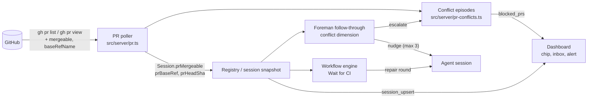

# React to pull requests blocked by merge conflicts

When a session's pull request conflicts with its base branch, Mission Control does nothing
about it. GitHub reports the PR as `CONFLICTING`, CI often stops running, and the PR sits
there. The agent is not told, the card shows nothing, and the operator finds out only by
opening GitHub.

This plan adds one conflict signal to the PR poller Mission Control already runs. Three
reactions consume it:

- Foreman nudges a live session to merge the base branch in.
- A workflow that owns the session treats the conflict as a repair round.
- The operator is alerted, and an inbox row is added, only when nothing else is handling the
  conflict.

The PR chip on cards and the session header shows the conflict in every case.

Settled in two grilling rounds (12 decisions) and the plan review (decisions 13 to 15), all
recorded below. Approved in the plan review on 2026-10-04 with Create tickets as the
follow-up. Single phase.

## Goals

- Every open PR a session or task owns is checked for conflicts, with no Inspector, YOLO mode
  or workflow required.
- A live session that Foreman may drive is told to resolve the conflict, and the number of
  nudges is capped.
- A workflow-owned session gets the conflict as an ordinary repair round instead of waiting
  45 minutes for `ci_missing`.
- The operator is interrupted only when a human is actually needed: the session has gone,
  Foreman cannot drive it, or the nudges ran out.
- A conflicting PR is visible on its chip whatever else is going on.

## Non-goals

- **A PR that is behind its base without conflicting.** That remains
  [`pr-behind-base`](../pr-behind-base/plan.md), unchanged.
- **Rebasing, force-pushing, or the daemon resolving conflicts itself.**
- **Automatically resuming an exited session, or filing a follow-up task for it.** The operator
  decides.
- **Changing YOLO auto-merge.** Its `conflicting` gate (`src/shared/shipping.ts:242`) keeps
  reading the Inspector's own `mergeable`.
- **A conflict label in the Shipping panel when YOLO is off.**
- **Persisting conflict state across daemon restarts.** See [Edge cases](#edge-cases).

## Recorded decisions

| # | Decision | Answer |
|---|----------|--------|
| 1 | Scope | Conflicts only: GitHub `mergeable == CONFLICTING`. `pr-behind-base` stays its own plan. |
| 2 | Signal source | Add `mergeable` to the existing 20s `gh pr list` poller and store it as `Session.prMergeable`. `UNKNOWN` means no change. |
| 3 | Live session | A third Foreman PR follow-through dimension, beside failing CI and review comments, with a new `trackMergeConflicts` setting that defaults to on. |
| 4 | Exited session or freed worktree | Attention only. The operator resumes the session or dispatches new work. |
| 5 | Visibility | A mark on the PR chip (cards and session header), **and** an attention reason (desktop alert plus inbox row). Not the Shipping label. |
| 6 | Workflow-owned session | The workflow reacts. Wait for CI and the Pull Request action's CI contract treat `CONFLICTING` as a repair round. |
| 7 | Resolution method | Merge the base branch into the PR branch, resolve the conflicts, run focused tests, push. Never rebase or force-push. |
| 8 | When attention fires | Only when nothing is handling the conflict: the session exited, Foreman cannot nudge it, or the nudges ran out. |
| 9 | Inbox placement | A new **Blocked pull requests** section after Pipeline halts. Each row shows the PR, repository, base, and owning task or session, with links to the PR and the session. The row clears itself when the conflict goes away. |
| 10 | Re-nudge policy | Once per PR head SHA while the PR stays `CONFLICTING`, at most 3 nudges per conflict episode, then escalate to attention. The episode re-arms when the PR becomes mergeable. |
| 11 | Workflow repair budget | A conflict repair is an ordinary repair round with a conflict-specific packet, and it counts against the run's budget. |
| 12 | Workflow signal | The workflow gates read `Session.prMergeable` from the 20s poller, not the Inspector. |
| 13 | Episode persistence (plan review) | In memory. No migration. A restart can allow up to 3 more nudges, which is still bounded. |
| 14 | Give-up threshold (plan review) | 2 minutes settled-idle on the nudged head while the PR is still `CONFLICTING`. |
| 15 | Follow-up (plan review) | Create tickets after the plan merges. |

## How it works today (verified)

- **PR poller** (`src/server/pr.ts`, every 20s, always on).
  - For live sessions it calls `gh pr list --head <branch> --json url,number,state,statusCheckRollup,createdAt,mergedAt,headRefOid` (`pr.ts:99`).
  - For task PRs whose session has gone, it calls `gh pr view <url> --json state,mergedAt` (`pr.ts:173`). This covers every task in an active, `failed` or `cancelled` status (`completableByMerge`, `registry.ts:9459`).
  - It reads no mergeability.
- **Inspector** (`src/server/inspector/github.ts:279`) is the only reader of `mergeable`.
  - It is off by default and sees only adopted PRs.
  - Its only consumer is the YOLO gate, which writes `merge_block` and re-checks forever without telling anyone.
- **Foreman PR follow-through** (`src/server/foreman/review-followup.ts`) types a nudge into a settled-idle, invited session for two things: posted Inspector findings and failing CI.
  - The de-duplication mark (`FollowupMark`) is in memory and kept per PR.
  - An active workflow suppresses it (`review-followup.ts:276`).
- **Wait for CI** (`src/shared/wait-for-ci.ts:218`) decides from the Inspector's check observation.
  - GitHub Actions `pull_request` workflows do not run on a conflicting PR. The node therefore waits until it blocks with `ci_missing` (45 minutes by default).
- **Workflow PR CI contract.** `workflowPullRequestCiContract` (`src/server/workflows/agent-contract.ts:5`) is added to Pull Request actions that have no Wait for CI node after them. It says nothing about conflicts.
- **Attention inbox and alerts** (`src/web/lib/attention.ts`, `src/shared/alerts.ts`) are derived in the browser from state the daemon publishes. No reason covers a PR.

## Design

### 1. The signal (`src/server/pr.ts`)

- Add `mergeable,baseRefName` to the `--json` list in `queryPr`. Add `mergeable,baseRefName,headRefOid` to `queryPrUrl`.
- Normalise GitHub's value to a shared `PrMergeable = "mergeable" | "conflicting"`, defined in `src/shared/`.
  - `UNKNOWN` maps to "no observation". The reconciler keeps the previous value, the same way the `"error"` lookup is handled today.
  - GitHub computes mergeability lazily, so the first read after a push is often `UNKNOWN`.
- New session snapshot fields (`src/shared/types.ts`):
  - `prMergeable: PrMergeable | null`
  - `prBaseRef: string | null`
  - `prHeadSha: string | null`

  They are set and cleared exactly when `prState` / `prChecks` are. A multi-repo task carries the same three fields on each `repoPrs[].feedback` entry.
- No schema change. These are live observations, like `prChecks`.

### 2. Conflict episodes (`src/server/pr-conflicts.ts`, new)

This is the one daemon-side owner of "is this conflict handled?". It is in-memory and keyed by PR URL.

- **Episode lifecycle.**
  - An episode opens on the first `conflicting` observation, from either poll path.
  - It closes when the PR is observed `mergeable`, merged, or closed, or when no session and no task reference it any longer.
  - It records `since`, `baseRef`, `headSha`, `taskId`, `sessionId` and `escalated`.
- **Unhandled reason.** An episode is *unhandled*, and becomes a blocked PR, when one of these holds:
  - `session-gone`: no live session owns the PR. The session exited or was removed, and the task's PR is seen only through the by-URL poller.
  - `foreman-cannot-nudge`: the owning session is live but Foreman will not type into it. The cases are:
    - `trackMergeConflicts` is off.
    - The session has no `foremanInvite`.
    - Foreman is dry-run or off.
    - The repository is not allowlisted.
    - The harness lacks `workQueue`, or the session lacks hooks.

    These are the same predicates `decideReviewFollowup` uses, imported rather than copied. The daemon already reads Foreman's config for `trackCiFailures` (`workflows/manager.ts:5340`).
  - `nudges-exhausted`: Foreman reported an escalation for this episode (see §3).
  - **Never unhandled:** a session an active workflow owns (`activeWorkflowOwnsSession`). The workflow is handling it, and if its repair budget runs out, the existing workflow alerts take over.
- **Publication.** The set of unhandled episodes goes out as a new `blocked_prs` snapshot `ServerEvent`. It is emitted when the set changes, and on connect. `src/web/useEventStream.ts` handles it exhaustively, per the change contracts.
- **Foreman's escalation route.** `POST /api/pr-conflicts/escalate` takes `{ prUrl, headSha }`. Its body is parsed with a Zod schema. It marks the matching open episode `escalated`, and does nothing if the episode has already closed.

### 3. Foreman: the conflict dimension (`src/server/foreman/review-followup.ts`, `worker.ts`)

- **Setting.** Add `trackMergeConflicts: z.boolean().default(true)` beside `trackCiFailures` (`src/shared/protocol.ts:2002`). Add its toggle in Foreman settings beside the other two follow-through toggles. Gate 1 skips only when all three are off.
- **Feedback.** `feedbackState` gains `conflicting = cfg.trackMergeConflicts && pr.mergeable === "conflicting"`. `FollowupPr` carries `mergeable`, `baseRef` and `headSha` from `followupPrs`.
- **Mark.** `FollowupMark` gains:
  - `conflictHead: string | null`, the head SHA last nudged.
  - `conflictNudges: number`.

  `advanceFollowupMark` resets both when the PR is no longer `conflicting`, which re-arms the episode.
- **When to nudge.** The PR is `conflicting`, its head is not `conflictHead`, and `conflictNudges < 3`. All other gates are unchanged: invite, live, idle, pane, no queue, no workflow, and live mode on an allowlisted repo. Delivery reuses the existing stamp-then-inject path, with rollback when delivery is confirmed undelivered.
- **When to escalate.** The worker calls the escalation route once per episode in either of these cases:
  - The PR is still `conflicting` on a new head after 3 nudges.
  - The session has been settled-idle for 2 minutes (`CONFLICT_GIVE_UP_MS`) while the PR is still `conflicting` on the head it was nudged about. In other words, the agent parked without pushing a fix.

  The escalation is also logged and recorded as an episode, like the ship shepherd's escalations.
- **Payload.** `buildPayload` gains a conflict problem line: "it has merge conflicts with `<base>`". It also gains these steps:
  1. `git fetch origin <base>` and `git merge origin/<base>`.
  2. Resolve every conflict, keeping both sides' intent.
  3. Run the tests that cover the files you touched.
  4. Commit the merge and push to the same branch.
  5. Do not rebase or force-push.

  The existing "Do NOT open a new pull request" and multi-repo qualifiers still apply. When CI or findings are also open, they share one payload, as they do today.

### 4. Workflows (`src/shared/wait-for-ci.ts`, `src/server/workflows/engine.ts`, `agent-contract.ts`)

- **Wait for CI.** `decideWaitForCi` takes an extra `mergeability: { mergeable: PrMergeable; headSha: string; baseRef: string | null } | null` input.
  - The engine reads it from the bound session's `prMergeable` / `prHeadSha` / `prBaseRef`, or from its `repoPrs` entry for a per-repository binding. It comes through the same seam as `observe`.
  - When it is `conflicting` and `headSha` matches `expectedHeadOid`, the node returns `fail` with a conflict cause. It does this before the pending, missing-check and timeout branches, because a conflicting PR may never get checks.
  - `waitForCiVerdict` turns that into one requested change: "Resolve merge conflicts with `<base>`". Its rationale repeats the resolution method from decision 7.
  - The `fail` edge then runs the run's ordinary repair round, which counts against the repair budget (decision 11).
- **Pull Request action contract.** When `trackMergeConflicts` is on, the packet carries a conflict line: "If the PR reports merge conflicts with its base, merge the base branch in, resolve the conflicts, run focused tests, and push. Never rebase or force-push."
  - This applies to PR actions with no Wait for CI node after them, the same condition as `pullRequestCi`.
  - It is a separate line from the CI contract, so it does not depend on `trackCiFailures`. It is frozen with the packet like the CI policy.

### 5. Dashboard

- **PR chip** (`src/web/components/session-bits.tsx:1635`).
  - When `prMergeable === "conflicting"` (or any `repoPrs` entry is conflicting), the chip shows a conflict icon. Its accessible name is "Conflicts with `<base>`".
  - It appears on cards and in the session header, next to the failing-CI icon.
- **Inbox** (`src/web/lib/attention.ts`, `AttentionInbox.tsx`).
  - A new **Blocked pull requests** section goes after Pipeline halts, fed by `blocked_prs`.
  - Each row shows:
    - PR number and title link.
    - Repository and base branch.
    - Owning task or session.
    - Why it needs you: "session ended", "Foreman can't drive this session", or "Foreman's 3 nudges didn't resolve it".
    - "Conflicting for Nm".
    - Links to open the PR and the session.
  - Each row counts as one answer owed. It disappears when the episode closes. The section is read-only, like Pipeline halts.
- **Alert** (`src/shared/alerts.ts`).
  - A new `AlertKind` `"pr-conflict"` with `attention` severity.
  - `detectAlerts` fires it once when a PR enters the blocked set. The id is stable per PR URL, so a repeat replaces its toast.

### 6. Documentation

- `docs/work-queues.md` (follow-through section): the conflict dimension, its cap, and its escalation.
- `docs/foreman.md` (settings): `trackMergeConflicts`.
- `docs/attention-and-alerts.md`: the Blocked pull requests section and the `pr-conflict` alert.
- `docs/workflows.md` (Wait for CI, Pull Request action): the conflict `fail` and the contract line.
- `docs/fork/ledger.md`: a new feature entry, and re-render `docs/fork/ledger.html`. This happens in the implementing PR.

## Edge cases

- **`UNKNOWN` forever.** GitHub sometimes never settles. The last known value stands, and the PR is never flagged on `UNKNOWN` alone.
- **Daemon or Foreman restart.**
  - Episodes and Foreman marks are in memory, so a restart can buy up to 3 more nudges. That is still bounded.
  - Escalation is recomputed. `session-gone` and `foreman-cannot-nudge` are re-derived from live state on the first poll.
- **Multi-repo task.** There is one episode per PR, and each PR gets its own mark (the existing per-PR keying). Nudges name the repository.
- **CI dimension silent on a conflict.** GitHub runs no `pull_request` checks while the PR conflicts, so the failing-CI nudge does not fire. The conflict dimension is what speaks.
- **Session exits mid-episode.** The next poll moves the episode to `session-gone`, and the alert fires then.
- **PR closed or merged while blocked.** The episode closes, and the inbox row and chip mark clear.
- **Draft PRs.** They are treated the same way. A draft can still conflict, and the fix is the same.

## Testing

Focused unit tests in `test/`, using `node:test`:

- `pr.ts` reconciliation:
  - `CONFLICTING` → `prMergeable: "conflicting"`.
  - `UNKNOWN` keeps the previous value.
  - Merged or closed clears it.
  - The by-URL path covers an exited session's task.
- `pr-conflicts.ts`:
  - Episode open and close.
  - Each unhandled reason.
  - A workflow-owned session is never unhandled.
  - Escalation of an already closed episode is ignored.
  - `blocked_prs` is emitted only on change.
- `review-followup.ts`:
  - The first nudge.
  - No repeat on the same head.
  - A new head re-nudges.
  - The cap of 3, then escalation.
  - Idle on the nudged head for 2 minutes escalates.
  - Recovery re-arms the episode.
  - `trackMergeConflicts` off skips.
  - The payload contains the merge steps and the no-rebase line.
- `wait-for-ci.ts`:
  - Conflicting on the expected head → `fail` with the conflict change, even with zero checks.
  - Conflicting on another head → wait.
- `agent-contract.ts`: the conflict line is present only when `trackMergeConflicts` is on.
- `alerts.ts` / `attention.ts`:
  - `pr-conflict` fires once on entry.
  - The section order and the answer count.

E2E, in `e2e/specs/pr-merge-conflicts.spec.ts`:

1. A fake `gh` on `PATH` reports a session's PR as `CONFLICTING`. Specs such as `workflow-pull-request-mismatch.spec.ts` already fake `gh` this way.
2. Assert the chip's "Conflicts with main" mark on the card.
3. Exit the session and assert the **Blocked pull requests** inbox row with "session ended".
4. Flip the fake to `MERGEABLE` and assert that the row and the mark disappear.

All selection is by role and label.

## Definition of done

- The focused tests above pass. `npm run typecheck` and `npm run lint` pass.
- `npm run build`, `npm run smoke` and `npm run test:e2e` pass with the new spec.
- The docs in §6 match the implementation, and the fork ledger entry is added.
