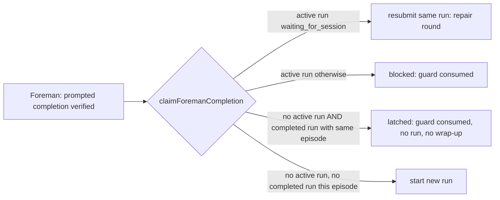

# PR publication ownership: stop post-completion workflow re-runs and make PR authority a grant

Status: shaped on 2026-10-04 from shape task "Fix premature PR creation" and approved as written by the operator the same day, with "Create tickets after the plan merges" chosen as the follow-up. Revised in Plan Validation repair round 1 (publisher table for deferred paths, unbound chat decision, drain-started run stamping). Not implemented.

## Problem

The operator reported: "A PR is often created before the workflow even begins. PRs should only be
created by the Pull Request action in a workflow or by direct command of the user."

Forensics on the live state (read-only `harness.db` and Claude transcripts, 2026-09-23 to
2026-10-04, every ship/bugfix task on Claude SDK) found that the PR is almost never opened early.
What the operator sees is a **new workflow run starting after the PR already exists**.

| Finding | Count |
|---|---|
| Ship/bugfix tasks with a bound workflow and a PR | 81 |
| ...whose first `gh pr create` came 0-4 min after the daemon typed `/mission-pull-request` | 80 |
| ...whose PR came from a human typing "create the PR" before Foreman claimed (dungeon-game#8) | 1 |
| Tasks with new workflow runs started after their PR existed | 25 |
| Runs started after the binding already had a completed run (29 bindings) | 38 |
| ...of those later cancelled by the operator | 15 |

Of the runs that started after the PR existed, these turns triggered them:

| Trigger turn | Runs |
|---|---|
| The Pull Request action's own turn | 13 |
| Inspector feedback fixes | 11 |
| A Claude background-task wake-up after the PR action | 8 |
| A human asking to rebase | 2 |

Verified example: on metalmind#286's binding `8418bac5`, run `2c4064ad` completed. Run
`c9de7f5a` started 16 seconds later and run `b902d130` 11 seconds after that one completed,
each claimed as a fresh `prompted` completion on the open PR.

**Root cause.** Foreman claims every completed prompted work-cycle generation under unchanged
intent (`promptedCompletionMarker` in `src/server/foreman/workflow-claim.ts` hashes the
generation). `WorkflowStore.claimForemanCompletion` (`src/server/workflows/store.ts`, the
`if (!run)` branch near line 6845) starts a new run whenever the binding has no *active* run. A
*completed* run therefore leaves the binding claimable again by the very next turn, including
the PR action's own turn. The repair loop relies on later generations claiming
(`docs/workflows.md`, "a later completed generation under unchanged intent can claim the binding
exactly once"). Nothing stops that once the run has completed. `docs/work-queues.md` states
it outright: "Only direct shipping latches - submitting a bound Foreman Complete Workflow does
not".

**Secondary exposure.** No agent was observed opening a PR on its own initiative. Still, the
prompts hand out PR authority as a standing permission and several texts contradict the ship
handoff:

- Every dispatched task gets "Mission Control execution authorization"
  (`src/server/execution-authorization.ts`): "When this task or the current workflow asks for a
  pull request, the operator has already authorized you to ... create or update that pull
  request. Act directly". So any intent or repo instruction that mentions a PR switches it on.
- The multi-repo manifest says "Commit and push in each repository you change, and open ONE pull
  request per repository" (`src/server/dispatcher.ts`, near line 2830). It is prepended to the
  intent, ahead of the ship handoff that forbids the same thing.
- Phase task intents written by the phased-plan skill require "open a reviewable pull request".
- Unbound plan and shape tasks, the no-workflow ensemble winner, retro-as-task, deflake and
  testing-setup are told to open their own PR.

## Decisions (recorded from the interview)

| Id | Question | Answer |
|---|---|---|
| observed-vectors | Where were premature PRs seen? | Ship/bugfix tasks with a workflow bound |
| approach | Shape of the fix | Make PR authorization a grant, not a standing permission |
| enforcement | Hard enforcement? | Prompts plus a `gh pr create` block. **Superseded by `scope`: the block is deferred** |
| user-command | What counts as a direct user command | Human-typed message in the session; Foreman "Ship it?" click; Runs "Ask the session to open a PR"; Foreman "Straight to PR" setting |
| plan-shape-unbound | Unbound plan/shape tasks | Defer like ship: commit and push, Foreman's PR path opens it. The push is the kind-contract exception to the task authorization's no-push default (Part B item 1), as bound plan/shape contracts already require. |
| self-publishing-skills | retro, deflake, testing-setup, ensemble winner | Follow the same rule: defer to the workflow or Foreman |
| push-policy | Does `git push` also wait for a grant? | Block only PR creation; the prompt still says don't push. Plan and shape are the one exception, through their kind contract (`plan-shape-unbound`). |
| grant-lifetime | How long a grant lasts | Until the session's PR exists; updating it is then always allowed |
| untasked-sessions | Are untasked sessions under the rule? | No, only dispatched task sessions |
| on-block | Behavior on a blocked PR | Denial message plus a recorded attempt (applies to the deferred hook) |
| scope | Plan scope after the forensics | Fix the re-trigger, plus the prompt-level grant changes; defer the hook |
| claim-rule | What may start another run after a completed run | Nothing until the human gives a new instruction (latch per intent episode, like Straight to PR) |
| human-pr-before-claim | Human asks for a PR before the claim | Allow it; the bound workflow still runs once against the open PR |
| latch-key | Which human messages re-arm | Any accepted human prompt (episode key) |
| latch-on-cancel | Does a cancelled run latch? | No, only completed runs latch |
| merged-before-review | Human-requested PR merged before the workflow ran | Accept it: the merge closes the task, no change |
| prompt-changes | Prompt changes in scope | All five: authorization split, manifest, phased-plan intent template, unbound plan/shape, skills and ensemble text |
| follow-ups | Findings recorded as follow-ups | Deferred `gh pr create` block; duplicate human-prompt capture; agent merged a PR |
| latch-ui | Show the latch in the dashboard? | No UI change; the recorded Foreman reason is enough |
| chat-publication (repair round 1) | How an unbound chat task gets its PR published | The chat task's dispatch intent counts as a human-typed message in the session |

Repair round 1 also records one design choice the plan review asked for, made from the code and
not put to the human: every claim that starts or resubmits a run stamps the episode, queue-drain
claims included (see Part A, Changes 2).

## Design

### Part A: latch a binding after its completed run

**Rule.** A prompted Foreman completion claim on a binding is **latched** when that binding has a
`completed` run whose claim episode equals the claim's `expectedIntent.episodeKey`. A latched
claim:

- consumes the generation in the same compare-and-set as every other claim outcome;
- creates no run and resubmits nothing;
- returns `claimed: true`, so the worker treats the session as owned and does **not** fall
  through to the Ship it? card or Straight to PR (falling through would publish a second time).

Any accepted human prompt bumps `promptRevision` and with it the episode key, so the next
completion after it claims normally. Daemon-injected turns (workflow session actions, Inspector
packets, Foreman wrap-ups) and Claude `<task-notification>` wake-ups never advance the episode,
so they stay latched. The one exception is on the terminal runtime: a daemon restart between a
packet's delivery and its echo (see the accepted residuals under Changes 2).

**What stays the same.**

- In-run repair rounds, both Persona failures and GitHub Inspector `restart_workflow` and
  `inspector_only` feedback. A gated run stays active until Inspector passes, so it never reaches
  the latch.
- Operator-cancelled runs do not latch. Status `cancelled` is not `completed`.
- Queue-drain claims are never refused by the latch. Drain needs new queue items to fire again,
  and those are human work. The latch refuses `completionKind: "prompted"` claims only. A run
  that a drain claim started is still stamped, so the prompted completion of its own Pull Request
  turn on an emptied queue is latched like any other.
- dungeon-game#8 (`human-pr-before-claim`). When a human asks for a PR before the claim and the PR
  stays open, the next generation claims under the new episode and the bound workflow runs once
  against the open PR. Today's code already behaves this way, so it is pinned by a test, not
  changed. If the PR is merged in that turn, the task closes on merge and nothing runs
  (`merged-before-review`).

**Changes.**

1. **Schema** (`src/server/db.ts`, migration beside its upgrade path):
   `addColumn(d, "workflow_runs", "claim_episode_key", "TEXT")`.
2. **Claim transaction** (`WorkflowStore.claimForemanCompletion`, `src/server/workflows/store.ts`):
   - Write `claim_episode_key` whenever **any** claim, prompted or queue-drain, starts a run or
     resubmits one, so the stamp is the episode of the last claim that fed the run. The value is
     `intent:<objective_version>:<prompt_revision>` from the session's `session_goals` row for
     the claim's note key, read in the same transaction. The transaction already reads that row
     for prompted claims; it now reads it for drain claims too, without changing what a drain
     claim checks or accepts. A resolved prompted episode key uses the same formula, so a
     drain-started run and the prompted claim of its own PR turn compare equal unless a human
     prompt came in between.
   - **Accepted residual:** when no `session_goals` row exists at claim time (a drain on a session
     whose goal was never recorded), the stamp stays null and never latches. If that session's
     goal is recorded later, without a human prompt, one extra run can still occur. A pinned test
     states it.
   - **Accepted residual, restart between delivery and echo (terminal runtime only).** Whether a
     prompt bumps `promptRevision` depends on whether it was authored by a human, and there are
     two paths:
     - SDK sessions record the sender explicitly. Only `origin: "human"` sends are captured as
       goal prompts (`src/server/sdk/deliver.ts`), with no ledger involved.
     - Terminal sessions learn the sender from the echo on the prompt hook.
       `Registry.captureHookGoalPrompt` skips a prompt that `isDaemonAuthoredPrompt` matches
       against the in-memory injection ledger (`src/server/injections.ts`, `claimInjectionEcho`).

     The ledger is deliberately unpersisted, so a daemon restart that lands *between* a daemon
     packet's delivery and its echo forgets that packet. Its echo then reads as human, bumps
     `promptRevision`, and re-arms the latch: one extra run, the same window `injections.ts`
     already accepts for the Goal ("a restart landing between a delivery and its echo lets one
     packet through"). Every packet delivered *after* the restart is recorded in the fresh
     ledger, so this is not "the first daemon turn after a restart". It is the single in-flight
     packet. All sessions in the forensic sample ran on Claude SDK, where the window does not
     exist. Persisting the ledger stays out of scope. A pinned test states the residual.
   - In the `if (!run)` branch, before creating a run, look up a `completed` run on the binding
     with `claim_episode_key = expectedIntent.episodeKey`. If one exists, consume the guard with
     the new outcome, append a `claim_latched` workflow event naming that run, and return
     `{ claimed: true, runId: <completed run>, submissionId: null, state: "latched" }`.
   - Runs created before the upgrade have a null stamp and never latch. At most one more run can
     occur per pre-upgrade binding, and that run stamps itself.
3. **Wire types:**
   - Add `"latched"` to the claimed `state` union of `WorkflowCompletionClaimResult`
     (`src/shared/workflow.ts`) and to its schema in `src/shared/protocol.ts`.
   - Append `"workflow_latched"` to `PROMPTED_COMPLETION_OUTCOMES` (`src/shared/types.ts`).
     Append only, never reorder. Document it as: "a bound Workflow already completed a run for
     this intent episode; nothing was started and nothing was handed off".
   - The protocol refinement that reserves `workflow_claimed` to the claim transaction reserves
     `workflow_latched` the same way.
4. **Worker** (`src/server/foreman/worker.ts`): a claimed result already returns `true`. Log
   `latched` distinctly ("workflow latched: run X already completed for this instruction"). No
   other change.
5. **Docs:**
   - `docs/work-queues.md`: replace "Only direct shipping latches..." with the two latches.
   - `docs/workflows.md`: in the Foreman complete paragraph and "The repair loop, end to end",
     say that a completed run latches its binding for the claiming episode and a new human
     instruction re-arms it.
   - `docs/agent-guides/change-contracts.md`: in "Prompted completion: one generation, one
     reason, one write", add `workflow_latched` beside `workflow_claimed` as a claim-transaction
     outcome.

### Part B: PR authority is a grant, not a standing permission

**Every deferred path has a publisher.** Traced from the code (repair round 1):

| Path | Task kind and workflow | Publisher after the change |
|---|---|---|
| testing-setup (`startTestingSetup`, `src/server/testing-setup.ts`) | `ship`, `workflowId: null` | Foreman's prompted wrap-up (Ship it? card or Straight to PR) and the ship shepherd's direct handoff |
| Retro follow-up (`createRetroFollowup`, `src/server/tasks.ts`) | `ship`, `workflowId: null` | The same as testing-setup |
| deflake (GitHub-issue task source, `src/server/task-sources/ingest.ts`) | The source's configured kind, `ship` unless configured otherwise, with that kind's default workflow (`BUILTIN_KIND_WORKFLOW_DEFAULTS`) | The bound workflow's Pull Request action, or Foreman's wrap-up when the kind's workflow is None. A source configured as `chat` follows the chat row. |
| Ensemble no-workflow winner (`src/server/ensembles/engine.ts`) | Its task's kind (`ship`) | Foreman's wrap-up (Ship it? card) |
| Unbound plan or shape | `plan` / `shape`, `workflowId: null` | Foreman's wrap-up (item 4 below) |
| Unbound chat | `chat`, `workflowId: null`; Foreman retires chat without a workflow (`automaticWrapupBlock`) | The human (`chat-publication`): the chat task's dispatch intent counts as a human-typed message in the session (item 6 below) |
| Chat with a workflow bound | `chat`, a workflow | The workflow's Pull Request action, as for ship |
| pipeline | Launched through Conductor (`dispatchPipeline` in `src/server/dispatcher.ts`) | Conductor. Mission Control's task contract never reaches these sessions, and this plan does not change them. |
| scout | `scout` | None by design: its report contract forbids publishing. Unchanged. |

The grant holders are:

- the workflow Pull Request action;
- the Runs UI "Ask the session to open a PR" (`renderPrHandoff`);
- Foreman's PR instructions: the Ship it? card, Straight to PR `WRAPUP_PR`, and the ship
  shepherd's direct handoff;
- a human-typed message in the session that asks for one.

No initial task prompt grants it, with one stated exception: an unbound chat task. There, the
dispatch intent is the human's own first message in the session, so it counts as that fourth
holder (`chat-publication`, item 6). A chat task with a workflow bound gets no such exception.

1. **Execution authorization** (`src/server/execution-authorization.ts`): split the PR clause.
   - The **task authorization**, rendered by `task-contract.ts` for every dispatched task, drops
     "When this task ... asks for a pull request ... authorized". In its place it says: do not
     push or open a pull request on your own initiative, even when the task text or repository
     instructions mention one. Mission Control's workflow Pull Request action, a Foreman PR
     instruction, or the human asking in this session grants that. Once a pull request for this
     task exists, you may push to update it. It keeps "does not authorize merge, another
     repository, or another external write".
   - **One push exception, owned by the kind contract.** The no-push default gives way only
     where the task's own kind contract explicitly requires a push. Today that is the plan and
     shape contracts: the bound ones already say "Commit and push the plan before ending the
     turn" (`src/server/plans/shape.ts` near line 152, and `src/server/plans/prompt.ts` near line
     123, "Keep the skill's commit-and-push requirement"), and item 4 extends this to unbound
     ones (`plan-shape-unbound`). The task authorization says this in one sentence ("unless your
     task's completion contract below requires pushing its branch"). No kind contract ever
     authorizes opening a pull request, so the two texts never conflict. Every other kind
     (ship, bugfix, chat, and the skill-driven tasks in item 5) commits without pushing.
   - The **grant authorization** keeps today's wording ("the operator has already authorized
     you to commit ..., push ..., and create or update that pull request ... Act directly
     without asking"). `executionAuthorizationContract` gains an explicit `pullRequestGrant`
     flag, and two callers in `src/server/workflows/feedback.ts` set it:
     - the session-action packet (near line 731), only when the action's contract completes on a
       pull request (`completion.kind === "pull_request"`, the built-in Pull Request action). An
       authored action of any other kind does not get it;
     - `renderPrHandoff`, through `finalizePacket` (near line 249).
   - **Repair and Inspector packets**, the other `finalizePacket` callers, leave the flag off.
     They carry the task authorization's update-only sentence and not the creation grant, so an
     in-run repair before the PR stage cannot be read as permission to open one.
2. **Multi-repo manifest** (`src/server/dispatcher.ts`, near line 2830). Replace the "Commit and
   push ... open ONE pull request" lines with: "Commit in each repository you change. Mission
   Control's workflow or Foreman opens one pull request per repository you changed. A repository
   you did not change needs no commit and no pull request."
3. **phased-plan intent template** (`skills/phased-plan/SKILL.md`, "the bar" near lines 231-232,
   the example near 268-272, and the `create_task` example near 280). Replace "open a reviewable
   pull request" with "commit the phase; Mission Control publishes it as a reviewable pull request
   whose merge releases dependent phases". The tickets template only uses the PR as the place to
   record deviations and needs no change.
4. **Unbound plan and shape.**
   - `src/server/plans/prompt.ts` (near line 127) and `src/server/plans/shape.ts` (near line 155):
     the no-workflow branch says commit and push the approved plan, report complete, and end the
     turn, because Foreman's Ship it? or Straight to PR path opens the plan's pull request. The
     push is the kind-contract exception named in item 1, which keeps unbound and bound planning
     tasks the same. Pushing is allowed; opening the pull request is not. The
     same applies where those texts and `skills/phased-plan/SKILL.md` (near lines 294-335) tell
     an owner-`skill` session to open the PR itself.
   - `src/shared/task-completion.ts`: `planningTaskCompletionContract` returns a deferral contract
     for unbound plan and shape too, not only workflow-bound ones. The Foreman verifier then
     judges "PR not opened" as expected, not as a gap.
   - The `get_plan_publication_context` description (`src/mcp/server.ts`) stops saying a skill
     owner "may follow its direct PR path". The `owner` values stay unchanged on the wire.
5. **Self-publishing skills and ensemble text:**
   - `skills/retro/SKILL.md` (near lines 243-247), `skills/deflake/SKILL.md`
     (section 5, near line 103) and `skills/testing-setup/SKILL.md` (near line 193): commit and report. The PR is opened
     by the workflow's Pull Request action or Foreman. Deflake carries `Fixes #<issue>` in its
     completion report and commit message so the pull-request skill puts it in the description.
   - `skills/pull-request/SKILL.md`: one precondition line saying it runs under a grant (one of
     the four holders above).
   - `src/server/ensembles/engine.ts` (near line 3343), the no-workflow winner: "commit, report
     complete, and Foreman's Ship it? card publishes it", replacing "push, and open a pull request
     yourself".
6. **Unbound chat** (`chat-publication`). A chat task with no workflow has no automatic
   publisher, so its dispatch intent is the human's first message in the session and is treated
   as one. `KIND_CONTRACT.chat` in `src/server/task-contract.ts`, which today renders nothing,
   renders one chat paragraph when no workflow is bound. If the dispatch message or a later human
   message in this session asks for a pull request, that request is the grant. Otherwise, commit,
   then say in the reply that the work is committed and not published, and that asking in this
   session publishes it. A chat task with a workflow bound gets the plain task authorization and
   defers to the workflow like ship.
7. **Docs:** `docs/dispatch-and-backlog.md` (multi-repo section) and
   `docs/agent-guides/architecture.md` where it describes the execution authorization.

### Fork ledger

The implementation PR adds a ledger entry for PR publication ownership. It records: the
completion latch, the grant holders, assumed upstream behavior (Foreman prompted claim, Straight to
PR latch), surfaces (store claim, execution authorization, planning prompts, skills), status and PRs.
It also re-renders `docs/fork/ledger.html`.

## Verification

Focused tests, by file, with the repo loader
(`node --test --import ./test/setup-state.mjs --import tsx <file>`):

| Test | Proves |
|---|---|
| `test/workflow-foreman-claim.test.ts` (new cases) | After a completed run, a prompted claim at the same episode returns `latched`, creates no run, consumes the generation with `workflow_latched`, and appends `claim_latched`. A claim under a new episode starts a run. A cancelled run does not latch. A pre-upgrade null stamp does not latch. A resubmission restamps the episode. **A run started by a queue-drain claim is stamped from `session_goals`, and after it completes, a prompted claim at that episode is latched.** A drain claim on a session with no `session_goals` row leaves the stamp null, which is the accepted residual. |
| `test/workflow-goal-provenance.test.ts` or the registry hook-prompt tests (new pinned case) | Terminal runtime, latch residual. A daemon packet whose injection-ledger entry is gone (a simulated restart between delivery and echo) is captured as a human prompt and bumps `promptRevision`, so the next prompted claim is not latched. The same packet echoed while its ledger entry exists does not bump it, and the claim stays latched. On the SDK runtime a non-human-origin send never bumps it. |
| `test/workflow-repair-cycle.test.ts` | Repair rounds (Persona and Inspector `waiting_for_session`) still resubmit the same run. |
| `test/prompted-wrapup-worker-e2e.test.ts` or `test/dispatched-launch-reaches-workflow.test.ts` | Through the worker: a run completes, the PR action's own turn settles, and no second run and no wrap-up instruction appear. A human-typed prompt then produces exactly one new run. A human-requested PR before the claim still gets one run (dungeon-game#8 shape). |
| `test/task-completion.test.ts`, `test/chat-task-kind.test.ts`, `test/task-assign.test.ts`, `test/standing-instructions-delivery.test.ts` | Initial task prompts carry the task authorization without the creation grant. |
| `test/workflow-feedback.test.ts`, `test/session-action-durability.test.ts` | The PR action packet carries the grant. Repair and Inspector packets carry only update-only wording. |
| `test/multi-repo-provisioning.test.ts` | The manifest no longer tells the agent to open PRs. |
| `test/plan-prompt.test.ts`, `test/shape-prompt.test.ts`, `test/plan-publication.test.ts`, `test/plan-completion-guard.test.ts` | Unbound plan and shape defer, with a deferral completion contract. |
| `test/prompted-wrapup-worker-e2e.test.ts` (new case) | Through the worker: an unbound `ship` task session (the testing-setup and retro follow-up shape: `workflowId: null`) settles after a committed turn and reaches a publish instruction. That is the Ship it? card under the default `ask` wrap-up, and `WRAPUP_PR` typed into the session under Straight to PR. The same holds for an unbound `plan` session (acceptance criterion 4). |
| `test/chat-task-kind.test.ts` (new cases) | An unbound chat task's turn-one prompt carries the chat paragraph, so a dispatch message asking for a PR is the grant. A chat task with a workflow bound gets only the plain task authorization. |
| `test/skills-catalog.test.ts` | Skill text changes keep the catalog valid. |

Then run `npm run typecheck` and `npm run lint`. There is no UI change, so no Playwright spec
(`latch-ui`).

**Acceptance criteria.**

1. A completed bound run is never followed by another automatic run until a human-typed prompt.
   This holds whether a prompted or a queue-drain claim started the run. There are two stated
   exceptions, both listed in Part A as accepted residuals: a run claimed when the session had no
   recorded goal, and, on the terminal runtime only, a daemon restart between a packet's delivery
   and its echo.
2. In-run repair rounds and Inspector feedback rounds behave as before.
3. No initial task prompt, intent template, or skill instructs or authorizes opening a PR.
   Only the four grant holders do. The one stated exception is an unbound chat task's
   `KIND_CONTRACT.chat` paragraph (Part B item 6). It treats a PR request in the dispatch intent
   as the human's in-session request, and tests assert that exception explicitly. Every other
   kind, including chat with a workflow bound, renders no creation grant.
4. Unbound plan and shape tasks reach Foreman's Ship it?/Straight to PR path without a verifier
   hold.
5. Every path told to defer has the publisher named in Part B's table. Unbound ship-kind tasks
   (testing-setup, retro follow-up, deflake with workflow None, the ensemble winner) reach a
   Foreman publish instruction. An unbound chat task publishes on the human's request, including
   its dispatch message.

## Out of scope and follow-ups

- **Deferred `gh pr create` block** (`enforcement`, `push-policy`, `grant-lifetime`,
  `untasked-sessions`, `on-block` are recorded for it). Findings for whoever picks it up:
  - Claude terminal: the PreToolUse hook is already installed with matcher `*`, but the bridge
    fails open after 800 ms.
  - Claude SDK: the daemon owns in-process `hooks.PreToolUse`. `canUseTool` does not fire under
    bypass.
  - Pi: has a `tool_call` event that can block; Mission Control does not subscribe to it.
  - Codex: the terminal hook ignores decisions, and the Codex SDK under full access sends no
    approval requests, so it cannot be enforced there.
  - Detection today is a regex that misses `gh api .../pulls`, `gh --repo o/r pr create`, `hub`,
    and GitHub MCP tools.
  - The human-versus-daemon prompt ledger is in memory only, so it reads as human after a
    restart.
- **Duplicate human-prompt capture:** 44 of 206 steering rows exactly repeat the previous
  revision, across 24 of 40 conversations. Each repeat holds intent unresolved for about 60 s
  (the reconciler debounce).
- **Agent merged a PR:** in dungeon-game#8 the agent ran the merge inside the human-requested turn,
  although the authorization says it does not authorize merge.
- **Not changed:** this repository's `AGENTS.md` ("Requested PR and CI work") and the ship
  handoff, which already defer correctly.

## Risks

- **Verifier cost:** each post-completion turn still spends one Foreman verifier call before the
  daemon answers `latched`. That is about 34 calls over the 12-day sample, accepted to keep the
  latch in one place.
- **Re-runs after any human prompt:** "thanks" or "status?" after a completed run starts one full
  re-review run (`latch-key`). This was chosen for parity with Straight to PR.
- **Old builds:** a build that cannot read `workflow_latched` reads the decision as absent, per
  the append-only contract.
