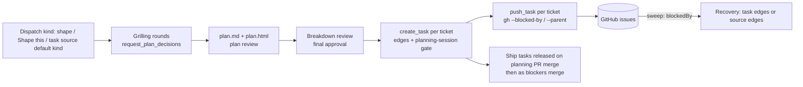

# Shape: a grill-first planning kind that produces tickets

A new task kind, **shape**, alongside `plan`. It brings three mattpocock-skills concepts into
Mission Control: `/grill-me` (interview before drafting), `/to-tickets` (tracer-bullet slices with
blocking edges), and `/implement` (tickets that ship agents can build unattended). Mission Control's
own machinery carries it: answer forms, `create_task`, Push, task sources, dependencies, and Foreman.

Settled through six grilling rounds (47 decisions). Background research:
`docs/reports/grill-tickets-implement-in-mission-control/report.html`.

## Goals

- A shape task always grills first. Each round is one `request_plan_decisions` form: every
  question that can be asked now, each with a recommended answer. Subagents gather facts.
  Rounds continue until nothing is left to ask, and only then is a plan drafted.
- You give final approval, twice: the plan review, then the **breakdown review**. Nothing is
  created before the breakdown is submitted.
- Work is sliced the `/to-tickets` way. **1 ticket = 1 task = 1 PR.**
- Mission Control creates the tasks first, with every dependency. GitHub mirrors them. GitHub
  issues can be recovered into Mission Control, with their blocking links, without duplicates.

- The core works **with no task source at all**. Mirroring and recovery are a layer on top,
  built on source-agnostic task-source capabilities. GitHub is the first implementation.
- `skills/grill` and `skills/tickets` are **rewritten for Mission Control and bundled in this
  repo's `skills/`**. They do not depend on the mattpocock-skills plugin. Pocock's method is
  credited (MIT) in each skill and in `NOTICE`.

## Non-goals

- The `plan` kind is unchanged: html-plans + phased-plan, no grilling, no tickets option.
- No Jira or Linear creation or recovery in v1. No two-way dependency sync (Mission Control writes
  to GitHub only at push time).
- No new approval authority for Foreman: it drafts, and never submits.

## The flow

### 1. Entry points

- **Dispatch → Kind: shape**, including the guided pass (key `s`).
- **Backlog "Shape this"**: converts a backlog task to shape and dispatches it. The task keeps its
  source link, so the tickets become sub-issues of that issue.
- **Task sources** can use shape as their default kind (e.g. issues labelled `needs-shaping`).
- Not available from recurring missions or MCP `create_task`.

### 2. Kind contract

- Prompt contract: hand the work to the new bundled `skills/grill`, then `html-plans`, then the
  new bundled `skills/tickets`. Dispatch is refused unless all three skills are on (the same
  pattern as plan).
- Completion contract: the same as plan. Commit and push are allowed in the first turn. PR,
  review and merge are deferred to the workflow or Foreman. The task is done when the planning
  PR merges.
- Default After-work workflow: **Plan Validation**.
- Grilling is never skipped: at least one round, even for a detailed intent.
- `push_task` is added to the kind's pre-approved Mission MCP tools, next to
  `request_plan_decisions` and `create_task`.

### 3. Grilling (`skills/grill`)

Pocock's `grilling` method (MIT, credited), with the delivery channel swapped:

- Map the decision as a design tree. Each round asks the whole frontier, meaning every question
  whose prerequisites are settled.
- A round is **one** `request_plan_decisions` form. Each question becomes a decision; the
  recommended option is listed first with `recommended: true`, and every decision gets
  `allowOther: true`.
- Facts are the agent's job and go to subagents. Decisions are yours.
- A dismissed round stops the session. Selections are never inferred.
- The session ends when nothing is left to ask. Then `plan.md`/`plan.html` are drafted and a plan
  review is requested. The plan review's follow-up is **Create tickets** / **Stop**.
- Test seams for `/tdd` are agreed during grilling and recorded per ticket.

### 4. Tickets (`skills/tickets`)

- Slicing follows `/to-tickets`:
  - vertical tracer bullets, each demoable or verifiable and sized to one fresh context window;
  - refactoring first;
  - expand-contract for wide refactors.
- Ticket body, used as both the MC intent and the issue body:
  - what to build;
  - acceptance criteria;
  - blocked by;
  - test seams;
  - pointer to `plan.md`.

  No file paths. Under 3000 characters.
- **Breakdown review** (final approval) is one `request_plan_decisions` form. It shows:
  - each ticket with its blocked-by and what it delivers;
  - an **adopt** choice per ticket, offering the repository's open backlog tasks. Adopting only
    adds edges; the adopted task's intent is untouched;
  - **mirror to GitHub** yes/no, preselected yes when the repo has a GitHub Issues source and
    off otherwise, with the reason shown.
- On submit:
  1. Write `docs/plans/<name>/tickets.md` (and its html rendering), mapping each ticket to its
     task id (or adopted task) and issue.
  2. Commit and push the artifacts.
  3. `create_task` per ticket in dependency order, with `dependsOnTaskIds` on its blockers and
     `dependsOnCurrentSession: true`. Tasks are eligible for autopilot, because your approval is
     the consent.
  4. If mirroring, `push_task` per ticket right away, with `--blocked-by` for already-pushed
     blockers, and `--parent` when the shape task came from an issue.
- Partial push failure:
  - MC tasks are kept, because MC is the source of truth;
  - tickets that depend on the failed one are not pushed;
  - the failure is reported;
  - `push_task` is idempotent through the existing issue link and "already seen" ledger, and a
    retry follows the existing "check GitHub before retrying" rule when the outcome is unknown.

### 5. MCP tool changes

- `create_task` gains optional `labels: string[]` and `kind: "ship" | "bugfix"`. Priority stays
  human-set.
- New `push_task({ taskId, sourceId? })` wraps the existing `POST /api/tasks/:id/push`, for
  any source kind whose `canPush` is true. The push draft gains
  `blockedBy` refs (only blockers that already have items) and a `parent` ref (from the shape
  task's source link). A kind with `canRelate` writes them; GitHub maps them to `--blocked-by`
  and `--parent`. It still writes the ledger row and the link in one
  transaction, so sweeps never re-file the issue.

### 6. Recovery through task sources (generic seam, GitHub first)

A new task-source capability, **`canRelate`**, next to `canPush` / `canAnnotate` /
`canResolve`. Call sites reach it through the registry and never branch on the kind:

- A sweep candidate carries `blockedBy: TaskSourceRef[]` and `parent?: TaskSourceRef`.
- The existing linked read (`readLinked`) reports each ref's state as `open`, `completed` or
  `not_planned`.
- A push draft carries `blockedBy` / `parent` refs (section 5).

The GitHub implementation:

- The GitHub source asks `gh` for `blockedBy` (and `parent` for display) in addition to today's
  fields. (`gh` 2.101 supports both; checked.)
- Mapping a blocker to an edge:
  - A blocker linked to an MC task becomes a **task** edge.
  - Any other blocker becomes a new **source** edge: `{ type: "source", sourceId, externalId, url }`.
    It is satisfied when the issue closes as completed. Closed as `not_planned`, the dependent
    shows the existing **stopped dependency** warning with its Resolve actions.
- The sweep re-checks open source edges through the linked read (`gh issue view` for GitHub),
  within its budget.
- Dependencies become a **4th keep-updated group**, next to `brief` / `priority` / `labels`:
  - it uses the same three-way merge and conflict review;
  - pushed tasks are included for this group only.
- A task deleted in MC stays deleted (ledger rule unchanged). "Forget seen items" is still the
  explicit reset. Parent and sub-issue links are for display only and never create edges.
- The issue is closed on merge through the existing write-back switches; nothing new.

### 7. Answer forms

- **Preselection:** every `request_plan_decisions` form and option-carrying `request_input` form
  opens with its `recommended` option(s) selected. The MCP schema text changes from "does not
  preselect" to "preselects". Dismiss stays available.
- **Foreman draft:** on plan-decisions forms from a session Foreman is invited into, Foreman may
  change the selection or write in **Other**, shown as "Foreman's draft" with a one-click revert to
  the agent's recommendation. It never submits. Submitted Foreman text is marked
  **Foreman draft, accepted** in the returned answer and in the conversation record.

## Data and compatibility

- `TaskDependency` gains the `source` variant inside the existing JSON `tasks.dependencies`
  column, so no table migration is needed. Readers must treat an unknown edge type as
  unsatisfied rather than dropping it, so a downgrade cannot release blocked work.
- Adding `shape` to `TASK_KINDS` is an append to a persisted id list, so existing ids are never
  renamed or reordered (see change contracts).
- The task-source sync baseline gains a `dependencies` group. Tasks with no baseline follow the
  existing "flag for review, never auto-apply" rule.

## Tickets (sliced the /to-tickets way)

| # | Ticket | Blocked by | What it delivers |
|---|---|---|---|
| 1 | Recommended option is preselected | None | Any decision form opens with the recommended option(s) selected. Submitting it untouched returns them. |
| 2 | Foreman drafts on decision forms | 1 | In invited sessions, Foreman's draft selection and Other text appear with a revert button. Accepted drafts are marked in the answer and the record. |
| 3 | Shape kind with grilling | None | Dispatch a shape task (form + guided `s`). It grills in rounds, drafts plan.md/html, and requests the plan review. Skill gating, completion contract and Plan Validation default included. |
| 4 | Tickets: breakdown review → MC tasks | 3 | Create tickets → breakdown review → tickets.md + `create_task` (with labels/kind) per ticket, with edges and the planning-session gate. Adopting an existing backlog task works. |
| 5 | Mirror tickets to a task source (GitHub first) | 4 | Push drafts carry blockedBy/parent refs. GitHub writes them. The breakdown's mirror choice pushes each ticket through the new `push_task`, with partial-failure handling. |
| 6 | Shape this + task-source default kind | 3 | A backlog task converts to shape keeping its source link. Any task source can file items as shape tasks. |
| 7 | Recover blocking links through task sources (GitHub first) | None | The `canRelate` capability + `source` edge. GitHub sweeps arrive with task or source edges, which release on completed close and show "stopped" on not_planned. |
| 8 | Keep dependencies in sync | 7 | A generic dependencies group in keep-updated. A changed blockedBy upstream updates edges, with conflicts surfaced. Pushed tasks are included. |

Tickets 1, 3 and 7 can start immediately and run in parallel. Tickets 1-4 and 6 need no task
source; 5, 7 and 8 each add their generic seam together with its GitHub implementation (one
vertical slice each). Every UI-visible ticket ships its
Playwright spec (AGENTS.md rule) and its docs update (`docs/dispatch-and-backlog.md`,
`docs/workflows.md`, `docs/foreman.md`, `docs/skills-and-settings.md` as touched).

### Test seams (agreed per ticket)

- 1: the decision-form component's initial state (markup test) + an e2e spec submitting an
  untouched form.
- 2: Foreman's verdict → draft mapping (unit) + an e2e spec for the draft, the revert, and the
  accepted marking.
- 3: the kind's contract text and dispatch gating (unit) + an e2e dispatch of a shape task
  against the fake agent.
- 4: creating the ticket set through `create_task` (route test: edges, gate, labels/kind, cycle
  refusal) + an e2e breakdown review.
- 5: the push-draft relations through the registry with a fake source, plus `push_task` against a faked `gh` (args include `--blocked-by`/`--parent`; ledger and link
  written; idempotent retry).
- 6: kind conversion keeps the source link (unit) + an e2e "Shape this".
- 7: the candidate → edges mapping with a fake `canRelate` source and faked `gh` JSON (task edge, source edge, completed,
  not_planned).
- 8: the three-way merge of the dependencies group (pure function tests).

## Delivery: the fork

All work happens on `ramiro314/mission-control` (public, Issues enabled).

- The existing clone is re-pointed: `origin` = the fork, `upstream` = teamupstart. This
  redirects every worktree in the pool.
- `gh repo set-default ramiro314/mission-control`, so PRs target the fork's `main`.
- This planning PR and every ticket task target the fork. Merging the planning PR on the fork
  releases the ticket tasks.
- Upstream sync is manual (`git fetch upstream` and merge into the fork's `main`), when wanted.

## Risks

- **Preselection everywhere** makes an accidental untouched submit possible on existing forms.
  Mitigation: Submit states what is selected. Dismiss is unchanged.
- **Source edges and unknown-type readers** on older builds. Mitigation: treat unknown as
  unsatisfied (Data section).
- **Grilling length** on a trivial intent. At least one round is required by design; the round
  can be short.
- **Re-pointing `origin`** affects other sessions in the same worktree pool that are working on
  teamupstart. Check none are mid-PR before switching.
- **Assumption:** harness coverage for the shape kind matches today's plan kind (Claude, Codex,
  Pi wherever the Mission MCP server is available).
