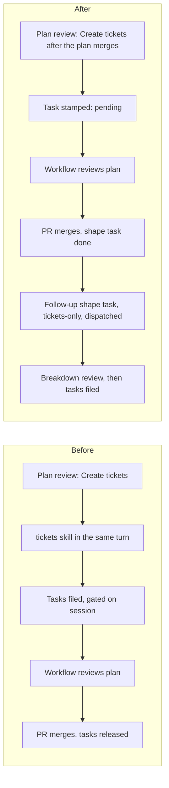

# Shape: create tickets after the plan merges

Today a shape task's plan review offers **Create tickets** and, on that choice, runs the
`tickets` skill in the same turn. That turn ends before the bound workflow (Plan Validation)
reviews the plan, so the tickets are sliced from a plan that has not been reviewed yet. When a
review round repairs the plan, the tickets already filed point at text that has since
changed.

This plan moves ticket creation to **after the plan's pull request merges**. The plan review
records the choice. The merge then starts a linked follow-up shape task that runs only the
`tickets` skill against the merged plan. A manual **Create tickets** action covers the cases
the automatic path does not.

Settled through three grilling rounds (18 decisions) and one plan-review question (decision
19), recorded below. Approved in the plan review on 2026-09-30, with Create tickets as the
follow-up.

## Goals

- Tickets are sliced only from a plan that has merged, whether or not a workflow is bound.
- The plan review still asks the question, so the common path needs no extra click.
- The breakdown review stays the human's final approval. Nothing is filed before it is
  submitted.
- Mirrored tickets stay sub-issues of the shape task's own item, as they are today.
- You can see on the shape task what will happen at merge, and what happened.

## Non-goals

- The `plan` kind's phased follow-up is unchanged. It still schedules phase tasks before the
  merge, gated on the planning session.
- No new task kind. The follow-up is a `shape` task in tickets-only mode.
- No `tickets.md` record file. The tasks, and any mirrored issues, are the record.
- No migration of shape sessions already in flight when this ships.

## Recorded decisions

| # | Round | Decision | Answer |
| --- | --- | --- | --- |
| 1 | 1 | What starts ticket creation after the merge? | Automatic, from the plan review's choice, **plus a manual action as a fallback** |
| 2 | 1 | Where does the tickets skill run? | A **new linked follow-up task** (the shape session is closed at merge) |
| 3 | 1 | Unbound shape tasks (no workflow) too? | **Yes: always after the merge** |
| 4 | 1 | Also change the `plan` kind's phased follow-up? | **Shape only** |
| 5 | 1 | Plan PR closed without merging? | The choice **lapses**: nothing is created |
| 6 | 1 | What happens to `tickets.md`? | **Dropped**: the tasks and mirrored issues are the record |
| 7 | 2 | How does the daemon learn the choice? | **Copy the `shape-follow-up` answer onto the task when the review resolves**; the latest review wins |
| 8 | 2 | What kind is the follow-up? | **A `shape` task in tickets-only mode**, linked through a relation table, After work: None |
| 9 | 2 | When does it run? | **Created and dispatched immediately at merge**; a refused dispatch leaves it in the backlog with the reason |
| 10 | 2 | Ticket edges | **Blocker edges plus an already-satisfied edge to the original shape task**; `push_task`'s caller check widened |
| 11 | 2 | How does the follow-up finish? | **Completes on its own** once tickets are filed or the breakdown is dismissed |
| 12 | 2 | Manual action | **On a done, merged shape task with no live or done follow-up**, in the card and drawer action menu; one live follow-up per shape task |
| 13 | 2 | Show the pending choice? | **Yes: a "Tickets after merge" marker** |
| 14 | 2 | Plan review copy | **"Create tickets after the plan merges" / "Stop"**, same decision and option ids |
| 15 | 3 | Follow-up agent | **The shape task's agent**, falling back to the default when it cannot run `tickets` (the Retro follow-up's runner rule); the shape task's repositories |
| 16 | 3 | What counts as merged? | **The shape task completes through its PR merge** (merge quorum, attached repositories included); a hand-completed shape task without a merged PR lapses |
| 17 | 3 | Marker over its life | **Pending ("Tickets after merge"), then a link to the follow-up, or "Tickets lapsed"** |
| 18 | 3 | Sessions in flight under the old prompt | **Left alone**: they file tickets in-session as before, and are never stamped |
| 19 | Review | Merge while the shape task's workflow run is open or failed | **The merge starts the follow-up anyway** |

## What the repository does today

These facts were verified in the code and shaped the decisions above.

- "Gated on this session" means **create now, release on merge**. `create_task` with
  `dependsOnCurrentSession` creates the task immediately. It waits in the backlog until the
  session's PR merges (`registry.reconcileWorkEpisodeMerge`).
- **Nothing reacts to a merge with a prompt.** A merge settles the task (`settleMergedTask`,
  `reconcileMergedTasks` in `tasks.ts`) and, for a dispatched task with a worktree, closes the
  session.
- A turn sent after the merge rolls the work episode over. `dependsOnCurrentSession` from that
  turn would bind to a new episode that never merges.
- Plan-review answers are durable: the `reviews` table stores `selections` as
  `PlanDecisionAnswer[]`. Rows are keyed by session, not task, and no server code reads them by
  decision id today.
- `push_task` takes an item's parent from the ticket's first planning-kind blocker that
  already has an item (`pushDraftFor`, `task-sources/push.ts`). Its route accepts only a task
  with an edge whose `sessionId` is the calling session.
- A new task edge to a task that is neither backlogged nor active is refused
  (`newTaskEdgeRefusal`). So the "already-satisfied edge to the shape task" cannot be made
  through today's `dependsOnTaskIds`. It needs the server-side path in section 5.
- The post-merge Retro already files a linked follow-up task through a relation table
  (`retro_followups`, `startPostMergeRetro`). That table is retro-specific: it has no type
  column and its key is one follow-up per source episode.

## The flow

Before, tickets are filed before the review and released by the merge. After, the review and
the merge both happen first, and the tickets are sliced from the merged plan.

## Design

### 1. The shaping turn stops at the plan

`shapeContractAppendix` in `src/server/plans/shape.ts` changes for newly dispatched shape
tasks:

- Step 4's follow-up options become `create-tickets` (**Create tickets after the plan
  merges**, recommended) and `stop` (**Stop**). The decision id `shape-follow-up` and both
  option ids are unchanged.
- Step 6 no longer invokes `tickets`. It says that Create tickets is recorded by Mission
  Control and that tickets are created by a follow-up task after the plan merges. The shaping
  turn files no tasks and pushes no items.
- The workflow-bound completion contract for `shape` stops inheriting the plan kind's phase
  lines. `taskCompletionContract("shape", true)` returns a shape contract stating that no
  tickets or tasks are filed in this turn. The plan kind's `PLAN_CONTRACT` is unchanged.
- `KIND_MISSION_MCP_TOOLS.shape` keeps `create_task`, `push_task` and `list_backlog_tasks`,
  because the tickets-only follow-up is also a shape task. The shaping prompt simply does not
  direct their use.

### 2. Recording the choice on the task

A new nullable task column, `shape_tickets`, added with `addColumn` beside its upgrade path in
`src/server/db.ts`:

| Value | Meaning |
| --- | --- |
| `NULL` | Not a new-style shape task (every existing row, every other kind). Never acted on. |
| `awaiting-review` | Stamped when a new-style shape task is dispatched. The discriminator that keeps in-flight sessions out (decision 18). |
| `pending` | The latest resolved plan review chose `create-tickets`. |
| `stop` | The latest resolved plan review chose `stop`. |
| `lapsed` | Was `pending`, but the shape task ended without its merge quorum. |
| `started` | The follow-up was created. The relation table names it. |

When `ReviewManager.resolve` resolves a `plan-decisions` review whose decisions include
`shape-follow-up`, the server finds the session's task. If that task is `shape` and its
`shape_tickets` is not `NULL`, it writes `pending` or `stop` from the selection. A later
resolved review overwrites an earlier one (decision 7). A dismissed review writes nothing.
The column is carried on the wire `Task` so the UI can render the marker.

### 3. The follow-up relation

A sibling of `retro_followups`, `shape_ticket_followups`, built the same way: reserve the
follow-up id first, then create the ordinary task under it.

- Columns: `source_task_id`, `followup_task_id` (unique), `source_episode_id`,
  `source_pr_url`, `created_at`, `updated_at`.
- More than one row per source is allowed, so the manual action can retry after a cancelled or
  failed follow-up. The service refuses a new one while any follow-up for the source is live
  or done (decision 12).

### 4. The merge starts the follow-up

When a shape task reaches `done` through its merge (the existing merge-quorum completion in
`settleMergedTask` and `reconcileMergedTasks`, the same gate `startPostMergeRetro` waits for)
and its `shape_tickets` is `pending`, `TaskManager` starts the follow-up:

1. Reserve the relation row and create a `shape` task titled `Tickets: <shape title>`, with
   the shape task's repositories (primary and attached), After work: None, and the agent picked
   by the Retro follow-up's runner rule: the shape task's agent, or the default when that agent
   cannot run `tickets` (decision 15).
2. Set the source's `shape_tickets` to `started`.
3. Dispatch it. If dispatch is refused, the task stays in the backlog with the reason as its
   error (decision 9), as a Retro follow-up does.

A shape task that becomes `done` or `cancelled` without its merge quorum (completed by hand, or
its PR closed unmerged), with `shape_tickets` still `pending`, moves to `lapsed` (decisions 5
and 16). Nothing is created.

### 5. The tickets-only contract and its edges

The follow-up is recognised by its row in `shape_ticket_followups`. For it,
`shapeContractAppendix` renders a tickets-only variant:

- No grill and no html-plans. It invokes `tickets` directly.
- It names the source shape task, its merged PR URL and its branch. The worktree is cut from
  the merged default branch, so the plan is read as merged, review repairs included. The plan
  path is not stored anywhere today: the agent locates the `docs/plans/<name>/plan.md` the
  merged PR added or changed. When there is not exactly one, it asks with `request_input`
  rather than guessing.
- The breakdown review is unchanged: one `request_plan_decisions` form, New task or Adopt per
  ticket, and the mirror decision.

Edges (decision 10). In a tickets follow-up session, `dependsOnCurrentSession: true` on
`create_task` resolves to an **already-satisfied task edge to the source shape task**, pinned
to the source's merged episode, session and PR URL. It does not become an edge to the
follow-up. This is a server-side path beside `resolveDependencies`, because
`newTaskEdgeRefusal` refuses a new edge to a done task. The effect:

- Tickets are not held back by anything except their own blockers.
- `pushDraftFor` keeps choosing the shape task as parent, because it is a planning-kind blocker
  with an item, so mirrored tickets stay sub-issues of the shape task's issue.
- The `push_task` route's gate also accepts a task whose edge targets the calling session's
  task's source shape task, so the follow-up can mirror what it filed.

`skills/tickets/SKILL.md` changes to match:

- Section 4 drops writing, committing and pushing `tickets.md` and `tickets.html`, and the
  "record the ids" step.
- Filing keeps `dependsOnCurrentSession: true`, now documented as "linked to the merged shape
  task". The final report (the ticket-to-task map, edges and the parallel set) is the record.
- The skill's description says it runs in a tickets follow-up after the plan merges.

### 6. How the follow-up finishes

The follow-up has no PR and no workflow. It completes through Foreman's ordinary completion
judgement against its intent: either the breakdown was submitted and every approved ticket was
filed (and pushed when mirroring was chosen), or the breakdown was dismissed and nothing was
filed (decision 11). A `create_task` failure leaves it for the human, as the skill already
says.

### 7. The manual action

`POST /api/tasks/:id/shape-tickets` starts a follow-up by hand. It shares the service in
section 4 and is accepted only when all of these hold:

- the task is `shape` and `done` through its merge quorum;
- no follow-up for it is live or done.

It is accepted whatever `shape_tickets` holds, `stop`, `lapsed` and `NULL` included. That
covers the late opt-in after Stop. For a lapsed choice it applies only once the task has
actually merged. An in-flight old-style task that already filed tickets in-session can take a
second slicing only by this explicit click.

A **Create tickets** item appears in the task's action menu on the board card and in the
drawer when the route would accept. A refusal returns 409 with the reason.

### 8. The marker

On a shape task's card and drawer:

| `shape_tickets` | Marker |
| --- | --- |
| `pending` | **Tickets after merge** |
| `started` | **Tickets:** a link to the follow-up task |
| `lapsed` | **Tickets lapsed** |
| anything else | nothing |

### 9. How the two phases interact with workflows

Raised in the plan review: shape now runs in two phases, the shaping session and the tickets
follow-up, and the tickets they file carry workflows of their own. Each meets workflows
differently.

**Phase 1: the shaping session.** The shape task takes its kind's Dispatch default, which is
the built-in Plan Validation unless you changed it.

- The plan review, and with it the Create tickets choice, resolves inside the shaping turn,
  before any workflow runs. The task is stamped `pending` or `stop` then.
- Foreman starts the bound workflow only after the turn ends and its verifier judges the turn
  complete against the shape completion contract. Section 1 changes that contract so the
  verifier no longer expects ticket tasks from this turn.
- Plan Validation's repair rounds are typed into the same session as new turns. If a repair
  makes the agent ask the plan review again, the latest answer wins (decision 7). A session
  working a repair is not idle, so merge settlement waits for that turn to end.
- Plan Validation v2 opens the pull request in its final action, after its judges pass. With
  the default binding there is normally nothing to merge until validation has passed.
- Plan Validation's completion policy is `none`, so it never blocks a merge. Neither a human
  merge nor YOLO auto-merge is held by an open run, and merge completion does not read workflow
  state.
- Unbound, the session opens its own PR after approval. With any other workflow bound, the
  trigger is the same: the merge.

**Phase 2: the tickets follow-up.** It is created with an explicit `workflowId: null`
(After work: None), as the Retro follow-up is. Without that, the shape kind's Dispatch default
would bind Plan Validation to a task that produces no plan, diff or PR. Its only gate is the
breakdown review you submit, and Foreman's completion judgement then closes it (section 6).

**The tickets themselves.** They are filed with `create_task`, which takes no workflow field,
so each ticket gets its own kind's Dispatch default when it is created. That is the built-in
No-Mistakes Review for `ship` and Bug Fix Review for `bugfix`, exactly as today.

**Merging before validation finishes** (decision 19). A merge with the shape task's workflow
run still open, or after it failed, can only happen when the PR already existed, for example
an agent or human opened it early or a different workflow is bound. In that case:
**the merge starts the follow-up anyway.** Merging is your acceptance of the plan as merged,
and the breakdown review is still a human gate. Nothing reads workflow run state.

## Data and compatibility

- One new nullable column (`tasks.shape_tickets`) and one new table
  (`shape_ticket_followups`), both added in the migration path, so an upgrading database keeps
  opening. No append-only id is renamed or reordered, and `TASK_KINDS` is unchanged.
- Existing rows are `NULL`, so nothing already in flight is stamped, followed up or marked
  (decision 18).
- The decision and option ids of `shape-follow-up` are unchanged, so Foreman's decision-draft
  check and conversation replay keep reading old and new reviews alike.
- Fork-only change. It extends the fork's shape feature and touches no upstream contract
  except `push_task`'s gate (also fork-only) and the merge-completion hook point.

## Tests

Unit (`test/`):

- `shape-prompt.test.ts`: the new follow-up copy; the shaping turn no longer invokes
  `tickets`; the tickets-only variant invokes only `tickets` and names the source PR; the shape
  completion contract has no phase lines.
- A review-resolution test: a `shape-follow-up` answer stamps `pending` or `stop`, the latest
  review wins, dismissal writes nothing, and a `NULL` task is never stamped.
- A merge test beside `task-completion-reconciler.test.ts`: merge-quorum completion with
  `pending` creates and dispatches exactly one follow-up; a refused dispatch leaves it
  backlogged with the reason; completion without merge and an unmerged close set `lapsed`.
- `mcp-create-task.test.ts` and `task-dependencies.test.ts`: from a follow-up session,
  `dependsOnCurrentSession` yields a satisfied edge to the source shape task, and the ticket
  is immediately eligible.
- A push test: `push_task` from the follow-up passes the gate and parents the item under the
  shape task's item.
- Manual route tests: accepted after Stop and after a cancelled follow-up; refused while one is
  live or done, and before the merge.
- Migration: an existing database opens with the new column and table.

End-to-end (`e2e/`, required for the UI changes):

- `shape-kind.spec.ts`: the delivered contract reads "Create tickets after the plan merges".
- A new spec: a shape task with `pending` shows **Tickets after merge**; after a simulated
  merge it shows the follow-up link and the follow-up card exists; a Stop task offers **Create
  tickets** in its menu, and clicking it creates the follow-up; a lapsed task shows **Tickets
  lapsed**. All agents faked, selected by role and label.

## Documentation

- `docs/dispatch-and-backlog.md`, `docs/sessions.md` and `docs/skills-and-settings.md`: the
  tickets step now runs after the merge, in a follow-up task.
- The fork ledger's "Shape tasks, grill and tickets" entry: behavior contracts (follow-up,
  marker, manual action, `push_task` gate), surfaces and PRs, with `docs/fork/ledger.html`
  re-rendered.
- `docs/plans/shape-task-kind/plan.md` stays as the historical plan. The ledger points here
  for the change.

## Assumptions to confirm during implementation

| Assumption | Confidence | If wrong |
| --- | --- | --- |
| `ReviewManager.resolve` can reach the session's task synchronously to stamp it | 85%, inferred from `task.sessionId` and `task_work_episode_bindings` | Stamp from `TaskManager` on a review-resolved event instead |
| The merge-quorum completion is one observable point for both `settleMergedTask` and `reconcileMergedTasks` | 80%, inferred from the Retro gate on `status === "done"` | Hook both paths through one helper |
| A PR closed unmerged reaches the task as a terminal state the lapse rule can see | 70%, unverified | Lapse on the next sweep that reads the PR as closed, or leave `pending` until the task ends |
| The merged PR's file list reliably shows one `docs/plans/<name>/plan.md` | 85% | The follow-up asks the human for the path with `request_input` |
