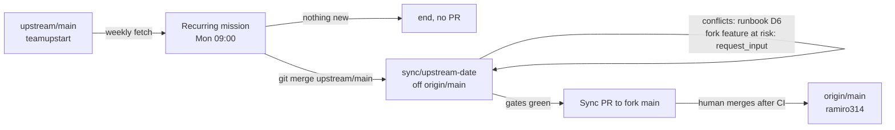

# Upstream sync: keep the fork building on top of teamupstart/mission-control

Status: approved 2026-09-29 after a four-round interview and plan review. Not implemented.

## Goal

`ramiro314/mission-control` (the fork, `origin`) should always be upstream
`teamupstart/mission-control` (`upstream`) plus a small, deliberate layer of fork changes. This
plan lands the first sync, writes down how every later sync is done, and schedules that sync
to run weekly.

## Where things stand (verified 2026-09-29)

- Merge base: `7db363f4` (upstream #1138).
- The fork is 139 commits ahead of it (100 non-merge, fork PRs #1 to #53). Upstream is 9 ahead:

| Upstream PR | Change | Kind |
| --- | --- | --- |
| #1145 | Update the agent SDKs | deps |
| #1144 | Return a dispatched task to the backlog from its session (`POST /api/tasks/:id/requeue`) | feature |
| #1147 | Space the working indicator group | UI fix |
| #1146 | Recover desktop startup when daemon readiness is delayed | fix |
| #1148 | Return completed and safely killed task checkouts (DB migration included) | behavior change |
| #1149 | Plan: SDK-to-terminal workflow handoff repair | docs |
| #1137 | Release 1.26.0 | release |
| #1150 | Collapse, normal and expanded widths for every board column | feature |
| #1152 | Plan: Upstart default telemetry to Datadog | docs |

- 30 files are touched on both sides. A trial merge of `upstream/main` into `origin/main`
  merges 25 on its own and leaves 5 textual conflicts:
  1. `package.json`: dependency versions.
  2. `package-lock.json`: follows from `package.json`.
  3. `src/server/routes.ts`: the `POST /api/tasks/:id/complete` handler.
  4. `docs/dispatch-and-backlog.md`: fork's "Freeing the worktree when you complete a task"
     against upstream's "Send a dispatched task back to the backlog".
  5. `docs/worktrees-and-checks.md`: task worktree retention prose.
- There is one design conflict, and it's larger than the textual ones. Fork PR #17
  (`feat/complete-frees-worktree`, commits `3a21ea14`, `c6c8fe0a`, `de602866`) made freeing the
  worktree on Complete an **opt-in** checkbox, with a safety preview at
  `GET /api/tasks/:id/free-preview`. Upstream #1148 makes Complete **always** reset and return
  task-owned worktrees, and adds a safe automatic return after Kill. `CompleteModal.tsx` merges
  cleanly as text but would carry both behaviours.
- `.github/dependabot.yml` is fork-only. Its merged PRs moved versions away from upstream:
  - #40: `@hono/node-server` 1.x to 2.x
  - #41: `concurrently` 9 to 10
  - #43: 16 minor and patch bumps
  
  It also has three open PRs: #38 (TypeScript 7), #39 (zod 4) and #42 (the github-actions group).
- The fork's `Release` workflow fails on every push to fork `main`. It depends on Upstart's
  `mission-control-release` GitHub App and on conventional squash titles, and the fork has
  neither.

## Decisions

| # | Question | Decision |
| --- | --- | --- |
| D1 | Fork #17 against upstream #1148 | Adopt upstream #1148. Remove the fork's checkbox, `free-preview` route, `freeWorktree` request field, `TaskFreePreview`, their docs, `test/complete-frees-worktree.test.ts` and `e2e/specs/complete-frees-worktree.spec.ts`. |
| D2 | Dependency versions | Remove Dependabot and roll back its changes. Every dependency takes upstream's version. `package.json` keeps only fork-only entries (the `build:flake-report-action` and `test:run` scripts, and any fork-only package such as the `esbuild` devDependency). `package-lock.json` is regenerated starting from upstream's lockfile. This supersedes round 1's "newest of each". |
| D3 | Sync model | Merge-based. Each sync merges `upstream/main` into `sync/upstream-<YYYY-MM-DD>`, branched from fresh `origin/main`, and lands by PR into the fork's `main`. There is no rebase and no force-push, and upstream SHAs are kept. |
| D4 | Upstream scope | Take all 9 commits, including the 1.26.0 release and the Upstart Datadog plan doc. |
| D5 | Dependabot | Delete `.github/dependabot.yml`. Close open PRs #38, #39 and #42 with a comment linking the sync PR. |
| D6 | Conflict policy for every sync | Upstream wins. Re-apply a fork change on top of upstream when it still makes sense. Stop and `request_input` before removing or reworking any fork feature. |
| D7 | Runbook | `docs/upstream-sync.md` is the source of truth, linked from `docs/README.md`, with a short `.agents/memory/upstream-sync.md` pointer indexed in `MEMORY.md`. |
| D8 | Who merges a sync PR | The human, after CI is green. The agent opens the PR and waits for CI, and never merges. |
| D9 | Recurring sync | A Mission Control recurring mission, Mondays 09:00 in the operator's local time zone. Missed runs collapse into one catch-up. The agent is inherited from the task kind. A run with nothing new upstream ends without a branch or PR. |
| D10 | Fork `Release` workflow | Disable it in the fork with `gh workflow disable release.yml -R ramiro314/mission-control`. The file stays byte-identical to upstream. |
| D11 | Split | Two tickets. Ticket 2 is blocked by ticket 1. |

## Sync flow

## Ticket 1: first sync, rollback and runbook

Branch `sync/upstream-2026-09-29` (or the day it runs) from fresh `origin/main`. It lands as one PR
to the fork.

1. `git fetch origin upstream`, then `git merge --no-ff upstream/main`. Resolve the conflicts:
   - `routes.ts`: take upstream's complete handler
     (`{ ...t, sessionClosureRequested: taskHasWorktrees(t) && t.sessionId !== null }`) and
     delete the fork's `freeWorktree` branch and the `/api/tasks/:id/free-preview` route (D1).
   - `docs/dispatch-and-backlog.md` and `docs/worktrees-and-checks.md`: take upstream's sections
     and drop the fork's "Freeing the worktree when you complete a task" section and its links (D1).
   - `package.json` and `package-lock.json`: see step 3.
2. Remove the rest of fork #17 that merged without conflicts (D1):
   - `CompleteModal.tsx`: the checkbox, preview fetch and `freed` messaging.
   - `App.tsx`: its wiring.
   - `api.ts`: the free-preview call and the `freeWorktree` argument.
   - `protocol.ts`: `TaskFreePreview` and the `freeWorktree` fields.
   - `tasks.ts`: `worktreeFreeability`, if nothing else uses it.
   - `actions.ts`: the #17 additions.
   - The #17 test, its e2e spec, the `dispatch-and-converse.spec.ts` lines #17 added, and its
     `test/fixtures/route-surface.json` entry.
   
   Search for `free-preview`, `freeWorktree`, `TaskFreePreview` and `worktreeFreeability` until
   no hits remain.
3. Roll back the dependencies (D2):
   - Start `package.json` from upstream's and re-add only the fork-only entries.
   - Start `package-lock.json` from upstream's, then run `npm install` to add those entries.
   - Diff the dependency sections against `upstream/main`: the only differences left should be
     the fork-only entries.
4. Delete `.github/dependabot.yml` (D5).
5. Write `docs/upstream-sync.md` covering:
   - the remotes;
   - the merge model (D3);
   - the conflict policy (D6), with this sync's #17 resolution as the worked example;
   - the dependency rule (upstream versions plus fork-only entries);
   - the fork-only surface a sync must preserve: flake-aware testing and its report action,
     shape tasks, tickets, wait-for-CI, and the fork-only `package.json` entries;
   - the gates to run;
   - the PR and CI hand-off (D8);
   - the disabled Release workflow (D10);
   - a "nothing new" early exit (`git rev-list --count origin/main..upstream/main` is 0).
   
   Link it from `docs/README.md`. Add `.agents/memory/upstream-sync.md` and its `MEMORY.md` line (D7).
6. Gates:
   - `npm run typecheck`, `npm run lint`, `npm test`, `npm run build`, `npm run smoke`.
   - `npm run test:e2e`: it covers upstream's new specs (`task-worktree-return`, the board column
     widths, requeue) and the removal of `complete-frees-worktree`.
7. Push, open the PR with the `mission-pull-request` shape, and wait for CI to go green. The human
   merges (D8).
8. After the PR is open:
   - Close Dependabot PRs #38, #39 and #42 with a comment linking it (D5).
   - Run `gh workflow disable release.yml -R ramiro314/mission-control` (D10).

Acceptance:

- The PR merges `upstream/main` as a real merge, so `git merge-base --is-ancestor upstream/main HEAD` holds.
- No #17 symbols remain.
- `package.json` dependencies equal upstream's apart from the fork-only entries.
- `dependabot.yml` is gone.
- Every gate is green.
- The runbook exists and is linked.

## Ticket 2: weekly recurring sync mission

Blocked by ticket 1, because the mission's task points at `docs/upstream-sync.md`.

1. On the operator's daemon, create a recurring mission through Missions (or `POST /api/schedules`):
   - Name: "Sync fork with upstream".
   - Repository: the fork.
   - Cadence: weekly, Mondays 09:00, local time zone.
   - Missed-run policy: collapse into one catch-up.
   - Overlap: skip when a previous run's task is still open.
   - Agent: inherit.
   - After work: None.
   - Task body: "Follow `docs/upstream-sync.md`. Exit without a branch or PR when upstream has
     nothing new."
2. Preview the next occurrences, then **Save & enable**.
3. Use **Run now** once to prove that it files the backlog task. Dispatch that task only when
   upstream has new commits; otherwise confirm the no-op path.
4. Record the mission's name and cadence in `docs/upstream-sync.md`.

Acceptance:

- The mission is enabled and its preview shows Mondays 09:00 local.
- A manual run files a task that references the runbook.

## Out of scope

- Sending fork features upstream.
- Changing fork CI files. The Release workflow is disabled through GitHub, not edited.
- Any product behavior beyond adopting upstream's.

## Risks

- **D1 is destructive.** After the sync, Complete discards uncommitted local changes in task
  worktrees. That is upstream's intended behavior.
- **The rollback touches the lockfile.** The hono 2.x to 1.x and concurrently 10 to 9
  downgrades are covered by the full test suite and e2e.
- **The mission spends model tokens weekly.** The early exit keeps an idle week cheap.
