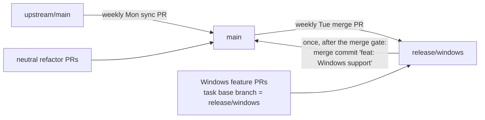
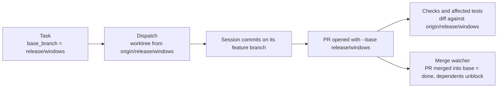

# Windows support on a parallel `release/windows` branch

Status: approved 2026-10-04 after a five-round interview and plan review. Follow-up: Mission Control slices this plan into tickets after its pull request merges. Not implemented.

## Goal

Mission Control runs natively on Windows 11 (x64): the daemon, the Foreman worker, the
dashboard, and the Electron shell in dev mode, with Claude Code SDK sessions dispatched, shown
on the board, and completed. Until that is complete and validated, all Windows-specific work
lives on a long-lived parallel branch, `release/windows`, and `main` stays a macOS product that
behaves exactly as it does today. When the merge gate below passes, `release/windows` merges
into `main` once, and the remaining Windows milestones (WezTerm terminal sessions and an NSIS
installer) continue on `main`.

## Where things stand (verified 2026-10-04 on `main` at `01262dda`)

- **Packaging is macOS only.** `electron-builder.yml` has only a `mac:` section (arm64 dmg and
  dir). `npm run package` runs `electron-builder --mac`.
- **CI.** Every job runs on `ubuntu-latest` except the release-only `package` job, which is
  pinned to `macos-14` and runs only on `v*` tags or `workflow_dispatch`. `ci.yml` runs on
  `push: branches: [main]` and on every `pull_request`, so pushes to another branch do not run
  CI. `release.yml` (Release Please) runs only on pushes to `main`.
- **Terminal backends** (`src/server/terminal/`): tmux, Herdr, cmux, WezTerm, iTerm, Ghostty
  and AppleScript. Only WezTerm runs natively on Windows. SDK-runtime sessions need no terminal.
- **Native addons** (`native/`):
  - `state-lock/state_lock.cc` uses POSIX `flock`/`fcntl`. It is required: the daemon takes
    state ownership through `dist/native/state-lock.node` before it serves anything.
  - `keep-awake/keep_awake.mm` is Objective-C++ (IOKit). `src/server/keep-awake.ts` ships a
    provider only for `darwin`.
- **POSIX process and shell coupling** in `src/`:
  - `ps`/`lsof`/`pgrep` in `server/discovery/processes.ts`, `server/discovery/proc-cwd.ts`,
    `server/discovery/codex-rollouts.ts`, `server/workflows/check-identity.ts`,
    `server/executables/catalog.ts`, `shared/executables.ts` and `pi/generation-lease.ts`.
  - Process-group signalling (`process.kill(-pid)` or `detached: true`) in
    `server/claude-cli.ts`, `server/routes.ts`, `server/llm/codex.ts`,
    `server/discovery/processes.ts`, `server/executables/locator.ts`,
    `server/workflows/check-group.ts`, `server/workflows/check-spawn.ts`,
    `main/update-build.ts` and `main/updater.ts`.
  - Login-shell PATH reads in `server/util/path-env.ts` and `server/executables/locator.ts`.
  - The executable resolver's search ladder names macOS and Unix locations (`/Applications`,
    `~/.local/bin`, mise, asdf, Volta, `~/go/bin`).
  - 20 `process.platform` branches already exist.
- **Symlinks.** `src/server/skills/reconcile.ts` links `~/.claude/skills/mission-<id>` into the
  app, and `src/server/extensions/pi-link-publication.ts` publishes Pi links the same way.
- **npm scripts use bash syntax:** `test` (`${MISSION_TEST_CONCURRENCY:-6}`), `test:run`
  (`${MISSION_TEST_JUNIT:+...}`) and `dev:electron` (`MISSION_DEV_SERVER_URL=... electronmon .`).
  npm on Windows runs scripts through `cmd.exe` by default.
- **Dispatch always bases on the default branch.** Task worktrees start from origin's default
  branch (`defaultBranchOf` in `src/server/actions.ts`). No task has a base branch of its own,
  so today Mission Control cannot dispatch a ticket that builds on `release/windows`.
- **This checkout is a fork.** A weekly mission merges upstream into `main`
  ([upstream-sync runbook](../../upstream-sync.md)), and every fork feature has an entry in the
  [fork ledger](../../fork/ledger.md).

## Decisions

Every decision below was made by the human during the interview. The round it came from is in
brackets.

| # | Question | Decision |
| --- | --- | --- |
| D1 | Runtime model | **Native Windows.** The daemon and Electron run on win32. Not WSL. [R1] |
| D2 | Deliverable order | Daemon/dev mode first, then the packaged Electron desktop app. [R1] |
| D3 | Architecture | **x64 only.** [R1] |
| D4 | Branch name | **`release/windows`.** Windows feature PRs target it. [R1] |
| D5 | Keeping up with `main` | A **weekly recurring mission merges `main` into `release/windows`**: merge, never rebase, no force-push. [R1] |
| D6 | Platform-neutral refactors | **Land on `main` directly** (macOS behavior unchanged). Only Windows-specific behavior goes on `release/windows`. [R1] |
| D7 | Manual validation | The human has a Windows machine or VM and runs the manual gates. [R1] |
| D8 | Merge gate criteria | Full unit suite green on a `windows-latest` CI job; Playwright e2e green on Windows CI; a manual smoke on real Windows (dispatch a task, run a session, see it on the board, complete it); macOS CI and the macOS package job still green with no macOS behavior change. [R1] |
| D9 | Session runtimes | **SDK runtime first**; a WezTerm terminal backend is a later milestone. [R2] |
| D10 | Required harness | **Claude Code.** [R2] |
| D11 | Machine prerequisites | Node 24+, **Git for Windows** (Git Bash on disk), and PowerShell for system queries (process and port queries use PowerShell/CIM instead of `ps`/`lsof`). [R2] |
| D12 | Windows version floor | **Windows 11 only.** [R2] |
| D13 | Keep Awake | **Port it**: a Windows build of the addon using `SetThreadExecutionState`. [R2] |
| D14 | How tickets target the branch | **The first ticket (on `main`) adds a per-task base branch** to Mission Control. Windows tickets set it to `release/windows`. [R2] |
| D15 | Where Windows CI runs | **Only on pushes to `release/windows` and PRs that target it.** The final merge brings it to `main`. [R2] |
| D16 | Final merge | **One PR merged with a merge commit** titled `feat: Windows support`. [R2] |
| D17 | Desktop packaging (later) | **Unsigned per-user NSIS installer, no auto-update** (manual reinstall). The macOS updater and install migration are out of scope on Windows. [R2] |
| D18 | Upstream | **Fork-only**, tracked in the fork ledger. [R2] |
| D19 | Milestones gating the merge | **Only the SDK daemon/dev mode milestone.** WezTerm and the NSIS installer continue on `main` after the merge. [R3] |
| D20 | Codex and Pi on Windows | **Marked unavailable on win32** in the harness capability registry, with the reason shown in Settings > Setup. [R3] |
| D21 | Where the base branch is set | The API, MCP `create_task`/`push_task`, and a field in the task create/edit form (with an e2e spec). [R3] |
| D22 | State home on Windows | **`%USERPROFILE%\.mission-control`**, the same layout as macOS. [R3] |
| D23 | Skill and extension links | **Require Developer Mode and use real symlinks.** [R3] |
| D24 | MAX_PATH | Set git `core.longpaths` in managed worktrees. Setup checks the `LongPathsEnabled` registry value and shows the fix. [R3] |
| D25 | Line endings | **Add `.gitattributes` with `* text=auto eol=lf` on `main`**, as a neutral change. [R3] |
| D26 | Sync schedule | **Tuesdays 09:00 America/Los_Angeles** (cron `0 9 * * 2`), a day after the Monday upstream sync. [R3] |
| D27 | Sync conflicts | `main` wins on shared code, and the Windows change is re-applied on top. **Ask the human before dropping any Windows change.** [R4] |
| D28 | Sync mission setup | A ticket writes the runbook `docs/windows-branch-sync.md`, and the agent also **creates the recurring mission through the daemon API**. [R4] |
| D29 | After the final merge | **Delete `release/windows`, retire the sync mission**, and set the ledger entry to "merged; follow-ups on main". [R4] |
| D30 | npm scripts on Windows | **Prerequisite: `npm config set script-shell` pointing at Git Bash.** Windows CI sets the same. No script rewrites. [R5] |
| D31 | Makefile | **Make the Makefile work under Git Bash plus a separately installed `make`.** This is Windows-specific, so it goes on `release/windows`. [R5] |
| D32 | Windows CI Node versions | **Node 24 only.** Node 26 stays covered on Linux. [R5] |

## Branch model

- `release/windows` is created from `main` once the per-task base branch feature has merged
  (milestone M0).
- **Neutral work goes to `main`** (D6). That means seams that leave macOS byte-for-byte
  identical, the base-branch feature, and `.gitattributes`. It reaches `release/windows`
  through the next weekly merge, or through an on-demand run of the same mission when a Windows
  ticket is waiting on it.
- **Windows-specific work goes to `release/windows`** (D4): win32 implementations behind those
  seams, Windows CI, the Makefile port, Setup checks, and Windows docs.
- Every PR into `release/windows` gets the existing Linux CI through `pull_request`, plus the
  Windows jobs from the branch's own `ci.yml` (D15).
- Release Please runs only on `main`, so nothing on `release/windows` cuts a release. The final
  merge commit's conventional title gives Release Please one `feat` entry (D16).

### Weekly sync (D5, D26, D27, D28)

The runbook `docs/windows-branch-sync.md` follows the shape of the
[upstream-sync runbook](../../upstream-sync.md):

1. Branch `sync/windows-<YYYY-MM-DD>` from fresh `origin/release/windows`.
2. Merge `origin/main` into it. Exit with no branch and no PR when `main` has nothing new.
3. On conflict, take `main` for shared code and re-apply the Windows change on top. Stop and ask
   the human before any Windows change would be dropped.
4. Run the focused tests for the conflicted areas. Open a PR into `release/windows`
   (base branch `release/windows`). Hand off to CI.

The recurring mission **Sync main into release/windows** is created through the daemon API with
these settings: cron `0 9 * * 2` (America/Los_Angeles); missed runs coalesce to the latest;
overlap skips if a sync is still active; agent inherits; completion completes the task
automatically, the same as the upstream sync.

## Per-task base branch (on `main`, the first ticket)

Today a task's worktree, its PR and its checks all assume `main`. This feature gives a task an
optional **base branch**. When a task has one, every stage follows it:

- **Storage:** a nullable `base_branch` column on `tasks`, added in `migrate()` next to its
  upgrade path. Null means today's behavior: origin's default branch.
- **Surfaces (D21):** the create and update task API (validated by the existing Zod schemas),
  MCP `create_task` and `push_task`, and a "Base branch" field in the task create/edit form.
  The card shows the base when it is not the default branch.
- **Followers:** the worktree start point at dispatch and at reset, the PR base used by the
  shipping and publication paths, the affected-tests and check diff base, PR merge-conflict
  reactions, and the merge watcher. A PR merged into a non-default base counts as done and
  unblocks dependents.
- **Validation:** the branch must exist on `origin` when the task is created and when it is
  dispatched. Otherwise the task is refused with a clear error.
- **Tests:** unit and route tests for each follower, plus a Playwright spec for the form field
  and the card label, per AGENTS.md.

## Milestones

Milestone order is strict where noted. The ticket follow-up slices each milestone into
tickets and records the blocking edges.

### M0: Groundwork (on `main`, then branch creation)

1. **Per-task base branch** (above). Blocks every ticket that targets `release/windows`.
2. **`.gitattributes`** with `* text=auto eol=lf` (D25), plus the renormalization commit it
   needs, with a check that byte-exact tests still pass.
3. **Create `release/windows`** from `main` once item 1 has merged, and add the fork-ledger
   entry "Windows support (in progress on `release/windows`)".
4. **Sync runbook and mission** (D28): write `docs/windows-branch-sync.md`, create the recurring
   mission through the daemon API, and add the runbook to `docs/README.md`.

### M1: Platform-neutral seams (on `main`, macOS behavior unchanged)

Each seam is a module with a POSIX implementation that keeps today's exact commands, and a
place for a win32 implementation that `main` does not yet register:

1. **Process inspection**: list processes, read a process's cwd and command line, and find the
   process listening on a port. This replaces direct `ps`/`lsof`/`pgrep` calls at the call sites
   listed above.
2. **Process lifetime**: spawn a supervised child and terminate its whole tree. This replaces
   direct `process.kill(-pid)` and `detached` process-group handling.
3. **Executable environment**: the search ladder's platform locations and the login-shell PATH
   read become a per-platform table.
4. **Native addon build**: `scripts/build-native.mjs` and the two addon builders pick sources
   per platform, still publishing through `publishNativeAddon`.

Acceptance for each seam: the existing tests pass unchanged, and a focused test pins that the
POSIX implementation issues the same commands it did before.

### M2: Windows implementation (on `release/windows`), the merge-gating milestone

1. **Windows CI** (D15, D30, D32): add `release/windows` to `ci.yml`'s `push` branches, and add
   `windows-latest` jobs on Node 24 for typecheck, the sharded unit suite, build plus smoke, and
   Playwright e2e. These jobs set npm's `script-shell` to Git Bash. They start allowed to fail
   and become required on this branch once M2 is green.
2. **State lock on win32**: a `LockFileEx` implementation in `native/state-lock`, with the
   same handle contract and the same tests.
3. **Keep Awake on win32** (D13): `SetThreadExecutionState` in `native/keep-awake`, and a win32
   provider in `src/server/keep-awake.ts`.
4. **win32 seam implementations**: process inspection through PowerShell/CIM, tree kill
   through `taskkill /T /F`, the executable ladder (`%LOCALAPPDATA%\Programs`, `%APPDATA%\npm`,
   `%USERPROFILE%\.local\bin`, mise/Volta Windows locations, `Program Files\Git\bin`), and PATH
   read from the process and user environment instead of a login shell.
5. **State home and paths** (D22): resolve `%USERPROFILE%\.mission-control`, and audit for
   string-concatenated `/` paths, `/tmp`, and POSIX file modes on that branch.
6. **Harness availability** (D10, D20): on win32, Claude Code is available. Codex and Pi report
   unavailable with a reason through the capability registry, and dispatch refuses them before
   acquiring a worktree.
7. **Runtime availability** (D9): on win32 the terminal runtime is unavailable for now, and
   terminal discovery does not start. SDK sessions dispatch, restore, and complete.
8. **Setup checks** (D11, D23, D24, D30): Git for Windows present, Developer Mode on, the
   `LongPathsEnabled` registry value, and npm's `script-shell` pointing at bash. Each check shows
   its fix in Settings > Setup, with an e2e spec. Managed worktrees get git `core.longpaths=true`.
9. **Electron dev shell on win32**: `npm run dev:desktop` starts the daemon, Foreman and
   window. The tray uses a Windows icon instead of the macOS template image, and the menu is
   correct without a macOS app menu.
10. **Makefile under Git Bash** (D31): the developer targets (`make start` and the build
    targets) work with Git Bash plus a separately installed `make`. Targets that only make sense
    on macOS (`make app`, `make install`) say so and exit.
11. **Docs**: a Windows section in `docs/setup.md` (prerequisites, `script-shell`, Developer
    Mode, long paths), the Windows rows in `docs/harnesses-and-terminals.md`, and the fork-ledger
    entry.

### M3: Validation and merge to `main`

1. All four D8 gates pass:
   - The full unit suite is green on Windows CI.
   - Playwright e2e is green on Windows CI.
   - The human's manual smoke on Windows 11 x64 passes: dispatch a Claude Code task, watch the SDK
     session on the board, message it, and complete it. The steps are written as a checklist in
     the merge PR.
   - macOS is unchanged: the full Linux CI is green, and a `workflow_dispatch` run of the macOS
     `package` job is green on the merge candidate.
2. **Merge PR** `release/windows` into `main`, merged with a merge commit titled
   `feat: Windows support` (D16). Windows CI jobs now run on `main` as well.
3. **Retire** (D29): delete `release/windows`, retire the sync mission, and set the ledger
   entry to "merged; follow-ups on main".

### After the merge (on `main`, not gating)

- **WezTerm terminal backend on Windows** (D9, D19): discovery, focus, capture and write for
  WezTerm panes on win32, which re-enables the terminal runtime there.
- **NSIS installer** (D17): add a `win:` section to `electron-builder.yml` (an unsigned,
  per-user NSIS installer for x64), an `npm run package:win` script, and a Windows package CI
  job. No auto-update: on Windows, the updater says to reinstall manually.
- **Codex and Pi** on Windows, one ticket each when wanted (D20).

## Acceptance criteria (for the merge to `main`)

- A1. On Windows 11 x64 with the D11 and D30 prerequisites, `npm install`, `npm run build`,
  `npm run dev` and `npm run dev:desktop` work from a checkout.
- A2. A Claude Code task dispatched on Windows runs as an SDK session, appears on the board,
  accepts a message, and completes.
- A3. Codex, Pi, and the terminal runtime are refused on win32 with a stated reason, never a
  crash.
- A4. Settings > Setup reports Git for Windows, Developer Mode, `LongPathsEnabled`, and npm's
  `script-shell`, each with its fix.
- A5. The state lock and Keep Awake work on win32.
- A6. The unit suite and Playwright e2e are green on `windows-latest` (Node 24).
- A7. macOS behavior is unchanged. Linux CI and a manual macOS `package` run are green.
- A8. A Windows ticket dispatched with base branch `release/windows` gets a worktree from
  `release/windows`, opens its PR against it, and unblocks its dependents when it merges.
- A9. The weekly sync mission exists, and a run produces a merge PR into `release/windows` or
  exits cleanly.

## Risks and open questions for implementation

- **Test suite portability.** Many tests spawn `node`, write fixture files, and compare bytes.
  Expect a long tail of path-separator, CRLF, file-locking (Windows cannot delete open files),
  and timing failures. The Windows CI job starts allowed to fail so that work can land
  incrementally.
- **Windows runner time.** `windows-latest` runs are slower than Linux. The shard count is
  tuned in the Windows CI ticket.
- **Claude Code on native Windows** depends on Git Bash. The Agent SDK spawning `claude` on
  win32 is assumed to work and is verified early, in the first M2 smoke.
- **Drift.** The weekly merge keeps conflicts small, but M1 seams landing on `main` while M2
  builds on them needs the on-demand sync run described in the branch model.

## Out of scope

- WSL as a supported runtime (D1).
- arm64 Windows (D3).
- Windows 10 (D12).
- Code signing, auto-update, and install migration on Windows (D17).
- Contributing Windows support upstream (D18).
