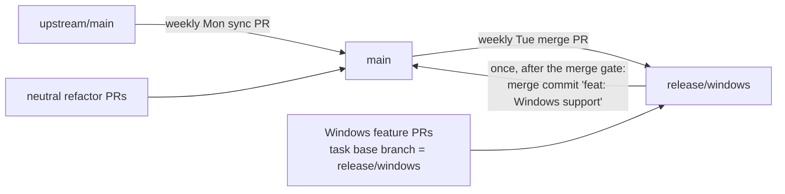
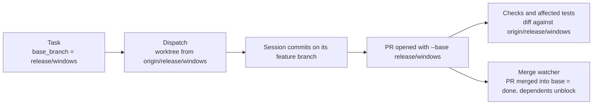

# Windows support on a parallel `release/windows` branch

Status: approved 2026-10-04 after a five-round interview and plan review. Amended the same day in plan-validation repair round 1 (D33 to D35, the D16 release correction, the early SDK spike, and executable checks for A5 and A10), and in repair round 2 (D36 and D37, named producers for the M3 and after-the-merge tickets, and the win32 cwd fallback), and in repair round 3 (D38: seams discovered during M2 are built on the branch), and in repair round 4 (how the PR-less gating ticket M2.0 releases its dependents), and in repair round 5 (M3 restructured into two tickets: M3.1 owns the merge PR on its own session branch, and M3.2 retires). Follow-up: Mission Control slices this plan into tickets after its pull request merges, in two stages (see [Ticket slicing](#ticket-slicing-d34)). Not implemented.

## Goal

Mission Control runs natively on Windows 11 (x64): the daemon, the Foreman worker, the
dashboard, and the Electron shell in dev mode, with Claude Code SDK sessions dispatched, shown
on the board, and completed. Until that is complete and validated, all Windows-specific work
lives on a long-lived parallel branch, `release/windows`, and `main` stays a macOS product that
behaves exactly as it does today. When the merge gate below passes, `release/windows` merges
into `main` once, and the remaining Windows milestones (WezTerm terminal sessions and an NSIS
installer) continue on `main`.

## Where things stand (verified 2026-10-04 on `main` at `01262dda`)

- **Packaging is macOS only.** `electron-builder.yml` has only a `mac:` section (arm64 dmg and
  dir). `npm run package` runs `electron-builder --mac`.
- **CI.** Every job runs on `ubuntu-latest` except the release-only `package` job, which is
  pinned to `macos-14` and runs only on `v*` tags or `workflow_dispatch`. `ci.yml` runs on
  `push: branches: [main]` and on every `pull_request`, so pushes to another branch do not run
  CI. `release.yml` (Release Please) is **disabled in the fork** (`gh workflow list` reports
  `disabled_manually`; see "The fork's Release workflow is disabled" in
  [the upstream-sync runbook](../../upstream-sync.md)), and fork PRs land as merge commits.
- **Terminal backends** (`src/server/terminal/`): tmux, Herdr, cmux, WezTerm, iTerm, Ghostty
  and AppleScript. Only WezTerm runs natively on Windows. SDK-runtime sessions need no terminal.
- **Native addons** (`native/`):
  - `state-lock/state_lock.cc` uses POSIX `flock`/`fcntl`. It is required: the daemon takes
    state ownership through `dist/native/state-lock.node` before it serves anything.
  - `keep-awake/keep_awake.mm` is Objective-C++ (IOKit). `src/server/keep-awake.ts` ships a
    provider only for `darwin`.
  - Both build with `node-gyp` (`scripts/build-state-lock-native.mjs`,
    `scripts/build-native.mjs`), which on Windows needs Visual Studio Build Tools with the C++
    workload and Python 3. GitHub's `windows-latest` image has both preinstalled.
- **POSIX process and shell coupling** in `src/`:
  - `ps`/`lsof`/`pgrep` in `server/discovery/processes.ts`, `server/discovery/proc-cwd.ts`,
    `server/discovery/codex-rollouts.ts`, `server/workflows/check-identity.ts`,
    `server/executables/catalog.ts`, `shared/executables.ts` and `pi/generation-lease.ts`.
  - Process-group signalling (`process.kill(-pid)` or `detached: true`) in
    `server/claude-cli.ts`, `server/routes.ts`, `server/llm/codex.ts`,
    `server/discovery/processes.ts`, `server/executables/locator.ts`,
    `server/workflows/check-group.ts`, `server/workflows/check-spawn.ts`,
    `main/update-build.ts` and `main/updater.ts`.
  - Login-shell PATH reads in `server/util/path-env.ts` and `server/executables/locator.ts`.
  - The executable resolver's search ladder names macOS and Unix locations (`/Applications`,
    `~/.local/bin`, mise, asdf, Volta, `~/go/bin`).
  - 20 `process.platform` branches already exist.
- **Symlinks.** `src/server/skills/reconcile.ts` links `~/.claude/skills/mission-<id>` into the
  app, and `src/server/extensions/pi-link-publication.ts` publishes Pi links the same way.
- **npm scripts use bash syntax:** `test` (`${MISSION_TEST_CONCURRENCY:-6}`), `test:run`
  (`${MISSION_TEST_JUNIT:+...}`) and `dev:electron` (`MISSION_DEV_SERVER_URL=... electronmon .`).
  npm on Windows runs scripts through `cmd.exe` by default.
- **Recurring missions file tasks from a stored task template** (`src/server/schedules/`,
  `template` in `manager.ts`), so a base branch can be part of that template.
- **Dispatch always bases on the default branch.** Task worktrees start from origin's default
  branch (`defaultBranchOf` in `src/server/actions.ts`). No task has a base branch of its own,
  so today Mission Control cannot dispatch a ticket that builds on `release/windows`.
- **This checkout is a fork.** A weekly mission merges upstream into `main`
  ([upstream-sync runbook](../../upstream-sync.md)), and every fork feature has an entry in the
  [fork ledger](../../fork/ledger.md).

## Decisions

Every decision below was made by the human during the interview. The round it came from is in
brackets.

| # | Question | Decision |
| --- | --- | --- |
| D1 | Runtime model | **Native Windows.** The daemon and Electron run on win32. Not WSL. [R1] |
| D2 | Deliverable order | Daemon/dev mode first, then the packaged Electron desktop app. [R1] |
| D3 | Architecture | **x64 only.** [R1] |
| D4 | Branch name | **`release/windows`.** Windows feature PRs target it. [R1] |
| D5 | Keeping up with `main` | A **weekly recurring mission merges `main` into `release/windows`**: merge, never rebase, no force-push. [R1] |
| D6 | Platform-neutral refactors | **Land on `main` directly** (macOS behavior unchanged). Only Windows-specific behavior goes on `release/windows`. [R1] D38 makes one narrow exception for seams discovered during M2. |
| D7 | Manual validation | The human has a Windows machine or VM and runs the manual gates. [R1] |
| D8 | Merge gate criteria | Full unit suite green on a `windows-latest` CI job; Playwright e2e green on Windows CI; a manual smoke on real Windows (dispatch a task, run a session, see it on the board, complete it); macOS CI and the macOS package job still green with no macOS behavior change. [R1] D37 defines what "green" means for tests that cannot apply on win32. |
| D9 | Session runtimes | **SDK runtime first**; a WezTerm terminal backend is a later milestone. [R2] |
| D10 | Required harness | **Claude Code.** [R2] |
| D11 | Machine prerequisites | Node 24+, **Git for Windows** (Git Bash on disk), and PowerShell for system queries (process and port queries use PowerShell/CIM instead of `ps`/`lsof`). [R2] |
| D12 | Windows version floor | **Windows 11 only.** [R2] |
| D13 | Keep Awake | **Port it**: a Windows build of the addon using `SetThreadExecutionState`. [R2] |
| D14 | How tickets target the branch | **The first ticket (on `main`) adds a per-task base branch** to Mission Control. Windows tickets set it to `release/windows`. [R2] |
| D15 | Where Windows CI runs | **Only on pushes to `release/windows` and PRs that target it.** The final merge brings it to `main`. [R2] |
| D16 | Final merge | **One PR merged with a merge commit** titled `feat: Windows support`. [R2] The title keeps history readable and passes the pull-request-title check. It does not cut a release: the fork's Release workflow is disabled. (Corrected in repair round 1; the draft wrongly said Release Please would record a `feat` entry.) |
| D17 | Desktop packaging (later) | **Unsigned per-user NSIS installer, no auto-update** (manual reinstall). The macOS updater and install migration are out of scope on Windows. [R2] |
| D18 | Upstream | **Fork-only**, tracked in the fork ledger. [R2] |
| D19 | Milestones gating the merge | **Only the SDK daemon/dev mode milestone.** WezTerm and the NSIS installer continue on `main` after the merge. [R3] |
| D20 | Codex and Pi on Windows | **Marked unavailable on win32** in the harness capability registry, with the reason shown in Settings > Setup. [R3] |
| D21 | Where the base branch is set | The API, MCP `create_task`/`push_task`, and a field in the task create/edit form (with an e2e spec). [R3] |
| D22 | State home on Windows | **`%USERPROFILE%\.mission-control`**, the same layout as macOS. [R3] |
| D23 | Skill and extension links | **Require Developer Mode and use real symlinks.** [R3] |
| D24 | MAX_PATH | Set git `core.longpaths` in managed worktrees. Setup checks the `LongPathsEnabled` registry value and shows the fix. [R3] |
| D25 | Line endings | **Add `.gitattributes` with `* text=auto eol=lf` on `main`**, as a neutral change. [R3] |
| D26 | Sync schedule | **Tuesdays 09:00 America/Los_Angeles** (cron `0 9 * * 2`), a day after the Monday upstream sync. [R3] |
| D27 | Sync conflicts | `main` wins on shared code, and the Windows change is re-applied on top. **Ask the human before dropping any Windows change.** [R4] |
| D28 | Sync mission setup | A ticket writes the runbook `docs/windows-branch-sync.md`, and the agent also **creates the recurring mission through the daemon API**. [R4] |
| D29 | After the final merge | **Delete `release/windows`, retire the sync mission**, and set the ledger entry to "merged; follow-ups on main". [R4] |
| D30 | npm scripts on Windows | **Prerequisite: `npm config set script-shell` pointing at Git Bash.** Windows CI sets the same. No script rewrites. [R5] |
| D31 | Makefile | **Make the Makefile work under Git Bash plus a separately installed `make`.** This is Windows-specific, so it goes on `release/windows`. [R5] |
| D32 | Windows CI Node versions | **Node 24 only.** Node 26 stays covered on Linux. [R5] |
| D33 | Native addon toolchain | **Prerequisite: Visual Studio Build Tools (the C++ workload) and Python 3**, checked in Setup. This extends D11. The NSIS installer later ships built addons, so end users never need the toolchain. [Repair 1] |
| D34 | How M2 tickets get their base branch | **Two stages.** The ticket follow-up files only the M0 and M1 tickets. The M0.3 ticket ends by filing the M2 tickets with `base_branch = release/windows`, once both the field and the branch exist. [Repair 1] |
| D35 | How the sync mission's tasks target the branch | **`base_branch` is part of the recurring-mission task template** (a D21 surface, built in M0.1). The sync mission sets it to `release/windows`. [Repair 1] |
| D36 | How M1 seams reach `release/windows` | **Create `release/windows` only after M0.1, M0.2 and all of M1 have merged into `main`**, so the branch starts with every seam and no M2 ticket waits on a sync for M1. A seam found later, during M2, follows D38. [Repair 2; the late-seam hand-off was replaced by D38 in repair 3] |
| D38 | Seams discovered during M2 | **The M2 ticket builds the seam itself on `release/windows`**, kept platform-neutral with macOS behavior unchanged, and it reaches `main` with the final merge. This is a narrow exception to D6 for seams discovered after M1. The ticket notes each such seam in its PR, M2.12 collects them all into the D38 list in its own PR into `release/windows`, and M3.1 carries that list into the merge PR, where they are reviewed as neutral changes. No cross-branch hand-off, sync trigger or dependency edge is involved. [Repair 3] |
| D37 | What "green" means for the Windows gate | **One explicit win32 skip guard with a stated reason**, used only for tests of surfaces unavailable on win32 (Codex, Pi, the terminal runtime and its backends, terminal discovery, the macOS updater and install migration) and for tests that pin POSIX-only implementations. The skip list is enumerated in the merge PR and reviewed there. Every other test must pass. The same rule applies to the e2e specs. This narrows D8's "full unit suite" to every test that applies to win32. [Repair 2] |

## Branch model

- `release/windows` is created from `main` (M0.3) only after M0.1, M0.2 and all of M1 have
  merged (D36), so it starts with the base-branch feature, `.gitattributes` and every seam.
- **Neutral work goes to `main`** (D6). That means seams that leave macOS byte-for-byte
  identical, the base-branch feature, and `.gitattributes`. Neutral work from before M0.3 is in
  the branch from the start. Later `main` changes reach it through the weekly merge.
- **Exception (D38):** a seam that an M2 ticket turns out to need is built inside that M2 ticket
  on `release/windows`, kept platform-neutral with macOS unchanged, and reaches `main` with the
  final merge. No M2 ticket ever waits on a sync.
- **Windows-specific work goes to `release/windows`** (D4): win32 implementations behind those
  seams, Windows CI, the Makefile port, Setup checks, and Windows docs.
- Every PR into `release/windows` gets the existing Linux CI through `pull_request`, plus the
  Windows jobs from the branch's own `ci.yml` (D15).
- Nothing on either branch cuts a release, because the fork's Release workflow is disabled
  (D16).

### Weekly sync (D5, D26, D27, D28)

The runbook `docs/windows-branch-sync.md` follows the shape of the
[upstream-sync runbook](../../upstream-sync.md):

1. Branch `sync/windows-<YYYY-MM-DD>` from fresh `origin/release/windows`.
2. Merge `origin/main` into it. Exit with no branch and no PR when `main` has nothing new.
3. On conflict, take `main` for shared code and re-apply the Windows change on top. Stop and ask
   the human before any Windows change would be dropped.
4. Run the focused tests for the conflicted areas. Open a PR into `release/windows`. The task
   already carries `base_branch = release/windows` from the mission template (D35), so the
   worktree, the PR base, the checks and the merge watcher all follow the branch. Hand off to
   CI.

The recurring mission **Sync main into release/windows** is created through the daemon API with
these settings: task template `base_branch = release/windows` (D35); cron `0 9 * * 2`
(America/Los_Angeles); missed runs coalesce to the latest; overlap skips if a sync is still
active; agent inherits; completion completes the task automatically, the same as the upstream
sync.

## Per-task base branch (on `main`, the first ticket)

Today a task's worktree, its PR and its checks all assume `main`. This feature gives a task an
optional **base branch**. When a task has one, every stage follows it:

- **Storage:** a nullable `base_branch` column on `tasks`, added in `migrate()` next to its
  upgrade path. Null means today's behavior: origin's default branch.
- **Surfaces (D21, D35):** the create and update task API (validated by the existing Zod
  schemas), MCP `create_task` and `push_task`, a "Base branch" field in the task create/edit
  form, and the **recurring-mission task template** (its API and the mission editor), so every
  task a mission files inherits the base. The card shows the base when it is not the default
  branch.
- **Followers:** the worktree start point at dispatch and at reset, the PR base used by the
  shipping and publication paths, the affected-tests and check diff base, PR merge-conflict
  reactions, and the merge watcher. A PR merged into a non-default base counts as done and
  unblocks dependents.
- **Validation:** the branch must exist on `origin` when the task is created and when it is
  dispatched, and when a mission template is saved. Otherwise the request is refused with a
  clear error. D34 makes this safe for the Windows tickets: none is filed before
  `release/windows` exists.
- **Tests:** unit and route tests for each follower and for a mission-filed task inheriting
  the template's base, plus a Playwright spec for the form field, the mission editor field, and
  the card label, per AGENTS.md.

## Milestones

Milestone order is strict where noted.

### Ticket slicing (D34)

Tickets are filed in two stages, so every ticket is valid on the day it is created:

1. **When this plan's PR merges**, the Mission Control ticket follow-up slices **only M0 and
   M1** into tickets on `main`, with their blocking edges. It files no M2 ticket, because
   neither `tasks.base_branch` nor `release/windows` exists yet. M0.3 is blocked on M0.1,
   M0.2 and M1.1 to M1.4 (D36). M0.4 is blocked on M0.3.
2. **The M0.3 ticket ends by filing the M2 tickets** (M2.0 to M2.12), each with
   `base_branch = release/windows`, sliced from M2 below with their blocking edges. Each is
   valid when it is created, because the field, the branch and every M1 seam already exist.
3. **The M2.12 gate-readiness ticket ends by filing the M3 tickets** (M3.1 and M3.2) on
   `main` (default base branch), with M3.1 blocking M3.2.
4. **The M3.2 retirement ticket ends by filing the after-the-merge tickets** on `main`. It runs
   only after M3.1's merge PR has merged, so those tickets cannot dispatch before the Windows code is on
   `main`.

**How each blocking ticket releases its dependents.** In Mission Control, a declared dependency
is satisfied only by the blocking task's merged PR, or by the operator completing that task with
`satisfyDependents` (the Complete modal's "Unblock the N tasks waiting on this" checkbox, which
is never pre-ticked, or `POST /api/tasks/:id/complete` with `"satisfyDependents": true`). See
`CompleteTaskSchema` in `src/shared/protocol.ts`. So every blocking ticket in this plan names
its path:

| Blocking ticket | Its dependents | Released by |
| --- | --- | --- |
| M0.1, M0.2, M1.1 to M1.4 | M0.3 (M0.1 also gates M0.4) | Their PRs merging into `main` |
| M0.3 | M0.4 | Its fork-ledger PR merging into `main` (creating the branch alone is not a merge) |
| M2.0 (SDK spike, no PR) | M2.1 to M2.11 | **The human** completes it with "Unblock" ticked, only when the spike passed |
| M2.1 to M2.11 | M2.12 | Their PRs merging into `release/windows` (base-branch merge watcher, A8) |
| M3.1 (merge PR and gates) | M3.2 | Its own merge PR (opened from the branch M3.1's own session works on, base `main`) merging into `main`, which the human does only when every gate passed. Fallback: if the merge is not attributed to M3.1 (for example, the PR was continued from another session or branch), the human completes M3.1 with "Unblock" ticked after confirming the merge landed |

The tickets that file others (M0.3, M2.12, M3.2) file them at the end of their own work, so
nothing waits on those filing steps through a dependency edge.

### M0: Groundwork (on `main`, then branch creation)

1. **Per-task base branch** (above), including the recurring-mission template surface (D35).
   Blocks M0.3, M0.4 and every ticket that targets `release/windows`.
2. **`.gitattributes`** with `* text=auto eol=lf` (D25), plus the renormalization commit it
   needs, with a check that byte-exact tests still pass.
3. **Create `release/windows`** from `main` once items 1 and 2 and all of M1 have merged
   (D36), and add the fork-ledger
   entry "Windows support (in progress on `release/windows`)". This ticket **ends by filing the
   M2 tickets** with `base_branch = release/windows` (D34). The ledger entry lands by PR into
   `main`, and that merge is what releases M0.4.
4. **Sync runbook and mission** (D28, D35). This waits for item 3, because the template's base
   branch must exist on origin. Write `docs/windows-branch-sync.md`, create the recurring
   mission through the daemon API with template `base_branch = release/windows`, and add the
   runbook to `docs/README.md`.

### M1: Platform-neutral seams (on `main`, macOS behavior unchanged)

Each seam is a module with a POSIX implementation that keeps today's exact commands, and a
place for a win32 implementation that `main` does not yet register. All four block M0.3
(D36):

1. **Process inspection**: list processes, read a process's cwd and command line, and find the
   process listening on a port. This replaces direct `ps`/`lsof`/`pgrep` calls at the call sites
   listed above.
2. **Process lifetime**: spawn a supervised child and terminate its whole tree. This replaces
   direct `process.kill(-pid)` and `detached` process-group handling.
3. **Executable environment**: the search ladder's platform locations and the login-shell PATH
   read become a per-platform table.
4. **Native addon build**: `scripts/build-native.mjs` and the two addon builders pick sources
   per platform, still publishing through `publishNativeAddon`.

Acceptance for each seam: the existing tests pass unchanged, and a focused test pins that the
POSIX implementation issues the same commands it did before.

### M2: Windows implementation (on `release/windows`), the merge-gating milestone

0. **SDK spike, first.** On the human's Windows 11 machine, with the D11, D30 and D33
   prerequisites, start a throwaway Agent SDK session that spawns `claude` from a small Node
   script (outside Mission Control), send it one message, and record the result in the ticket.
   If it fails, stop and re-plan with the human before any other M2 ticket starts, because D9
   (SDK first) rests on it. Every other M2 ticket is blocked on this one. This ticket opens no
   PR, so it releases its dependents only one way: **if the spike passed, the human completes it
   with "Unblock the tasks waiting on this" ticked** (`satisfyDependents`). If the spike failed,
   the human completes it without that box, M2.1 to M2.11 stay blocked, and the stop-and-replan
   exit applies.
1. **Windows CI** (D15, D30, D32): add `release/windows` to `ci.yml`'s `push` branches, and add
   `windows-latest` jobs on Node 24 for typecheck, the sharded unit suite, build plus smoke, and
   Playwright e2e. These jobs set npm's `script-shell` to Git Bash. They start allowed to fail
   and become required on this branch once M2 is green. This ticket also adds the single
   win32 skip guard (D37), a helper that takes a stated reason, and it is the only way a test
   or e2e spec may skip on win32. They also run two native probes on
   win32: the state-lock tests (`test/native-state-lock-provisioning.test.ts` and
   `test/daemon-state-ownership.test.ts`) and `npm run verify:keep-awake-native`.
2. **State lock on win32**: a `LockFileEx` implementation in `native/state-lock`, with the
   same handle contract and the same tests.
3. **Keep Awake on win32** (D13): `SetThreadExecutionState` in `native/keep-awake`, a win32
   provider in `src/server/keep-awake.ts`, and `scripts/probe-keep-awake-native.mjs` extended
   to accept win32 (today it throws on anything but darwin), so the M2.1 probe can run.
4. **win32 seam implementations**: process inspection through PowerShell/CIM, tree kill
   through `taskkill /T /F`, the executable ladder (`%LOCALAPPDATA%\Programs`, `%APPDATA%\npm`,
   `%USERPROFILE%\.local\bin`, mise/Volta Windows locations, `Program Files\Git\bin`), and PATH
   read from the process and user environment instead of a login shell. **Process cwd comes
   first:** CIM's `Win32_Process` exposes no working directory, and cwd feeds both discovery
   (`discovery/correlate.ts`) and worktree occupancy (`worktrees/occupancy.ts`). The ticket
   first confirms whether a reliable win32 source exists. If none does, the win32
   `readProcCwdsSnapshot` returns its existing `unknownReason`, which destructive callers
   already treat as unsafe to proceed, and the ticket records that choice.
5. **State home and paths** (D22): resolve `%USERPROFILE%\.mission-control`, and audit for
   string-concatenated `/` paths, `/tmp`, and POSIX file modes on that branch.
6. **Harness availability** (D10, D20): on win32, Claude Code is available. Codex and Pi report
   unavailable with a reason through the capability registry, and dispatch refuses them before
   acquiring a worktree.
7. **Runtime availability** (D9): on win32 the terminal runtime is unavailable for now, and
   terminal discovery does not start. SDK sessions dispatch, restore, and complete.
8. **Setup checks** (D11, D23, D24, D30, D33): Git for Windows present, Developer Mode on, the
   `LongPathsEnabled` registry value, npm's `script-shell` pointing at bash, and Visual Studio
   Build Tools (C++ workload) plus Python 3. Each check shows
   its fix in Settings > Setup, with an e2e spec. Managed worktrees get git `core.longpaths=true`.
9. **Electron dev shell on win32**: `npm run dev:desktop` starts the daemon, Foreman and
   window. The tray uses a Windows icon instead of the macOS template image, and the menu is
   correct without a macOS app menu.
10. **Makefile under Git Bash** (D31): the developer targets (`make start` and the build
    targets) work with Git Bash plus a separately installed `make`. Targets that only make sense
    on macOS (`make app`, `make install`) say so and exit.
11. **Docs**: a Windows section in `docs/setup.md` (prerequisites including the D33
    toolchain, `script-shell`, Developer Mode, long paths), the Windows rows in `docs/harnesses-and-terminals.md`, and the fork-ledger
    entry.
12. **Gate readiness**: blocked on M2.1 to M2.11. It confirms the Windows jobs are required and
    green under D37, and writes two lists into the description of its own PR into
    `release/windows`: the skip list (every use of the win32 skip guard, with its reason) and the
    D38 list (every neutral seam built on the branch during M2, with its PR). M3.1 copies both
    lists into the merge PR. It **ends by filing the M3 tickets** (D34).

### M3: Validation and merge to `main`

1. **Merge PR and gates.** M3.1 is an ordinary task on `main` (no base branch set), so the
   merge watcher tracks its PR like any other session PR. Its session:
   - Works on the feature branch its own session creates from `origin/main` through the
     ordinary shipping flow. The plan prescribes no branch name, so the merge watcher's binding
     follows the branch this session actually stands on.
   - Merges `origin/release/windows` into that branch, resolving any conflicts by the D27 rule.
   - Makes sure the Windows CI jobs run on this PR and on `main` afterwards (D15), removing any
     `release/windows`-only condition M2.1 may have added.
   - Opens the PR against `main`, titled `feat: Windows support`. The description carries
     M2.12's skip list and D38 list, plus the manual smoke checklist.
   - Starts a `workflow_dispatch` run of the macOS `package` job on that branch.

   All four D8 gates are judged on this PR, which is the merge candidate:
   - The unit suite is green on Windows CI under D37.
   - Playwright e2e is green on Windows CI under D37.
   - The human has reviewed the skip list and the D38 seam list in the PR.
   - The human's manual smoke on Windows 11 x64 passes on the PR's head commit: dispatch a
     Claude Code task, watch the SDK session on the board, message it, and complete it.
   - macOS is unchanged: the full Linux CI is green on the PR, and the `package` dispatch run is
     green.

   **The human merges the PR, with a merge commit (D16), only when every gate has passed.** That
   merge completes M3.1 through the merge watcher and releases M3.2, with no `satisfyDependents`
   step in the normal case. The PR must stay on M3.1's own session branch. If it is ever
   continued from another session or branch, the merge watcher cannot attribute the merge.
   Then the human confirms the merge landed on `main` and completes M3.1 with "Unblock the tasks
   waiting on this" ticked (`satisfyDependents`), the repair named in
   `.agents/memory/merge-watcher-reads-the-session-branch.md`. If a gate fails, the fix lands on `release/windows` through an ordinary M2-style
   ticket. M3.1's session then merges `origin/release/windows` into its branch again, and the
   gates are re-run on the updated PR.
2. **Retire** (D29), after M3.1's PR has merged: delete `release/windows`, retire the sync
   mission, and set the ledger entry to "merged; follow-ups on main" by PR into `main`. This
   ticket **ends by filing the after-the-merge tickets** below (D34).

### After the merge (on `main`, not gating)

Filed by M3.2 once the merge has landed:

- **WezTerm terminal backend on Windows** (D9, D19): discovery, focus, capture and write for
  WezTerm panes on win32, which re-enables the terminal runtime there.
- **NSIS installer** (D17): add a `win:` section to `electron-builder.yml` (an unsigned,
  per-user NSIS installer for x64), an `npm run package:win` script, and a Windows package CI
  job. No auto-update: on Windows, the updater says to reinstall manually.
- **Codex and Pi** on Windows, one ticket each when wanted (D20).

## Acceptance criteria (for the merge to `main`)

- A1. On Windows 11 x64 with the D11, D30 and D33 prerequisites, `npm install`, `npm run build`,
  `npm run dev` and `npm run dev:desktop` work from a checkout.
- A2. A Claude Code task dispatched on Windows runs as an SDK session, appears on the board,
  accepts a message, and completes.
- A3. Codex, Pi, and the terminal runtime are refused on win32 with a stated reason, never a
  crash.
- A4. Settings > Setup reports Git for Windows, Developer Mode, `LongPathsEnabled`, npm's
  `script-shell`, and the D33 toolchain, each with its fix.
- A5. The state lock and Keep Awake work on win32. Proved by the M2.1 native probes on
  `windows-latest` (the state-lock tests and `npm run verify:keep-awake-native`) and by the
  manual smoke.
- A6. The unit suite and Playwright e2e are green on `windows-latest` (Node 24) under D37.
  Every skip on win32 goes through the one guard with a stated reason, and the enumerated skip
  list in the merge PR has been reviewed.
- A7. macOS behavior is unchanged. Linux CI and a manual macOS `package` run are green.
- A8. A Windows ticket dispatched with base branch `release/windows` gets a worktree from
  `release/windows`, opens its PR against it, and unblocks its dependents when it merges.
- A9. The weekly sync mission exists, and its template carries `base_branch = release/windows`.
  A run (scheduled or Run now) files a task whose worktree starts from `origin/release/windows`
  and that produces a merge PR into `release/windows`, or exits cleanly when `main` has nothing
  new.
- A10. The Makefile's developer targets (`make start` and the build targets) work on Windows
  under Git Bash plus a separately installed `make`. The macOS-only targets exit with a clear
  message. This is checked in the manual smoke (D31).
- A11. The M2.0 SDK spike result is recorded, and it passed before any other M2 ticket started.

## Risks and open questions for implementation

- **Test suite portability.** Many tests spawn `node`, write fixture files, and compare bytes.
  Expect a long tail of path-separator, CRLF, file-locking (Windows cannot delete open files),
  and timing failures. The Windows CI job starts allowed to fail so that work can land
  incrementally.
- **Windows runner time.** `windows-latest` runs are slower than Linux. The shard count is
  tuned in the Windows CI ticket.
- **Claude Code on native Windows** depends on Git Bash. Whether the Agent SDK can spawn
  `claude` on win32 is settled first, by the M2.0 spike, with a stop-and-replan exit.
- **Drift.** The weekly merge keeps conflicts small. M1 is in the branch from the start (D36),
  and seams discovered during M2 stay on the branch (D38). The cost is a larger final merge,
  which the D38 list in the merge PR makes reviewable.

## Out of scope

- WSL as a supported runtime (D1).
- arm64 Windows (D3).
- Windows 10 (D12).
- Code signing, auto-update, and install migration on Windows (D17).
- Contributing Windows support upstream (D18).
